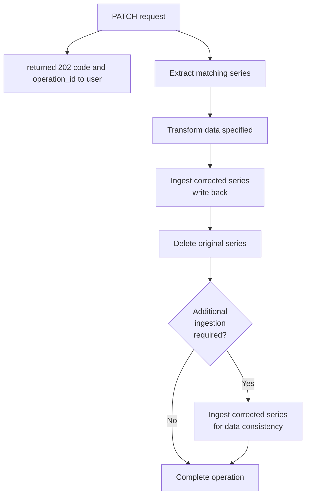

# API document

This document defines the RESTful API provided by the `api-server` component. The API enables programmatic access to metrics and metadata, supporting integration with external applications and automation of data management tasks.

Authentication for `api-server` is configurable. By default it is designed for trusted intranet environments.

## 1. Overview

This API exposes read access to VictoriaMetrics metrics (names, label keys/values, time-series data) and asynchronous metadata mutation operations (add / modify / delete labels).

### Timezone Handling

- **API Request/Response**: All timestamp parameters in API requests and responses **MUST** be ISO 8601 format (e.g., `2022-10-19T11:45:34Z`, `2022-10-19T11:45:34+00:00`, or `2022-10-19T11:45:34+09:00`).
- **Internal Processing**: The server converts all timestamps to the timezone specified by `server.timezone` configuration for:
  - Operation IDs (e.g., `20251126T123456_1`)
  - Log entries (`timestamp` field)
  - Operation history files (`started_at`, `ended_at`, timestamps in `progress.steps`)
- **Lock File**: Lock file contents use the configured timezone.

**Example A**: If `server.timezone` is set to `Asia/Tokyo`:

| API Request Parameter             | Parsed As               | Converted to Server TZ  | Used In                                   |
| --------------------------------- | ----------------------- | ----------------------- | ----------------------------------------- |
| `start=2025-12-19T11:45:34Z`      | 2025-12-19 11:45:34 UTC | 2025-12-19 11:45:34 UTC | Query processing                          |
| `start=2025-12-19T20:45:34+09:00` | 2025-12-19 20:45:34 JST | 2025-12-19 11:45:34 UTC | Query processing                          |
| (Operation created at this time)  | -                       | -                       | Operation ID: `20221019T204534_1`         |
| -                                 | -                       | -                       | Log timestamp: `2022-10-19T20:45:34+0900` |

**Note**: Both requests represent the same point in time (2022-10-19 11:45:34 UTC = 2022-10-19 20:45:34 JST). The server accepts any valid ISO 8601 timestamp and internally converts it to the configured `server.timezone` (Asia/Tokyo) for operation IDs, logs, and history files.

**Example B**: If `server.timezone` is set to `UTC` (or not set):

| API Request Parameter             | Parsed As               | Converted to Server TZ  | Used In                                   |
| --------------------------------- | ----------------------- | ----------------------- | ----------------------------------------- |
| `start=2025-12-19T11:45:34Z`      | 2025-12-19 11:45:34 UTC | 2025-12-19 11:45:34 UTC | Query processing                          |
| `start=2025-12-19T20:45:34+09:00` | 2025-12-19 20:45:34 JST | 2025-12-19 11:45:34 UTC | Query processing                          |
| (Operation created at this time)  | -                       | -                       | Operation ID: `20251219T114534_1`         |
| -                                 | -                       | -                       | Log timestamp: `2025-12-19T11:45:34+0000` |

**Note**: Both requests represent the same point in time (2025-12-19 11:45:34 UTC = 2025-12-19 20:45:34 JST). The server accepts any valid ISO 8601 timestamp and internally converts it to the configured `server.timezone` (UTC) for operation IDs, logs, and history files.

## 2. Configuration

The `api-server` is configured via a YAML file (`./config/config.yaml`). For flexibility in containerized environments, any value in the YAML file can be overridden by a corresponding environment variable.

### Configuration Loading

The path to the configuration file can be specified using the `API_SERVER_CONFIG_PATH` environment variable in the host machine of this container. If this variable is not set, the server will look for `./config/config.yaml`.

The final configuration values are determined by the following order of precedence (from highest to lowest):

1. **Environment Variables** (e.g., `API_SERVER_PORT`)
2. Values from the **YAML configuration file** (e.g., `./config/config.yaml`)
3. **Default values** hardcoded in the application

### Example `config.yaml`

```yaml
# Server configuration
server:
  timezone: "Asia/Tokyo"
  port: 8080

# VictoriaMetrics connection settings
victoria_metrics:
  url: "http://ip.address.of.apiserver:8428"

# Operation-specific settings
operations:
  lock_timeout_hours: 1
```

### Configuration Parameters

The following table details all configurable parameters, their corresponding YAML paths, and environment variable overrides.

| Parameter               | YAML Path                       | Environment Variable            | Description                                                                       | Required | Default |
| :---------------------- | :------------------------------ | :------------------------------ | :-------------------------------------------------------------------------------- | :------: | :------ |
| **Server Timezone**     | `server.timezone`               | `API_SERVER_TIMEZONE`           | The timezone of the `api-server`.                                                 |    No    | `UTC`   |
| **Server Port**         | `server.port`                   | `API_SERVER_PORT`               | The network port on which the API server will listen.                             |    No    | `8080`  |
| **VictoriaMetrics URL** | `victoria_metrics.url`          | `VICTORIAMETRICS_URL`           | Base URL of the VictoriaMetrics API endpoint.                                     |   Yes    | -       |
| **Lock Timeout**        | `operations.lock_timeout_hours` | `API_SERVER_LOCK_TIMEOUT_HOURS` | The number of hours after which a stale lock is considered for monitoring alerts. |    No    | `1`     |

### Primary Environment Variable

| Variable                            | Required | Default value           | Type | Explanation                                                    |
| ----------------------------------- | :------: | :---------------------- | ---- | -------------------------------------------------------------- |
| `API_SERVER_CONFIG_PATH`            |    no    | `./config/config.yaml`  | str  | Path to the YAML configuration file.                           |
| `API_SERVER_LOGGING_CONFIG_PATH`    |    no    | `./config/logging.yaml` | str  | Path to the YAML configuration file for logging.               |
| `API_SERVER_LOGGING_DIR_PATH`       |    no    | `./logs`                | str  | Path to the log file storage.                                  |
| `API_SERVER_OPERATION_HISTORY_PATH` |    no    | `./data`                | str  | Path to the directory for operation history and the lock file. |

## 3. Time-series query constraints

- Max samples returned (after downsampling): [100M](<https://docs.victoriametrics.com/victoriametrics/single-server-victoriametrics/#:~:text=The%20maximum%20number%20of%20CPU,default%20netstorage.defaultMaxWorkersPerQuery()>)
- If exceeded: 400 with code: `Bad Request`

## 4. API summary

The complete API specification (endpoints, parameters, schemas, error model) is maintained in `oas/openapi.yaml`.

This section provides only a concise functional overview; consult `oas/openapi.yaml` for authoritative details and future updates.

### Read (GET)

This section defines the endpoints for retrieving metric data and metadata.

These endpoints provide read-only access to the time-series database, allowing users to query metric names, labels, and time-series data points.

#### Endpoints

- GET `/metrics/names`  
  List metric names (paginated: offset, limit).

- GET `/metrics/{metric_name}/labels`  
  List label keys for the metric. (If large, pagination may be applied in future.)

- GET `/metrics/{metric_name}/labels/{label_key}/values`  
  List distinct label values (supports pagination: offset, limit).

- GET `/metrics/{metric_name}/series/data`  
  Fetch time-series points constrained by:

  Limits: max returned (after downsampling) [100M samples](<https://docs.victoriametrics.com/victoriametrics/single-server-victoriametrics#:~:text=The%20maximum%20number%20of%20CPU,default%20netstorage.defaultMaxWorkersPerQuery()>).

  The specified time-series should be unique.

  **Example request**:

  ```bash
  curl -s 'http://localhost:8080/metrics/node_cpu_seconds_total/series/data?start=2022-10-19T11:45:34%2B09:00&end=2022-10-19T12:45:34%2B09:00&selector[instance]=hostA:9100&selector[job]=node'
  ```

### Mutation (asynchronous, PATCH/DELETE) and status GET

This section describes endpoints for modifying **ONE** metadata of the metrics.

Only one mutation including deletion, operation can be executed at a time.

While an operation is **"in_progress"**, no other operations will be accepted.

#### Operations to mutate

Due to the design of VictoriaMetrics, data modification is not an in-place operation.

The process requires extracting the target data, modifying it, deleting the original data from the database, and then re-ingesting the corrected data.



#### Pseudo-transaction

Since this API's metadata update (PATCH) lacks a native transaction mechanism in VictoriaMetrics, it is treated as a **pseudo**-transaction at the operation level.

The pseudo-transaction steps are as follows:

1. extracting  
   copies the original time-series to machine memory
2. transforming  
   modifies the label key or value of the time-series
3. ingesting  
   ingests the transformed time-series to VictoriaMetrics
4. deleting  
   deletes the original time-series
5. finishing  
   finishing this operation

**Pseudo ACID property**:

- Atomicity:

  Only adopt the new label state if the final state of the operation is completed.
  If an operation fails during execution, partial metrics remain, requiring the operator to manually delete those partial metrics.

- Consistency:

  Only ingest entries that pass validation defined in `./oas/openapi.yaml` (prohibits duplicate keys / maximum length).
  Failed entries are not committed.

- Isolation:

  During PATCH operation execution, the API server rejects new PATCH requests with HTTP `423` (Locked) to prevent conflicts and ensure data consistency.
  Only one metadata mutation operation can run at a time.
  Read operations (GET) may observe intermediate states during operation execution (brief gaps after deletion but before re-ingestion).
  To minimize gaps, execute ingesting → deleting operations immediately consecutively.

- Durability:

  Once a operation reaches `finishing` status, the metadata changes are permanently stored in VictoriaMetrics and survive system restarts, crashes, or power failures.

**Roll-back strategy in each step**:

| Step                                | Effect                                            | Roll-back behavior                                                                  |
| ----------------------------------- | ------------------------------------------------- | ----------------------------------------------------------------------------------- |
| extracting / transforming           | DB unchanged                                      | Make the operation failed.                                                          |
| ingesting (After any part inserted) | Original time-series + New time-series incomplete | Make the operation failed (User should manually delete the incomplete time-series). |
| deleting (After any part deleted)   | Original time-series incomplete + New time-series | Make the operation failed (User should manually delete the incomplete time-series). |

#### Endpoints

All PATCH endpoints schedule a background operation and return HTTP `202` with a **`operation_id`**.

- GET `/meta/status`

  The server determines the operation's status by checking for the existence of the lock file (`./data/.lock`) and the corresponding operation history file (`./data/operations/<operation_id>.json`).
  - "completed"

    The server detected that the corresponding operation history file was created with successful operation.

  - "in_progress"

    The server finds that the `operation_id` matches the one in the `.lock` file, but the history JSON file has not yet been created.

  - "failed"

    The server cannot find the `operation_id` in either a lock file or the history directory.
    Or, the server found that the operation history file ultimately failed.

- PATCH `/meta/add`

  Add a new label key with a default value across matching series (selected by metric_name + selector).

  Before performing this operation, the API must verify at least the following items:
  - the time-series specified by the metric_name and selector is uniquely determined
  - the status of any other operation is **NOT** "in_progress"
  - the target time-series does **NOT** violate the [query constraints](#3-time-series-query-constraints)
  - a new label key does **NOT** overlap with the original ones

- PATCH `/meta/modify/key`

  Rename label key. The corresponding value of the key should remain the same.

  Before performing this operation, the API must verify at least the following items:
  - the time-series specified by the metric_name and selector is uniquely determined
  - the status of any other operation is **NOT** "in_progress"
  - the target time-series does **NOT** violate the [query constraints](#3-time-series-query-constraints)
  - a new label key does **NOT** overlap with the original ones
  - a set of labels, including a new label, must **NOT** overlap with any other time-series.

- PATCH `/meta/modify/value`

  Rename label value (selected by metric_name + selector + time range).

  Before performing this operation, the API must verify at least the following items:
  - the time-series specified by the metric_name and selector is uniquely determined
  - the status of any other operation is **NOT** "in_progress"
  - the target time-series does **NOT** violate the [query constraints](#3-time-series-query-constraints)

- PATCH `/meta/delete`

  Remove specified label keys from matching time series.

  Before performing this operation, the API must verify at least the following items:
  - the time-series specified by the metric_name and selector is uniquely determined
  - the status of any other operation is **NOT** "in_progress"
  - the target time-series does **NOT** violate the [query constraints](#3-time-series-query-constraints)

- DELETE `/metrics/{metric_name}/series/data`

  Delete the entire time-series data (selected by metric_name + selector).

  Before performing this operation, the API must verify at least the following items:
  - the time-series specified by the metric_name and selector is uniquely determined
  - the status of any other operation is **NOT** "in_progress"

  **The metric specified by label_key and label_value MUST be uniquely determined.**

#### Operation ID specification

Each asynchronous operation (PATCH, DELETE) is assigned a unique `operation_id` upon creation.
For each operation, the file that describes the detailed operation.

The timezone should be the value of `server.timezone`.

**Format**: `<timestamp>_<number>`

**Components**:

- `timestamp`: ISO 8601 format timestamp when operation has been created (e.g., `20251126T123456`), where the timezone is the value of `server.timezone`.
- `number`: A natural number used to distinguish multiple operations within one second (e.g., `1`).

**Examples**:

```text
20251126T123456_1
```

**Properties**:

- **Uniqueness**: Guaranteed by combination of timestamp (in configured timezone) and a natural number
- **Sortability**: Sortable by creation time

#### Operation history file structure

Each operation's state and metadata are persisted in a dedicated JSON file located in the operation history directory.
This JSON file is saved when **the operation has been completed or failed**.
During the operation, the status will be saved in `.lock` file (for the file format, see [Lock file format](#concurrent-operation-management)).

**Directory structure**:

```bash
/data/
├── .lock                          # Global lock file (contains operation_id)
└── operations/                    # Operation history directory
    ├── 20251126T123456_1.json  # Operation history file
    ├── 20251126T123456_2.json
    ├── 20251127T090705_1.json
    └── ......
```

**File location**: `./data/operations/<operation_id>.json`

**File naming convention**: `<operation_id>.json`

**Example**: `./data/operations/20251126T123456_1.json`

##### File schema

JSON files are generated for each operation.
The example below shows the case in changing the metadata key `env`.

**Success case**:

```json
{
  "operation_id": "20251126T123456_1",
  "operation_type": "modify/key",
  "steps": "finishing",
  "started_at": "2025-11-26T12:34:56Z",
  "ended_at": "2025-11-26T12:35:42Z",
  "request": {
    "metric_name": "node_cpu_seconds_total",
    "range": {
      "start": "2022-10-19T11:45:34+09:00",
      "end": "2022-10-19T11:45:34+09:00"
    },
    "selector": {
      "match": [
        {
          "key": "instance",
          "value": "hostA:9100",
          "regex": true
        }
      ]
    },
    "from_key": "string",
    "to_key": "string"
  },
  "progress": {
    "steps": [
      {
        "name": "extracting",
        "status": "completed",
        "started_at": "2025-11-26T12:34:56Z",
        "completed_at": "2025-11-26T12:35:10Z"
      },
      {
        "name": "transforming",
        "status": "completed",
        "started_at": "2025-11-26T12:35:10Z",
        "completed_at": "2025-11-26T12:35:15Z"
      },
      {
        "name": "ingesting",
        "status": "completed",
        "started_at": "2025-11-26T12:35:15Z",
        "completed_at": "2025-11-26T12:35:35Z"
      },
      {
        "name": "deleting",
        "status": "completed",
        "started_at": "2025-11-26T12:35:35Z",
        "completed_at": "2025-11-26T12:42:42Z"
      },
      {
        "name": "finishing",
        "status": "completed",
        "started_at": "2025-11-26T12:35:42Z",
        "completed_at": "2025-11-26T12:42:43Z"
      }
    ]
  },
  "error": null
}
```

**Failure case**:

```json
{
  "operation_id": "20251126T123456_1",
  "operation_type": "modify/key",
  "steps": "ingesting",
  "started_at": "2025-11-26T12:34:56Z",
  "ended_at": "2025-11-26T12:35:42Z",
  "request": {
    "metric_name": "node_cpu_seconds_total",
    "range": {
      "start": "2022-10-19T11:45:34+09:00",
      "end": "2022-10-19T11:45:34+09:00"
    },
    "selector": {
      "match": [
        {
          "key": "instance",
          "value": "hostA:9100",
          "regex": true
        },
        {
          "key": "env",
          "value": "local",
          "regex": false
        }
      ]
    },
    "from_key": "env",
    "to_key": "environment"
  },
  "progress": {
    "steps": [
      {
        "name": "extracting",
        "status": "completed",
        "started_at": "2025-11-26T12:34:56Z",
        "completed_at": "2025-11-26T12:35:10Z"
      },
      {
        "name": "transforming",
        "status": "completed",
        "started_at": "2025-11-26T12:35:10Z",
        "completed_at": "2025-11-26T12:35:15Z"
      },
      {
        "name": "ingesting",
        "status": "failed",
        "started_at": "2025-11-26T12:35:15Z",
        "completed_at": "2025-11-26T12:35:35Z"
      }
    ]
  },
  "error": {
    "step": "ingesting",
    "message": "Failed to ingest transformed series: VictoriaMetrics remote write timeout",
    "cleanup_instructions": "Delete series matching: node_cpu_seconds_total{instance=\"hostA:9100\",environment=\"local\"}"
  }
}
```

##### Field definitions

| Field                           | Type              | Description                                                                                                                                                                                                                                                                            |
| ------------------------------- | ----------------- | -------------------------------------------------------------------------------------------------------------------------------------------------------------------------------------------------------------------------------------------------------------------------------------- |
| `operation_id`                  | string            | Unique identifier for the operation                                                                                                                                                                                                                                                    |
| `operation_type`                | enum              | Type of operation: `add`, `modify/key`, `modify/value`, `delete_label`, `delete_time_series`                                                                                                                                                                                           |
| `steps`                         | enum              | Current steps: `extracting`, `transforming`, `ingesting`, `deleting`, `finishing`                                                                                                                                                                                                      |
| `started_at`                    | string (ISO 8601) | Timestamp when operation was started                                                                                                                                                                                                                                                   |
| `ended_at`                      | string (ISO 8601) | Timestamp when operation reached terminal state (completed/failed), null if still in progress                                                                                                                                                                                          |
| `request`                       | object            | Original request body                                                                                                                                                                                                                                                                  |
| `progress`                      | object            | Detailed progress tracking                                                                                                                                                                                                                                                             |
| `progress.steps`                | array             | Array of steps execution details                                                                                                                                                                                                                                                       |
| `progress.steps[].name`         | enum              | Step name: `extracting`, `transforming`, `ingesting`, `deleting`, `finishing`                                                                                                                                                                                                          |
| `progress.steps[].status`       | enum              | Step status: `in_progress`, `completed`, `failed`                                                                                                                                                                                                                                      |
| `progress.steps[].started_at`   | string (ISO 8601) | Step start timestamp                                                                                                                                                                                                                                                                   |
| `progress.steps[].completed_at` | string (ISO 8601) | Step completion timestamp, null if not completed                                                                                                                                                                                                                                       |
| `error`                         | object            | Error details (null if no error)                                                                                                                                                                                                                                                       |
| `error.step`                    | string            | Step where error occurred: `extracting`, `transforming`, `ingesting`, `deleting`, `finishing`                                                                                                                                                                                          |
| `error.message`                 | string            | Error message                                                                                                                                                                                                                                                                          |
| `error.cleanup_instructions`    | string            | Instructions for manually cleaning up partial data when operation fails mid-execution. Includes specific API commands to identify and remove incomplete time-series. Only present when partial data exists in VictoriaMetrics (i.e., failures during `ingesting` or `deleting` steps). |

##### Status values

| Status        | Description                      | Terminal State |
| ------------- | -------------------------------- | -------------- |
| `in_progress` | Operation currently executing    | No             |
| `completed`   | Operation successfully completed | Yes            |
| `failed`      | Operation completed, but failed  | Yes            |

#### Concurrent operation management

It should be emphasized once again, only one mutation including deletion operation can be executed at a time.

**Lock mechanism**:

- Global lock file: `./data/.lock`
- Lock file contains the `operation_id` of the currently executing operation
- Lock acquired before starting any mutation operation
- Lock released after operation completes (completed/failed)

**Lock file content**:

The lock file simply stores the `operation_id` of the operation currently holding the lock as plain text.

**Example**:

```text
20251126T123456_1
```

This indicates that operation `20251126T123456_1` is currently executing and holds the exclusive lock.

**Lock acquisition behavior**:

1. Attempt to create lock file `./data/.lock` with the current `operation_id`
2. If lock file already exists:
   - Read the `operation_id` from the lock file
   - Check the corresponding operation file `./data/operations/<operation_id>.json`
   - If the operation file exists and status is terminal (`completed` or `failed`), the lock is stale:
     - Log warning: `"Stale lock detected for operation {operation_id}"`
     - Overwrite lock file with new `operation_id`
   - If the operation file does not exist or operation is still `in_progress`:
     - Reject new operation with HTTP `423 Locked`
     - Response body: `{"message": "Another operation is in progress. locked by "operation_id"}`
3. If lock file does not exist:
   - Create lock file with current `operation_id`
   - Proceed with operation

**Lock release**:

- **Automatic**: When operation reaches terminal state (`completed` or `failed`):
  1. Write operation history JSON file to `./data/operations/<operation_id>.json`
  2. Delete `./data/.lock`
- **Manual**: If operation is stuck (e.g., process crash), operator can:
  1. Verify operation status by checking if operation history file exists
  2. If no operation history file exists, the operation likely crashed before completion
  3. Manually delete `./data/.lock` to allow new operations
  4. Investigate and clean up partial data if necessary (see `error.cleanup_instructions` in operation history)

**Concurrency guarantees**:

- Only **one** mutation operation (PATCH/DELETE) can execute at a time
- Read operations (GET) are **not** affected by the lock and can proceed concurrently
- Lock prevents race conditions between concurrent PATCH/DELETE requests
- Lock file operations are atomic (file creation/deletion is atomic on POSIX filesystems)

**Lock timeout policy**:

- No automatic timeout is enforced by the system
- Operators must manually intervene if an operation is stuck for unusually long time
- Recommended monitoring: Alert if `.lock` file age exceed unusually long time without corresponding operation progress

## 5. Logging

This section defines the logging strategy for the `api-server`.

The path to the configuration file for logging can be specified using the `API_SERVER_LOGGING_CONFIG_PATH` environment variable in the host machine of this container. If not set, the default path is `./config/logging.yaml`.

### Logging Configuration (dictConfig)

The `api-server` reads a detailed logging configuration from a separate YAML file, compatible with Python `logging.config.dictConfig`. This enables centralized control of formatters (JSON), handlers (console/file), and per-component log levels without code changes.

- Recommended structure: similar to `tranqu-server`'s `./config/logging.yaml`

Example `logging.yaml`:

```yaml
version: 1
disable_existing_loggers: false

formatters:
  json:
    class: pythonjsonlogger.jsonlogger.JsonFormatter
    format: "%(asctime)s %(levelname)s %(name)s %(message)s"

handlers:
  console:
    class: logging.StreamHandler
    level: INFO
    formatter: json
    stream: ext://sys.stdout

loggers:
  api-server:
    level: INFO
    handlers: [console]
    propagate: no
  api-server.api:
    level: INFO
    handlers: [console]
    propagate: no
  api-server.operations:
    level: INFO
    handlers: [console]
    propagate: no
  api-server.lock:
    level: WARN
    handlers: [console]
    propagate: no

root:
  level: INFO
  handlers: [console]
```

Note: The JSON fields described below (e.g., `timestamp`, `level`, `logger`, `message`) are produced by the JSON formatter specified in `./config/logging.yaml`.

### Logging Strategy

The `api-server` implements a structured logging strategy using JSON format.

All log entries related to a specific asynchronous operation **MUST** include the `operation_id` to allow for easy tracing of the entire lifecycle of a request.

### Log Format

Each log entry is a JSON object containing a set of standard fields, plus contextual fields specific to the event.

**Standard Fields**:

| Field       | Type   | Description                                     | Example                    |
| ----------- | ------ | ----------------------------------------------- | -------------------------- |
| `timestamp` | string | ISO 8601 timestamp of the log entry             | `2025-12-10T20:20:24+0900` |
| `msecs`     | number | milliseconds                                    | `980.0`                    |
| `level`     | string | The severity of the log (e.g., `INFO`, `ERROR`) | `INFO`                     |
| `logger`    | string | The name of the logger component                | `api-server.operations`    |
| `message`   | string | The main, human-readable log message            | `Operation started`        |

**Contextual Fields**:

| Field            | Description                                                                | Example              |
| ---------------- | -------------------------------------------------------------------------- | -------------------- |
| `operation_id`   | The unique ID of the asynchronous operation. Included in all related logs. | `20251202T100000_1`  |
| `operation_type` | The type of operation being performed (e.g., `modify/key`).                | `modify/key`         |
| `step`           | The specific step of the operation (e.g., `extracting`, `ingesting`).      | `ingesting`          |
| `http_method`    | The HTTP method of the incoming request.                                   | `PATCH`              |
| `http_path`      | The path of the incoming request.                                          | `/meta/modify/key`   |
| `error`          | A detailed error message or exception trace.                               | `Connection timeout` |

### Example Log Entries

- **Operation Start**: An `INFO` log when a new operation is accepted and started.

  ```json
  {
    "timestamp": "2025-12-02T10:00:00.123Z",
    "level": "INFO",
    "logger": "api-server.api",
    "message": "New operation accepted and started.",
    "operation_id": "20251202T100000_1",
    "operation_type": "modify/key",
    "http_method": "PATCH",
    "http_path": "/meta/modify/key"
  }
  ```

- **Step Completion**: An `INFO` log for each successfully completed step.

  ```json
  {
    "timestamp": "2025-12-02T10:05:15.456Z",
    "level": "INFO",
    "logger": "api-server.operations",
    "message": "Step completed successfully.",
    "operation_id": "20251202T100000_1",
    "step": "ingesting",
    "duration_seconds": 12.5
  }
  ```

- **Operation Failure**: An `ERROR` log when a step fails.

  ```json
  {
    "timestamp": "2025-12-02T10:05:20.789Z",
    "level": "ERROR",
    "logger": "api-server.operations",
    "message": "Operation failed during step.",
    "operation_id": "20251202T100000_1",
    "step": "deleting",
    "error": "Failed to delete original series: VictoriaMetrics API returned 503."
  }
  ```

- **Stale Lock Detection**: A `WARN` log when a stale lock file is detected and removed.

  ```json
  {
    "timestamp": "2025-12-02T11:00:00.999Z",
    "level": "WARN",
    "logger": "api-server.lock",
    "message": "Stale lock file detected and removed.",
    "locked_operation_id": "20251201T080000_5"
  }
  ```
