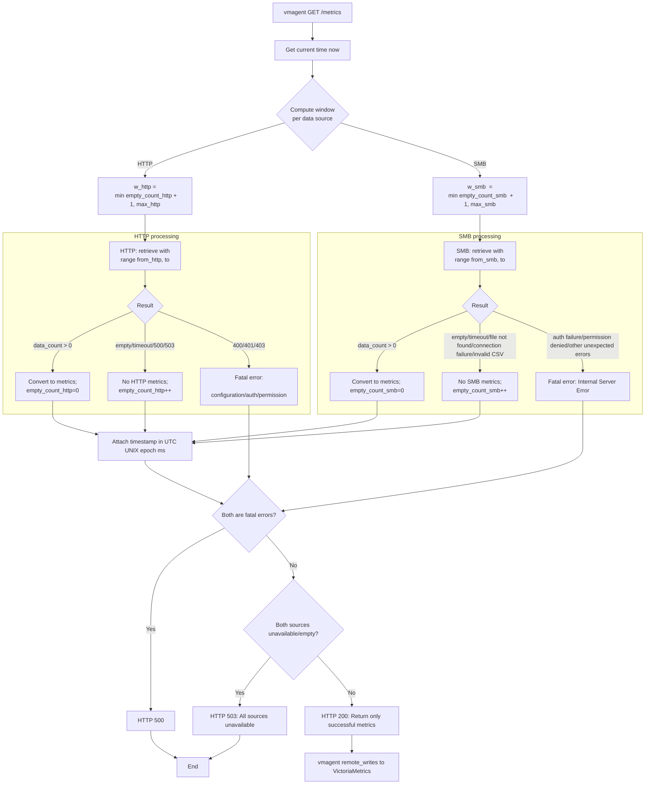
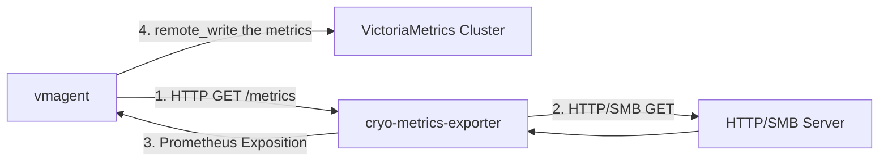

# Detailed design: custom exporter for the dilution refrigerator

## 1. Overview

This exporter responds to pull requests from `vmagent` by retrieving time-series data from `HTTP`/`SMB` servers. It collects and transforms various types of data, such as temperature, pressure, and gas flow rate, and returns the results in Prometheus format. The implementation uses Python's `prometheus_client` library to build a custom exporter. This document provides the detailed design specifications for the exporter.

### 1.1 Key features and design principles:

- This exporter is containerized
- Data Source: `HTTP`/`SMB` servers
- Access the data source upon each `/metrics` request from `vmagent`
- Specify a time range (typically 1 minute) when accessing the data source
- If the number of retrieved records is zero, return an empty array equivalent (zero samples for the corresponding metrics) to `vmagent`
- On the next pull, expand the time range to include the previous range and retry data retrieval, which we define the time range as "window"
- The maximum expansion limit (how many windows to extend) can be configured via environment variables
- After retries exceed the maximum expansion limit, the exporter discards data starting from the oldest window
- The host machine must synchronize time with `NTP` server (same as `vmagent` and data sources)
- The timestamp should be included in the metrics to prioritize the time information obtained from the `HTTP`/`SMB` server
- When sending to `vmagent`, the timezone must be converted to **UTC** (UNIX time) format.

### 1.2 Note on window semantics

- A window is a half-open interval [from, to) per source (to = the scrape-time now).
- Length = `scrape_interval_sec × w`, where `w = min(empty_count + 1, max_expand_windows)`.
- On empty data or retryable failures: `empty_count++` → next scrape expands the window backward in time.
- On success (`data_count > 0`): `empty_count` resets to 0 → next window returns to `w = 1`.
- Upon reaching the upper bound: older intervals are discarded; only the latest `max_expand_windows` intervals are considered.
- HTTP and SMB manage windows independently; one source's expansion does not affect the other.
- Duplicate timestamps are handled by VictoriaMetrics (last-write-wins); client-side deduplication is unnecessary.
- See section [3.3 Time range specification](#33-time-range-specification) for details.

**Example**:
For the case of `scrape_interval_sec=60`, `max_expand_windows=3`

```text
w=1: now |<------ 60s ------>|
w=2: now |<----------- 120s ----------->|
w=3: now |<---------------------- 180s ---------------------->|
```

### 1.3 Flow chart of the exporter

The flowchart of this exporter is shown below:



## 2. Architecture

### 2.1 Positioning of this system



This diagram illustrates the data flow for metrics collection:

- **`vmagent` to `cryo-metrics-exporter`**:

  `vmagent` periodically sends an HTTP GET request to the `/metrics` endpoint of the `cryo-metrics-exporter`.

- **`cryo-metrics-exporter` to `HTTP/SMB Server`**:

  Upon receiving the request, the exporter fetches raw data from the upstream `HTTP/SMB Server`.

- **`HTTP/SMB Server` to `cryo-metrics-exporter`**:

  The server returns the requested data (e.g., JSON or log files) to the exporter.

- **`cryo-metrics-exporter` to `vmagent`**:

  The exporter processes/converts the raw data, transforms it into the Prometheus exposition format, and sends it back to `vmagent` as the HTTP response with timestamp included in the raw data.

- **`vmagent` to `VictoriaMetrics Cluster`**:

  Finally, `vmagent` forwards the collected metrics to the central `VictoriaMetrics Cluster` for long-term storage and querying.

### 2.2 Processing flow

- `vmagent` periodically sends `/metrics` requests via HTTP GET
- The exporter determines the current time range _[`from`, `to`)_ based on the current timestamp and its internal state (previous retrieval results)
- The exporter retrieves data from the `HTTP`/`SMB` server for the specified time range
- Parse the retrieved data into an internal format and convert it into Prometheus metrics
  - If the number of retrieved records > 0: Output metrics as usual
  - If the number of retrieved records = 0: Do not output any samples for the corresponding metrics (equivalent to an empty array)
- Update the internal state for the time-range expansion logic based on retrieval success and record count
- Send the generated metrics to `vmagent` in Prometheus exposition format
- `vmagent` forwards the collected metrics to `VictoriaMetrics Cluster`

### 2.3 Configuration

The exporter is configured primarily via a YAML file. For flexibility in containerized environments, any setting in the YAML file can be overridden by a corresponding environment variable.

#### 2.3.1 Configuration File (`config.yaml`)

The exporter loads its configuration from a YAML file (e.g., `./config/config.yaml`) specified by the `CRYO_EXPORTER_CONFIG_PATH` environment variable.

**Example `config.yaml`:**

```yaml
# Basic exporter settings
exporter:
  port: 9101
  timezone: "Asia/Tokyo"
  device_name: "your.refrigerator.name"

# Data retrieval and time window settings
retrieval:
  scrape_interval_sec: 60
  max_expand_windows:
    http: 5
    smb: 5

# Data source definitions
sources:
  http:
    datasource_timezone: "UTC"
    url: "http://example.com/api/metrics"
    port: 80
    timeout_sec: 5
  smb:
    datasource_timezone: "UTC"
    server: "smb.example.com"
    share: "LogData"
    port: 445
    username: "smbuser"
    base_path: ""
    timeout_sec: 5
```

**_Important Note_**:
This exporter uses the environment variable `SMB_PASSWORD` for the SMB password (required).

#### 2.3.2 Configuration Parameters

The following table details all parameters that can be configured in the `config.yaml` file.

**_Timezone Expression Format_**:

All timezone parameters follow the **IANA Time Zone Database** format (e.g., `Asia/Tokyo`, `America/New_York`, `UTC`, `Europe/London`). See the [IANA Time Zone Database](https://www.iana.org/time-zones) for the complete list of valid timezone identifiers.

| Parameter                              | YAML Path                           | Environment Variable                | Description                                                                                 | Required | Default |
| -------------------------------------- | ----------------------------------- | ----------------------------------- | ------------------------------------------------------------------------------------------- | :------: | ------- |
| **Exporter Port**                      | `exporter.port`                     | `EXPORTER_PORT`                     | The port on which the exporter will listen for `/metrics` requests.                         |    No    | `9101`  |
| **Exporter Timezone**                  | `exporter.timezone`                 | `EXPORTER_TIMEZONE`                 | The timezone of the exporter, which is used to append timestamp in logging.                 |    No    | `UTC`   |
| **Exporter Device Name**               | `exporter.device_name`              | `EXPORTER_DEVICE_NAME`              | Common label value for all metrics; shown as `device_name="<value>"`.                       |   Yes    | -       |
| **Scrape Interval Second to Retrieve** | `retrieval.scrape_interval_sec`     | `RETRIEVAL_SCRAPE_INTERVAL_SEC`     | The expected scrape interval. Used to calculate the time window.                            |    No    | `60`    |
| **Max Expand Windows (HTTP)**          | `retrieval.max_expand_windows.http` | `RETRIEVAL_MAX_EXPAND_WINDOWS_HTTP` | Maximum number of windows to expand for the HTTP source on data failure.                    |    No    | `5`     |
| **Max Expand Windows (SMB)**           | `retrieval.max_expand_windows.smb`  | `RETRIEVAL_MAX_EXPAND_WINDOWS_SMB`  | Maximum number of windows to expand for the SMB source on data failure.                     |    No    | `5`     |
| **HTTP Data Source Timezone**          | `sources.http.datasource_timezone`  | `SOURCES_HTTP_DATASOURCE_TIMEZONE`  | The timezone of the **HTTP** datasource, which is used to append timestamp for the metrics. |    No    | `UTC`   |
| **HTTP Data Source URL**               | `sources.http.url`                  | `SOURCES_HTTP_URL`                  | The base URL for the HTTP data source API.                                                  |   Yes    | -       |
| **HTTP Data Source Port**              | `sources.http.port`                 | `SOURCES_HTTP_PORT`                 | The port for the HTTP data source.                                                          |    No    | `80`    |
| **HTTP Data Source Timeout**           | `sources.http.timeout_sec`          | `SOURCES_HTTP_TIMEOUT_SEC`          | Connection and read timeout in seconds for the HTTP source.                                 |    No    | `5`     |
| **SMB Data Source Timezone**           | `sources.smb.datasource_timezone`   | `SOURCES_SMB_DATASOURCE_TIMEZONE`   | The timezone of the **SMB** datasource, which is used to append timestamp for the metrics.  |    No    | `UTC`   |
| **SMB Data Source Server**             | `sources.smb.server`                | `SOURCES_SMB_SERVER`                | The hostname or IP address of the SMB server.                                               |   Yes    | -       |
| **SMB Data Source Share**              | `sources.smb.share`                 | `SOURCES_SMB_SHARE`                 | The SMB share name to connect to.                                                           |   Yes    | -       |
| **SMB Data Source Port**               | `sources.smb.port`                  | `SOURCES_SMB_PORT`                  | The port for the SMB server.                                                                |    No    | `445`   |
| **SMB Data Source Username**           | `sources.smb.username`              | `SOURCES_SMB_USERNAME`              | The username for SMB authentication.                                                        |   Yes    | -       |
| **SMB Data Source Base Path**          | `sources.smb.base_path`             | `SOURCES_SMB_BASE_PATH`             | The base directory path on the SMB share where log files are located.                       |    No    | `""`    |
| **SMB Data Source Timeout**            | `sources.smb.timeout_sec`           | `SOURCES_SMB_TIMEOUT_SEC`           | Connection and read timeout in seconds for the SMB source.                                  |    No    | `5`     |

#### 2.3.3 Environment Variables

Environment variables can be used to specify the configuration file path or to override specific values within the file.

**Primary Environment Variable:**

| Variable                            | Required | Default value           | Type | Explanation                                                                            |
| ----------------------------------- | :------: | :---------------------- | ---- | -------------------------------------------------------------------------------------- |
| `CRYO_EXPORTER_CONFIG_PATH`         |    no    | `./config/config.yaml`  | str  | Path to the YAML configuration file.                                                   |
| `CRYO_EXPORTER_LOGGING_CONFIG_PATH` |    no    | `./config/logging.yaml` | str  | Path to the YAML configuration file for logging.                                       |
| `CRYO_EXPORTER_LOGGING_DIR_PATH`    |    no    | `./logs`                | str  | Path to the log file storage.                                                          |
| `SMB_PASSWORD`                      |   yes    | -                       | str  | SMB password. Do not include it in `config.yaml`; inject it via environment variables. |

## 3. Detailed specifications

### 3.1 Data extraction

- Temperature: retrieves in JSON format from the **`HTTP`** API
- Pressure/Gas Flow Rate: retrieves CSV/Text Files from **`SMB`** Server
- Acquired data: array (list) format

### 3.2 Behavior from the perspective of `vmagent`

- endpoint: `/metrics` (HTTP GET)
- response format: Prometheus Text Exposition Format
- Status code:
  - **200 OK**:

    Default response. Returned when the exporter is running correctly and can provide some or all of the requested metrics. This is true even if some upstream data sources are temporarily unavailable, as long as at least one source is successful.

  - **500 Internal Server Error**:

    Returned in case of a configuration error within the exporter (e.g., invalid credentials, missing required environment variables).
    Resolving this error code requires operator intervention.

  - **503 Service Unavailable**:

    Returned only when **all** upstream data sources (HTTP and SMB) are unreachable or fail to provide data.
    This indicates the loss of data visibility.

### 3.3 Time range specification

For each data retrieval request, the Exporter calculates the following time range.

#### 3.3.1 Time range calculation rules

The exporter maintains separate `empty_count` state for each data source:

- `empty_count_http`: Counter for HTTP data source (initial value 0)
- `empty_count_smb`: Counter for SMB data source (initial value 0)

**Time range calculation per source**:

```python
# HTTP
w_http = min(empty_count_http + 1, retrieval.max_expand_windows.http)
from_http = now - (config.retrieval.scrape_interval_sec * w_http)
to_http = now

# SMB
w_smb = min(empty_count_smb + 1, retrieval.max_expand_windows.smb)
from_smb = now - (config.retrieval.scrape_interval_sec * w_smb)
to_smb = now
```

**State update logic per source**:

For HTTP:

```python
# data_extraction has been succeeded
if data_count > 0:
    empty_count = 0
# failed
else:
    empty_count = min(empty_count + 1, config.retrieval.max_expand_windows.http - 1)
```

The SMB case is similar to the case of HTTP.

**Example scenario**:

Assuming (`retrieval.scrape_interval_sec=60`, `retrieval.max_expand_windows.http=3`):

| Scrape # | HTTP result           | empty_count | Window Multiplier | HTTP Window | Time range        |
| -------- | --------------------- | ----------- | ----------------- | ----------- | ----------------- |
| 1        | 1 record (succeeded)  | 0           | 1                 | 60s         | _[now-60s, now)_  |
| 2        | 0 record (failed)     | 0→1         | 1                 | 60s         | _[now-60s, now)_  |
| 3        | 0 record (failed)     | 1→2 (max)   | 2                 | 120s        | _[now-120s, now)_ |
| 4        | 0 record (failed)     | 2 (max)     | 3                 | 180s        | _[now-180s, now)_ |
| 5        | 0 record (failed)     | 2 (max)     | 3                 | 180s        | _[now-180s, now)_ |
| 6        | 2 records (succeeded) | 2→0         | 3                 | 180s        | _[now-180s, now)_ |
| 7        | 1 record (succeeded)  | 0           | 1                 | 60s         | _[now-60s, now)_  |

**Important notes**:

- Each data source maintains its own time window independently
- HTTP and SMB requests are made **in parallel** during each scrape
- If a request to any resource in either source fails, the `empty_count` for the corresponding data source (HTTP or SMB) is incremented
- All successfully retrieved metrics (except ones failed) from the data sources will still be returned to `vmagent`
- Window expansion does not affect the other data source's state
- If it reaches the limit of window size, then it discards the data from the window starting with the oldest entries

### 3.4 Data transformation

- Convert acquired data into VictoriaMetrics metrics format (compatible with Prometheus)
- Return the converted data together

Transformation rules are:

- Pressure (before_trap / after_trap / tank)
  - Unit difference: ULVAC = [kPa], Bluefors = [mbar]
  - Normalization policy: convert to [kPa]
  - Formula: kPa = mbar × 0.1
  - Label: location ∈ {"before_trap","after_trap","tank"}

- Pressure (still_tmp / chamber_internal / exhaust_pump)
  - Unit difference: ULVAC = [Pa], Bluefors = [mbar]
  - Normalization policy: convert to [Pa]
  - Formula: Pa = mbar × 100
  - Label: `location` ∈ {"still_tmp","chamber_internal","exhaust_pump"}

- Helium flow
  - Unit difference: ULVAC = [umol/s], Bluefors = [mmol/s]
  - Normalization policy: convert to [umol/s]
  - Formula: umol/s = mmol/s × 1000

- Compressor pressure
  - Unit difference: ULVAC = [MPa], Bluefors = [psig]
  - Normalization policy: convert to [MPa]
  - Formula: MPa = psig × 0.006894744825494
  - Label: side ∈ {"alp","alp2"}

### 3.5 Output metrics specification (Bluefors)

This section defines all metrics exposed by the custom exporter.
Each metric represents a specific operational parameter of the dilution refrigerator and is returned in Prometheus Text Exposition Format when `vmagent` pulls the `/metrics` endpoint.

For the implementation guide, refer to the [document](https://prometheus.github.io/client_python/).

| Metric Name                        | Labels                                                          | Type  | Unit   | Extraction | Notes                                         |
| ---------------------------------- | --------------------------------------------------------------- | ----- | ------ | ---------- | --------------------------------------------- |
| `refrigerator_temperature`         | `stage="plate_50k",location="flange",unit="kelvin",raw="true"`  | gauge | K      | HTTP       | CH1                                           |
| `refrigerator_temperature`         | `stage="plate_4k",location="flange",unit="kelvin",raw="true"`   | gauge | K      | HTTP       | CH2                                           |
| `refrigerator_temperature`         | `stage="still",location="flange",unit="kelvin",raw="true"`      | gauge | K      | HTTP       | CH5                                           |
| `refrigerator_temperature`         | `stage="mxc",location="flange",unit="kelvin",raw="true"`        | gauge | K      | HTTP       | CH6                                           |
| `refrigerator_pressure`            | `location="before_trap",unit="millibar",raw="true"`             | gauge | mbar   | SMB        | Maxigauge/CH4                                 |
| `refrigerator_pressure`            | `location="before_trap",unit="kilopascal",raw="false"`          | gauge | kPa    | SMB        | Maxigauge/CH4 (transformed)                   |
| `refrigerator_pressure`            | `location="after_trap",unit="millibar",raw="true"`              | gauge | mbar   | SMB        | Maxigauge/CH3                                 |
| `refrigerator_pressure`            | `location="after_trap",unit="kilopascal",raw="false"`           | gauge | kPa    | SMB        | Maxigauge/CH3 (transformed)                   |
| `refrigerator_pressure`            | `location="tank",unit="millibar",raw="true"`                    | gauge | mbar   | SMB        | Maxigauge/CH5                                 |
| `refrigerator_pressure`            | `location="tank",unit="kilopascal",raw="false"`                 | gauge | kPa    | SMB        | Maxigauge/CH5 (transformed)                   |
| `refrigerator_pressure`            | `location="still_tmp",unit="millibar",raw="true"`               | gauge | mbar   | SMB        | Maxigauge/CH2                                 |
| `refrigerator_pressure`            | `location="still_tmp",unit="pascal",raw="false"`                | gauge | Pa     | SMB        | Maxigauge/CH2 (transformed)                   |
| `refrigerator_pressure`            | `location="chamber_internal",unit="millibar",raw="true"`        | gauge | mbar   | SMB        | Maxigauge/CH1                                 |
| `refrigerator_pressure`            | `location="chamber_internal",unit="pascal",raw="false"`         | gauge | Pa     | SMB        | Maxigauge/CH1 (transformed)                   |
| `refrigerator_pressure`            | `location="exhaust_pump",unit="millibar",raw="true"`            | gauge | mbar   | SMB        | Maxigauge/CH6                                 |
| `refrigerator_pressure`            | `location="exhaust_pump",unit="pascal",raw="false"`             | gauge | Pa     | SMB        | Maxigauge/CH6 (transformed)                   |
| `refrigerator_helium_flow`         | (common labels only,`unit="millimoles per second",raw="true"`)  | gauge | mmol/s | SMB        | Flowmeter                                     |
| `refrigerator_helium_flow`         | (common labels only,`unit="micromoles per second",raw="false"`) | gauge | umol/s | SMB        | Flowmeter (transformed)                       |
| `refrigerator_device_status`       | `component="scroll1",unit="None",raw="true"`                    | gauge | -      | SMB        | Channels/scroll1 [0 if normal, 1 otherwise]   |
| `refrigerator_device_status`       | `component="scroll2",unit="None",raw="true"`                    | gauge | -      | SMB        | Channels/scroll2 [0 if normal, 1 otherwise]   |
| `refrigerator_device_status`       | `component="turbo1",unit="None",raw="true"`                     | gauge | -      | SMB        | Channels/turbo1 [0 if normal, 1 otherwise]    |
| `refrigerator_device_status`       | `component="turbo2",unit="None",raw="true"`                     | gauge | -      | SMB        | Channels/turbo2 [0 if normal, 1 otherwise]    |
| `refrigerator_device_status`       | `component="pulsetube",unit="None",raw="true"`                  | gauge | -      | SMB        | Channels/pulsetube [0 if normal, 1 otherwise] |
| `refrigerator_compressor`          | `rotation="actual_spd",unit="Hz",raw="true"`                    | gauge | Hz     | SMB        | Status/tc400actualspd                         |
| `refrigerator_compressor`          | `rotation="actual_spd2",unit="Hz",raw="true"`                   | gauge | Hz     | SMB        | Status/tc400actualspd_2                       |
| `refrigerator_compressor`          | `rotation="actual_spd3",unit="Hz",raw="true"`                   | gauge | Hz     | SMB        | Status/tc400actualspd_3                       |
| `refrigerator_compressor_pressure` | `side="alp",unit="psig",raw="true"`                             | gauge | psig   | SMB        | Status/cpalp                                  |
| `refrigerator_compressor_pressure` | `side="alp",unit="megapascal",raw="false"`                      | gauge | MPa    | SMB        | Status/cpalp (transformed)                    |
| `refrigerator_compressor_pressure` | `side="alp2",unit="psig",raw="true"`                            | gauge | psig   | SMB        | Status/cpalp_2                                |
| `refrigerator_compressor_pressure` | `side="alp2",unit="megapascal",raw="false"`                     | gauge | MPa    | SMB        | Status/cpalp_2 (transformed)                  |

**_Important Note_**:  
The timestamp should be included in the metrics to prioritize the time information obtained from the HTTP/SMB server.

**Timestamp format in Prometheus metrics**:

- Timestamp is in milliseconds since Unix epoch (UTC)

#### 3.5.1 Timestamp handling

**Duplicate timestamp handling**:

- VictoriaMetrics uses last-write-wins for same timestamp
- No client-side deduplication

### 3.6 Output label specification

#### **Labels of the metrics**

**Common labels**:

- `device_name`

  The device name of this dilution refrigerator, which is specified by `config.yaml`.

- `unit`

  The unit of the metrics.
  e.g., `kelvin`, `millimoles per second`, `None`

- `raw`

  The raw value before unit conversion.  
  e.g., `raw="true"` for the original value, `raw="false"` for converted value

**Temperature labels**:

- `stage`

  The cooling stage of the dilution refrigerator.  
  e.g., `stage="plate_50k"`

- `location`

  The physical location of the sensor.  
  e.g., `location="flange"`

**Pressure labels**:

- `location`

  The location of the pressure sensor.  
  e.g., `location="before_trap"`

**Device status labels**:

- `component`
  The specific component being monitored.
  e.g., `component="scroll1"`

**Gas flow labels**:

No specific labels beyond common ones.

**Compressor labels**:

- `rotation`

  Identifies the specific rotational speed sensor for the compressor.
  e.g., `rotation="actual_spd"`

- `side`

  Identifies the specific pressure side of the compressor.
  e.g., `side="alp"`

### 3.7 Parallel data retrieval

**Execution model**:

- HTTP and SMB requests execute in parallel using `ThreadPoolExecutor`
- Each source has independent timeout (`sources.http.timeout_sec`, `sources.smb.timeout_sec`)
- `/metrics` endpoint waits for both sources to complete or timeout
- Maximum total wait time: `max(sources.http.timeout_sec, sources.smb.timeout_sec) + 1s` (overhead)

**Response timing**:

- If both succeed quickly: return immediately
- If one times out: wait for the other
- If both timeout: return after slower timeout completes

## 4. External interface

### 4.1 Access from `vmagent`

- URL: `http://<exporter_host>:<port>/metrics`
- HTTP method: GET
- Authorization: None
- Timeout: set by `vmagent`

### 4.2 HTTP data source

**Timestamp interpretation**:

- Date/time columns are interpreted in the timezone specified by `sources.http.datasource_timezone`
- Converted to UNIX epoch (UTC) before adding to metrics
- Example: `05-11-25,18:55:41` with `datasource_timezone="UTC"` → `1730832941` (epoch seconds)
- Example: `06-11-25,03:55:41` with `datasource_timezone="Asia/Tokyo"` → `1730832941` (epoch seconds)

#### 4.2.1 Data source specification

- base URL (environmental variable): `sources.http.url`
  - e.g., `http://example.com/api/metrics`
- port: `sources.http.port`
- HTTP method: POST
- request body fields:
  - from: ISO8601 string
  - to: ISO8601 string
- request (example)

  ```bash
  curl -X POST "<sources.http.url>:<sources.http.port>/channel/historical-data" -H "Content-Type: application/json" -d '{
      "channel_nr": 2,
      "start_time": "2025-09-01T00:00:00",
      "stop_time": "2025-09-01T00:02:00",
      "fields": [
        "timestamp", "temperature", "status_flags"
        "key1", "key2", "key3"
      ]
    }'
  ```

- response (example)

  ```json
  {
    "status": "OK",
    "over_limit": false,
    "fields": ["timestamp", "temperature", "key1", "key2"],
    "start_time": "2025-09-01T00:00:00",
    "measurements": {
      "timestamp": [1756684820.090134, 1756684869.426473, 1756684918.737419],
      "temperature": [3.489204, 3.487032, 3.489155],
      "key1": [1.881, 1.019, 1.008],
      "key2": [1.521, 1.075, 1.205]
    },
    "channel_nr": 2,
    "datetime": "2025-09-09T06:21:21.932080Z",
    "stop_time": "2025-09-01T00:02:00"
  }
  ```

- response in case of empty

  ```json
  {
    "status": "OK",
    "over_limit": false,
    "fields": ["timestamp", "temperature", "key1", "key2"],
    "start_time": "2025-09-01T00:00:00",
    "measurements": {
      "timestamp": [],
      "temperature": [],
      "key1": [],
      "key2": []
    },
    "channel_nr": 2,
    "datetime": "2025-09-09T06:21:21.932080Z",
    "stop_time": "2025-09-01T00:02:00"
  }
  ```

**Target devices for metrics**:
Only extract data for `channel_nr=1,2,5,6`, which correspond to the cooling stages specified by the labels `stage` and `location` with the metric name of `refrigerator_temperature`.  
Channels 3 and 4 are not used in this configuration.

#### 4.2.2 Error handling

The behavior applies to each metric.

| HTTP Status Code (from HTTP data source) | Window Expansion (Next Scrape) | Response to `vmagent`               | Exporter Behavior                    | Notes                                                                                                                                                                                       |
| ---------------------------------------- | ------------------------------ | ----------------------------------- | ------------------------------------ | ------------------------------------------------------------------------------------------------------------------------------------------------------------------------------------------- |
| 200 OK (empty data)                      | Yes (increment `empty_count`)  | 200 OK                              | No metrics output for this source    | -                                                                                                                                                                                           |
| 400 Bad Request                          | No retry                       | 500 Internal Server Error           | Logs a critical configuration error  | -                                                                                                                                                                                           |
| 401 Unauthorized                         | No retry                       | 500 Internal Server Error           | Logs a critical authentication error | -                                                                                                                                                                                           |
| 403 Forbidden                            | No retry                       | 500 Internal Server Error           | Logs a critical permission error     | -                                                                                                                                                                                           |
| 404 Not Found                            | No retry                       | 200 OK                              | Logs a warning.                      | Assumes endpoint is not applicable/temporary unavailable. HTTP endpoint structure is static; 404 indicates misconfiguration                                                                 |
| 500 Internal Server Error                | Yes (increment `empty_count`)  | 200 OK (or 503 if all sources fail) | No metrics output for this source    | If parallel collection succeeds for other sources, it returns only the successful portions to maximize observability. Only when all sources fail is a 503 returned as loss of observability |
| 503 Service Unavailable                  | Yes (increment `empty_count`)  | 200 OK (or 503 if all sources fail) | No metrics output for this source    | Same as above                                                                                                                                                                               |
| Connection timeout                       | Yes (increment `empty_count`)  | 200 OK (or 503 if all sources fail) | No metrics output for this source    | Same as above                                                                                                                                                                               |
| Network unreachable                      | Yes (increment `empty_count`)  | 200 OK (or 503 if all sources fail) | No metrics output for this source    | Same as above                                                                                                                                                                               |

Every error must be logged for the debugging reason.

### 4.3 SMB data source

Connection parameters are specified via environment variables (see [config](#23-configuration)).

#### 4.3.1 File access pattern

The exporter retrieves `.log` files with the delimiter of comma from the SMB share using the following pattern:

**File path construction**:

```text
<sources.smb.base_path>/<YY-MM-DD>/<filename>.log
```

**Example**:

```text
<sources.smb.base_path>/25-11-05/maxigauge 25-11-05.log
<sources.smb.base_path>/25-11-05/Flowmeter 25-11-05.log
<sources.smb.base_path>/25-11-05/Channels 25-11-05.log
<sources.smb.base_path>/25-11-05/Status_25-11-05.log
```

**Time range handling**:

- The exporter calculates the target date(s) based on the time range _[from, to)_
- If the time range spans multiple days, files from all relevant dates are retrieved
- Files are read sequentially and filtered by timestamp

#### 4.3.2 File format specifications

**Timestamp interpretation**:

- Date/time columns are interpreted in the timezone specified by `sources.smb.datasource_timezone`
- Converted to UNIX epoch (UTC) before adding to metrics
- Example: `05-11-25,18:55:41` with `datasource_timezone="UTC"` → `1730832941` (epoch seconds)
- Example: `06-11-25,03:55:41` with `datasource_timezone="Asia/Tokyo"` → `1730832941` (epoch seconds)

##### Pressure data (Maxigauge channels)

**File naming**: `maxigauge <YY-MM-DD>.log` (e.g.: `maxigauge 25-11-05.log`)

**Columns** (repeating 6-column pattern per channel):

- 1st column: Date in DD-MM-YY format
- 2nd column: Time in HH:mm:ss format

**For each channel** (pattern repeats every 6 columns starting from column 3):

- Column N+0: Channel name (string, e.g., `CH1`, `CH2`)
- Column N+1: Not used
- Column N+2: Not used
- Column N+3: **Pressure value** in mbar (scientific notation)
- Column N+4: Not used
- Column N+5: Not used

**Parsing logic**:

```python
# save first 2 columns (date, time) to send the metrics with timestamp
timestamp = convert_to_epoch(columns[0], columns[1])
# Then extract every 6 columns for each channel
for i in range(2, len(columns), 6):
    channel_name = columns[i]          # CH1, CH2, ...
    pressure_value = float(columns[i+3])  # 4th column in each group
    # Map channel_name to metric_name
```

**Target devices for metrics**:
Only extract data for `CH1`, `CH2`, `CH3`, `CH4`, `CH5`, `CH6`, which are specified by the label `location` with the metric name of `refrigerator_pressure`.

**Example for first row**:

- Columns 3-8: `CH1,,0,2.00e-02,4,1` → Pressure = 0.02 mbar
- Columns 9-14: `CH2,,1,4.89e-01,0,1` → Pressure = 0.489 mbar
- Columns 15-20: `CH3,,1,-2.18e+01,0,1` → Pressure = -21.8 mbar (invalid, must be positive)

##### Gas flow rate data

**File naming**: `Flowmeter 25-11-05.log`

**Columns**:

- 1st column: Date in DD-MM-YY format
- 2nd column: Time in HH:mm:ss format
- 3rd column: Helium flow rate in the unit of `mmol/s`

**Target devices for metrics**:
Only extract data for 3rd columns whose metric name is `refrigerator_helium_flow`.

##### Machine state data

**File naming**: `Channels 25-11-05.log`

**Columns** (repeating pattern):

- 1st column: Date in DD-MM-YY format
- 2nd column: Time in HH:mm:ss format
- 3rd column: Not used
- 4th, 6th, 8th... columns: Device name (string, e.g., `v1`, `turbo1`, `scroll1`)
- 5th, 7th, 9th... columns: Metric value (integer, typically 0 or 1)

**Parsing logic**:

```python
# save first 2 columns (date, time) to send the metrics with timestamp
# and skip 3rd column (not used)
timestamp = convert_to_epoch(columns[0], columns[1])
# Then extract pairs: (device_name, value)
for i in range(3, len(columns), 2):
    device_name = columns[i]
    value = int(columns[i+1])
    # Process only if device_name in target list
```

**Target devices for metrics**:
Only extract data for `turbo1`, `turbo2`, `scroll1`, `scroll2`, `pulsetube`, which are specified by the label `component` with the metric name of `refrigerator_device_status`.

##### Compressor data

**File naming**: `Status_25-11-05.log`

(Note: Unlike other log files, this uses underscore instead of space before the date)

**Columns** (repeating pattern):

- 1st column: Date in DD-MM-YY format
- 2nd column: Time in HH:mm:ss format
- 3rd, 5th, 7th... columns: Parameter name (string, e.g., `cpalp`, `tc400actualspd`)
- 4th, 6th, 8th... columns: Metric value (float, scientific notation)

**Parsing logic**:

```python
# save first 2 columns (date, time) to send the metrics with timestamp
timestamp = convert_to_epoch(columns[0], columns[1])
# Then extract pairs: (param_name, value)
for i in range(2, len(columns), 2):
    param_name = columns[i]
    value = float(columns[i+1])
    # Process only if param_name in target list
```

**Target devices for metrics**:
Only extract data for `tc400actualspd`, `tc400actualspd_2`, `tc400actualspd_3`, `cpalp`, `cpalp_2`, which are specified by the labels `rotation` and `side` with the metrics name of `refrigerator_compressor` and `refrigerator_compressor_pressure`.

#### 4.3.3 Error handling

The retry behavior depends on the error types as following:

| Error Type                           | Retry                  | Response to `vmagent`               | Exporter Behavior                                                                                           | Notes                                                                                                                                           |
| ------------------------------------ | ---------------------- | ----------------------------------- | ----------------------------------------------------------------------------------------------------------- | ----------------------------------------------------------------------------------------------------------------------------------------------- |
| File not found                       | Yes (window expansion) | 200 OK                              | No metrics output for this source. SMB files are date-based; file may not exist yet for current time window | -                                                                                                                                               |
| Authentication/configuration failure | Yes (window expansion) | 200 OK (or 503 if all sources fail) | No metrics output for this source                                                                           | -                                                                                                                                               |
| Connection timeout                   | Yes (window expansion) | 200 OK (or 503 if all sources fail) | No metrics output for this source                                                                           | Not an Exporter failure. Prioritize partial success by discarding only the affected file and returning normal data from other files and sources |
| SMB connection failure               | Yes (window expansion) | 200 OK (or 503 if all sources fail) | No metrics output for this source                                                                           | General SMB/OS errors are retryable                                                                                                             |
| Invalid CSV format                   | Yes (window expansion) | 200 OK (or 503 if all sources fail) | Logs an error per invalid line; skips invalid rows                                                          | If all rows are invalid, the result is empty and triggers retry. Code does not distinguish "all invalid" from "no data"                         |
| Other unexpected errors              | No                     | 500 Internal Server Error           | Raises `InternalServerError`                                                                                | Unrecoverable errors requiring operator intervention                                                                                            |

Every error must be logged for the debugging reason.

#### 4.3.4 Data validation

All retrieved CSV data is validated before conversion to Prometheus metrics:

**Value validation**:

- Pressure: Must be positive
- Flow rate: Must be non-negative
- Status: Must be 0 or 1

**Invalid data handling**:

- Invalid rows are skipped; valid rows in the same file are still processed
- If all rows in a file are invalid, it is treated as an empty file
- `empty_count` is incremented only when all files for the time range are empty or invalid
- Log all invalid rows for debugging

**Example log**:

```log
2025-11-26T12:34:56Z WARNING Invalid pressure value in maxigauge_CH1.log line 42: 0 (must be larger than 0)
2025-11-26T12:34:56Z WARNING Invalid timestamp in flowmeter.log line 15: 2025-11-26T25:00:00Z (invalid hour)
```

## 5. Logging

The logging configuration is defined in a separate `logging.yaml` file, which is compatible with Python's `logging.config.dictConfig`. The exporter reads this file at startup to configure formatters, handlers, and log levels.

The path to the logging configuration file can be specified using the `CRYO_EXPORTER_LOGGING_CONFIG_PATH` environment variable on the host machine of this container. If not set, the default path is `./config/logging.yaml`.

The log file storage directory references the host-side `CRYO_EXPORTER_LOGGING_DIR_PATH`. If unset, it defaults to `./logs`.

For the detailed logging configuration and format, refer to [`logging.yaml`](../../custom_exporters/cryo_metrics_exporter/config/logging.yaml).
