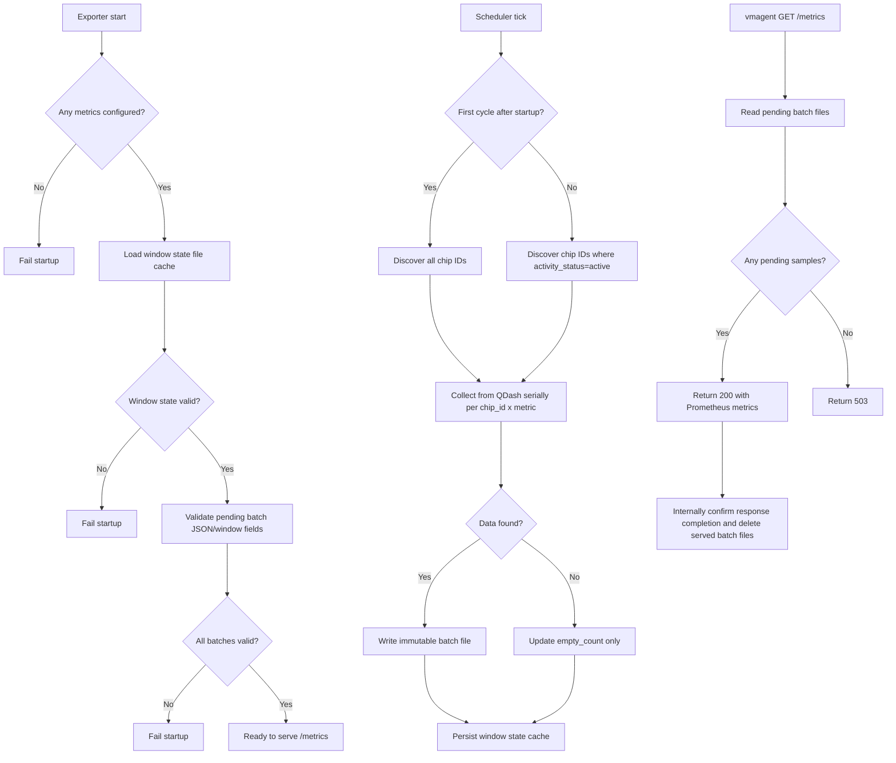
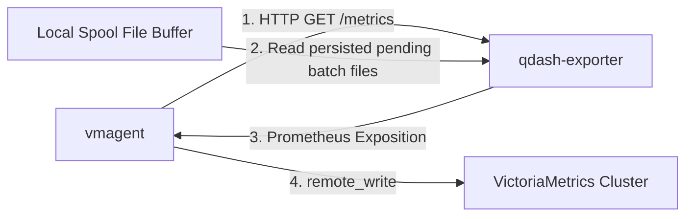
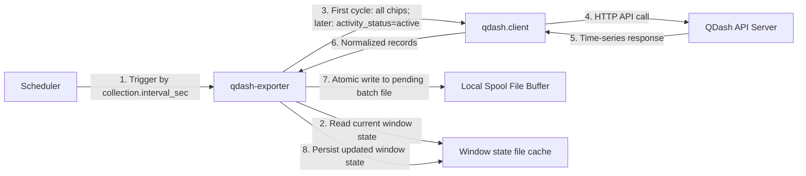
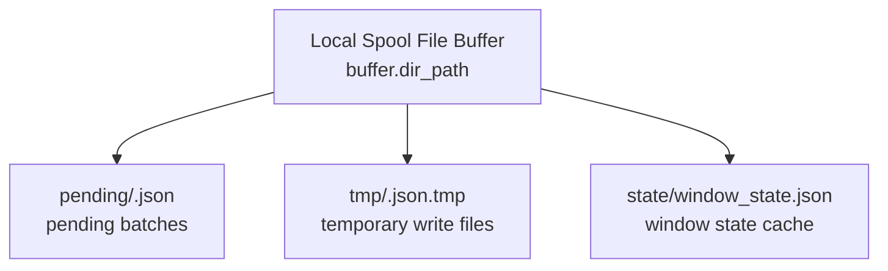

# Detailed design: custom exporter for QDash calibration metrics

## 1. Overview

This exporter responds to pull requests from `vmagent` by returning calibration metrics that were collected from QDash in advance and persisted in the Local Spool File Buffer. It collects per-qubit and per-coupling metric values through `qdash.client`, stores the normalized results durably inside the exporter, and serves buffered data in Prometheus format which is supported by `vmagent`. The implementation uses Python's `prometheus_client` library to build a custom exporter. This document provides the detailed design specifications for the exporter.

### 1.1 Key features and design principles

- This exporter is containerized
- Data source access is performed only by a scheduled background collector, never by the `/metrics` request path
- QDash access is implemented through `qdash.client.QDashClient`
- The collector runs every configured interval (default: 1 hour)
- On exporter startup, only the first collection cycle fetches all chip IDs; from the second cycle onward, only chips with `activity_status=active` are collected
- Each collection cycle executes QDash requests serially for each target `chip_id × metric` combination
- Collected records are written to immutable local spool files in the Local Spool File Buffer before they become visible to `/metrics`
- The collector uses a configurable retry count per request
- After retry exhaustion, the collector applies the same window expansion strategy as `cryo-metrics-exporter`
- Window state is persisted in a local file cache per `chip_id × metric` combination and reused across process restarts
- The `/metrics` endpoint returns only data that already exists in the Local Spool File Buffer
- Buffered files are deleted only after internal confirmation that `/metrics` response processing completed successfully
- Even after exporter shutdown, both local spool files and window state are retained on persistent storage and reused after restart
- Timestamps attached to metrics come from QDash time-series data and are converted to UTC UNIX epoch milliseconds

### 1.2 Note on window semantics

- A window is a half-open interval `[from, to)` per `chip_id × metric` combination.
- Length = `collection.interval_sec × w`, where `w = min(empty_count + 1, max_expand_windows)`.
- On empty data or upstream request failures after all retry attempts are exhausted: `empty_count++` and the next scheduled collection expands the window backward in time.
- On success (`data_count > 0`): `empty_count` resets to `0`, so the next window returns to `w = 1`.
- Upon reaching the upper bound, older intervals are discarded and only the latest `max_expand_windows` intervals are considered.
- Window state is managed independently for each `chip_id × metric` combination and persisted in the file cache.
- Because expanded windows may overlap previously buffered timestamps, duplicate timestamps are allowed; VictoriaMetrics handles them with last-write-wins semantics.
- See section `3.3 Scheduled collection and window expansion` for details.

**Example**:
For the case of `collection.interval_sec=3600`, `collection.max_expand_windows=3`

```text
w=1: now |<------------- 1 hour ------------->|
w=2: now |<------------------- 2 hours ------------------->|
w=3: now |<-------------------------------- 3 hours -------------------------------->|
```

### 1.3 Flow chart of the exporter



### 1.4 Scope and constraints

**In scope:**

- Scheduled background collection from QDash API for per-qubit and per-coupling calibration metrics
- Local persistent buffering of collected metrics in JSON format
- Prometheus metric exposition through `/metrics` endpoint
- Retry logic with configurable retry count for transient upstream failures
- Window expansion mechanism for handling consecutive empty collections
- Per-`chip_id × metric` state management and persistence

**Out of scope:**

- End-to-end delivery guarantee to downstream VictoriaMetrics (exporter-local buffering only)
- Real-time metric collection (metrics are pre-collected on a scheduled interval)
- Metric transformation beyond value type validation and normalization
- QDash API caching or request batching beyond serial per-combination fetching
- Authorization or authentication (delegated to `qdash.client` configuration)

**Key constraints:**

- Requires persistent storage (`buffer.dir_path`) for metric buffering and state persistence across container restarts
- QDash requests executed serially (one request in flight at a time in case of large numbers of chips/metrics or long response times)
- Window state persisted per-combination; no cross-combination state aggregation
- Startup validation required to detect and fail on corrupted local cache or window state

### 1.5 Assumptions and dependencies

**Dependencies:**

- [`qdash.client`](https://pypi.org/project/qdash-client): QDash API client library for time-series data fetching and chip discovery
- `prometheus_client`: Python library for Prometheus metrics exposition format
- Persistent storage backend (e.g., host bind mount or persistent volume) for `buffer.dir_path`

**Assumptions:**

- QDash API `/metrics/config` endpoint is available and returns consistent metric catalogs
- QDash API chip discovery mechanism supports `activity_status` filtering
- Operator is responsible for `qdash.client` configuration (auth, TLS, proxy, timeout settings)
- Persistent storage is reliable and survives container lifecycle events (stop/start, recreate, node migration)
- `vmagent` scrapes `/metrics` endpoint on a regular schedule (e.g., once per minute) as configured
- Batch files once written to `pending` directory remain readable until deletion

### 1.6 Non-functional requirements

| Aspect               | Requirement                                                                                                     | Notes                                                                                           |
| -------------------- | --------------------------------------------------------------------------------------------------------------- | ----------------------------------------------------------------------------------------------- |
| **Availability**     | Exporter remains operational during upstream QDash failures for at least `max_expand_windows` collection cycles | Window expansion keeps data freshness; `/metrics` returns 503 only when no buffered data exists |
| **Data retention**   | Buffered data persisted across exporter process restart/recreate cycles                                         | Requires persistent storage; operator must configure backup/archival separately                 |
| **Latency (scrape)** | `/metrics` response completes within configured `vmagent` timeout (typically 30-60 seconds)                     | Response time is O(batch_count) for file I/O only; no blocking QDash requests                   |
| **Throughput**       | Handles qubit/coupling metric counts up to 100s of records per collection cycle                                 | Performance depends on file I/O and JSON parsing speed, not QDash request rate                  |
| **Reliability**      | No data loss during successful `/metrics` response completion to `vmagent`                                      | Exporter-local only; downstream write failures not guaranteed to be replayed                    |
| **Consistency**      | Window state consistent with pending batch file set                                                             | Validated at startup; atomic updates to window state file using rename                          |
| **Recoverability**   | Exporter startup fails fast with clear error if local cache is corrupt                                          | Operator required to manually inspect and repair `buffer.dir_path` state                        |

## 2. Architecture

### 2.1 Positioning of this system



### 2.1.1 Independent scheduled pull from QDash



This diagram illustrates the data flow for metrics collection and delivery:

In this flow, `qdash-exporter` returns metrics by reading data that has already been persisted in local spool files under `buffer.dir_path` (for example, `pending` batch files). The `/metrics` path does not fetch directly from QDash.

- **`vmagent` to `qdash-exporter`**:

  `vmagent` periodically sends an HTTP GET request to the `/metrics` endpoint of the `qdash-exporter`.

- **`qdash-exporter` pull path**:

  Upon receiving the request, the exporter reads already-collected batch files from the Local Spool File Buffer and converts them into Prometheus exposition format. The pull path does not call QDash.

- **`qdash-exporter` scheduled collector**:

  Independently from scraping, the exporter runs a background collection cycle at the configured interval. Only the first cycle after startup uses all chip IDs; later cycles use only chips with `activity_status=active`.

- **`vmagent` to `VictoriaMetrics Cluster`**:

  `vmagent` forwards the scraped metrics to the central `VictoriaMetrics Cluster`.

- **Batch deletion policy inside exporter**:

  The exporter performs internal best-effort confirmation only. It deletes served batch files after successful `/metrics` response completion on the exporter side. This does not prove downstream `remote_write` success.

### 2.2 Processing flow

- On startup, the exporter validates that at least one metric is configured; otherwise startup fails
- On startup, the exporter loads per-combination window state from the local file cache
- On startup, the exporter validates JSON/schema and window field consistency of pending local spool batch files before serving `/metrics`
- A background scheduler wakes up every `collection.interval_sec`
- Only the first collection cycle after startup targets all chip IDs
- From the second cycle onward, only `activity_status=active` chip IDs are targeted
- For each targeted `chip_id` and configured `metric`, the exporter computes the current collection window from its per-combination `empty_count` state
- The exporter uses `qdash.client.QDashClient.get_task_results_timeseries()` to fetch data for that window
- Requests are executed serially; only one QDash request is in flight at a time
- If data is returned, the exporter normalizes the result and writes an immutable batch file to local storage
- If the result is empty, or if all retry attempts fail with an upstream request failure, no batch file is written and `empty_count` is incremented for that combination
- If the result is successful and non-empty, `empty_count` is reset to `0`
- After each cycle, the exporter persists updated window state to the local file cache
- `vmagent` scrapes `/metrics`; the exporter reads all pending batch files and returns them in Prometheus exposition format
- Pending batches for metrics removed from current config are retained in local spool and are not returned to `vmagent`
- After successful `/metrics` response completion, the exporter deletes the served batch files

### 2.3 Configuration

The exporter is configured primarily via a YAML file. For flexibility in containerized environments, any setting in the YAML file can be overridden by a corresponding environment variable.

#### 2.3.1 Configuration File (`config.yaml`)

The exporter loads its configuration from a YAML file (e.g., `./config/config.yaml`) specified by the `QDASH_EXPORTER_CONFIG_PATH` environment variable.

**Example `config.yaml`:**

```yaml
# Basic exporter settings
exporter:
  port: 9104
  timezone: "Asia/Tokyo"

# Background collection settings
collection:
  interval_sec: 3600
  retry_max_attempts: 3
  max_expand_windows: 24
  tag: "calibration"

# Local durable buffer
buffer:
  dir_path: "./data/qdash-buffer"

# qdash.client bootstrap
qdash_client:
  config_file: ""
  config_section: "default"

# Target metrics to collect
targets:
  # At least one metric must be configured across qubit_metrics and coupling_metrics.
  qubit_metrics:
    - "readout_frequency"
    - "qubit_frequency"
    - "anharmonicity"
    - "t1"
    - "t1_average"
    - "t2_echo"
    - "t2_echo_average"
    - "t2_star"
    - "average_readout_fidelity"
    - "average_gate_fidelity"
    - "x90_gate_fidelity"
    - "x180_gate_fidelity"
    - "maximum_rabi_frequency"
    - "hpi_amplitude"
    - "hpi_length"
    - "one_qubit_gate_coherence_limit"
  coupling_metrics:
    - "zx90_gate_fidelity"
    - "bell_state_fidelity"
    - "zx90_gate_time"
    - "two_qubit_gate_coherence_limit"
    - "static_zz_interaction"
```

**Important notes**:

- QDash connection, authentication, TLS, proxy, and timeout settings are provided through `qdash.client` configuration.
- Typical client-side settings include `QDASH_BASE_URL`, `QDASH_API_TOKEN`, `QDASH_PROJECT_ID`, or legacy username/password settings such as `QDASH_USERNAME` and `QDASH_PASSWORD`.
- The exporter must be able to create and delete files under `buffer.dir_path`.
- `buffer.dir_path` must point to persistent storage (for example, a host bind mount or persistent volume), not ephemeral container filesystem, so buffered data survives container restart/recreate.
- At least one metric must be configured across `targets.qubit_metrics` and `targets.coupling_metrics`; if both are omitted or empty, exporter startup fails.
- If new metric types are introduced in QDash, operators must update `config.yaml` (the `targets` metric lists) and restart the exporter to start collecting them.

#### 2.3.2 Configuration Parameters

| Parameter                       | YAML Path                       | Environment Variable            | Description                                                                                                                                                              | Required | Default       |
| ------------------------------- | ------------------------------- | ------------------------------- | ------------------------------------------------------------------------------------------------------------------------------------------------------------------------ | :------: | ------------- |
| **Exporter Port**               | `exporter.port`                 | `EXPORTER_PORT`                 | The port on which the exporter will listen for `/metrics` requests.                                                                                                      |    No    | `9104`        |
| **Exporter Timezone**           | `exporter.timezone`             | `EXPORTER_TIMEZONE`             | The timezone for logging timestamps.                                                                                                                                     |    No    | `UTC`         |
| **Collection Interval**         | `collection.interval_sec`       | `COLLECTION_INTERVAL_SEC`       | How often the background collector runs.                                                                                                                                 |    No    | `3600`        |
| **Retry Max Attempts**          | `collection.retry_max_attempts` | `COLLECTION_RETRY_MAX_ATTEMPTS` | Maximum retry attempts per QDash request before applying window expansion on the next cycle.                                                                             |    No    | `3`           |
| **Max Expand Windows**          | `collection.max_expand_windows` | `COLLECTION_MAX_EXPAND_WINDOWS` | Maximum number of collection windows retained in the backward expansion logic.                                                                                           |    No    | `24`          |
| **Collection Tag**              | `collection.tag`                | `COLLECTION_TAG`                | Optional tag passed to `qdash.client` when requesting time-series data.                                                                                                  |    No    | `calibration` |
| **Buffer Directory**            | `buffer.dir_path`               | `BUFFER_DIR_PATH`               | Directory where immutable batch files are stored.                                                                                                                        |   Yes    | -             |
| **QDash Client Config File**    | `qdash_client.config_file`      | `QDASH_CLIENT_CONFIG_FILE`      | Optional path to a `qdash.client` config file. If empty, `qdash.client` uses its default lookup behavior.                                                                |    No    | `""`          |
| **QDash Client Config Section** | `qdash_client.config_section`   | `QDASH_CLIENT_CONFIG_SECTION`   | Section name within the `qdash.client` config file.                                                                                                                      |    No    | `default`     |
| **Qubit Metrics**               | `targets.qubit_metrics`         | `TARGETS_QUBIT_METRICS`         | Comma-separated list of qubit metric names to collect. Required as part of the target metrics configuration (at least one of qubit/coupling lists must be non-empty).    |   Yes    | -             |
| **Coupling Metrics**            | `targets.coupling_metrics`      | `TARGETS_COUPLING_METRICS`      | Comma-separated list of coupling metric names to collect. Required as part of the target metrics configuration (at least one of qubit/coupling lists must be non-empty). |   Yes    | -             |

Note: for target metrics, one-of-two required applies: at least one of `targets.qubit_metrics` or `targets.coupling_metrics` must be non-empty.

#### 2.3.3 Environment Variables

| Variable                             | Required | Default value           | Type | Explanation                                      |
| ------------------------------------ | :------: | ----------------------- | ---- | ------------------------------------------------ |
| `QDASH_EXPORTER_CONFIG_PATH`         |    No    | `./config/config.yaml`  | str  | Path to the YAML configuration file.             |
| `QDASH_EXPORTER_LOGGING_CONFIG_PATH` |    No    | `./config/logging.yaml` | str  | Path to the YAML configuration file for logging. |
| `QDASH_EXPORTER_LOGGING_DIR_PATH`    |    No    | `./logs`                | str  | Path to the log file storage.                    |

The exporter also relies on `qdash.client` environment variables or config-file settings for the actual QDash connection, authentication, TLS, proxy, and timeout settings.

Chip IDs are discovered dynamically from QDash by the exporter. Only the first cycle after startup targets all chips; later cycles target chips with `activity_status=active`.

## 3. Detailed specifications

### 3.1 Data extraction

- Data source: QDash API accessed through `qdash.client.QDashClient`
- Chip targeting: first cycle after startup collects all chip IDs; later cycles collect chips with `activity_status=active`
- Metric catalog: `/metrics/config` is used to validate configured metrics and retrieve metric metadata (it does not auto-enable collection targets)
- Primary method: `get_task_results_timeseries(...)`
- Acquisition mode: scheduled background collection only
- Execution order: serial over all targeted `chip_id × metric` combinations
- Request range: one logical collection window `[from, to)` per combination
- Acquired data: time-series records with source timestamps and metric values

### 3.2 Behavior from the perspective of `vmagent`

- Endpoint: `/metrics` (HTTP GET)
- Response format: Prometheus Text Exposition Format
- Pull behavior:
  - Reads local pending batch files only
  - Returns only samples for metrics currently enabled in `targets.qubit_metrics` and `targets.coupling_metrics`
  - Pending samples for metrics disabled in current config are excluded from `/metrics` output
  - Does not trigger `qdash.client` or any outbound QDash HTTP request
- Status code:
  - **200 OK**:

    Returned when at least one buffered sample is available and the exporter can render Prometheus output.

  - **500 Internal Server Error**:

    Returned for unrecoverable exporter-local failures on the pull path, such as invalid buffer configuration, unreadable/corrupt batch metadata, or internal batch-state corruption that prevents safe serving.

  - **503 Service Unavailable**:

    Returned when there are no deliverable buffered samples. This includes the case where background collection is failing or returning empty data and the buffer has already been drained.

### 3.2.1 Rationale and monitoring guidance for 503

This exporter uses `503` as a **data-availability signal** on the pull path, not as a pure process-liveness signal.

- `200` means at least one buffered sample is currently deliverable.
- `503` means the exporter process can still be running, but there is no deliverable buffered sample at scrape time.
- `500` means an exporter-local pull-path fault (for example, buffer corruption or unreadable metadata).

Operationally, this distinction is important:

- Treat repeated `503` as a **data freshness/data continuity alert**, not necessarily as immediate process down.
- Treat `500` as an **exporter fault alert** that usually requires operator action.
- Design alert rules to avoid false positives due to short-term empty windows (for example, require consecutive failures over a time window before paging).

If strict process health monitoring is required, monitor process/container liveness separately from `/metrics` delivery status.

### 3.3 Scheduled collection and window expansion

The background collector maintains separate `empty_count` state for each `chip_id × metric` combination.

#### 3.3.1 Collection timing

- The collector runs every `collection.interval_sec`
- The default interval is 1 hour
- The first cycle after startup uses all discovered chip IDs; later cycles filter by `activity_status=active`
- If a collection cycle is still running when the next tick arrives, the exporter does not start a second cycle in parallel; the next cycle begins only after the current one completes

#### 3.3.2 Time range calculation rules

For each targeted `chip_id × metric` combination:

```python
w = min(empty_count + 1, config.collection.max_expand_windows)
from_at = now - (config.collection.interval_sec * w)
to_at = now
```

#### 3.3.3 State update logic

```python
if data_count > 0:
    empty_count = 0
elif retryable_failure_or_empty:
    empty_count = min(
        empty_count + 1,
        config.collection.max_expand_windows - 1,
    )
else:
    # exporter-local fatal condition (not an upstream request error)
    empty_count = empty_count
```

The exporter applies the following sequence for each request:

1. Attempt the QDash request.
2. If it fails with an upstream request failure, retry up to `collection.retry_max_attempts` times.
3. If all attempts still fail, treat the combination as `retryable_failure_or_empty` for window-expansion purposes.
4. Only exporter-local fatal conditions outside normal upstream request handling are excluded from window expansion.

#### 3.3.4 Example scenario

Assuming `collection.interval_sec=3600`, `collection.max_expand_windows=3`:

| Collection # | Result                                           | empty_count | Window Multiplier | Time range      |
| ------------ | ------------------------------------------------ | ----------- | ----------------- | --------------- |
| 1            | data found                                       | 0           | 1                 | `[now-1h, now)` |
| 2            | empty                                            | `0→1`       | 1                 | `[now-1h, now)` |
| 3            | upstream request failure after retries exhausted | `1→2`       | 2                 | `[now-2h, now)` |
| 4            | upstream request failure after retries exhausted | `2` (max)   | 3                 | `[now-3h, now)` |
| 5            | data found                                       | `2→0`       | 3                 | `[now-3h, now)` |
| 6            | data found                                       | 0           | 1                 | `[now-1h, now)` |

> Note: The window multiplier in each row is calculated from the pre-request `empty_count`.
>
> State update (`empty_count` reset/increment) is applied after the request result is known. For this reason, Collection #5 still uses multiplier `3` even though `empty_count` becomes `0` at the end of that collection.

### 3.4 Local spool file buffer specification

The exporter persists collected data in immutable batch files.



`pending batches` are one state/category inside the Local Spool File Buffer; they are not a separate storage system.

#### 3.4.1 File layout

- Base directory: `buffer.dir_path`
- Pending batches: `buffer.dir_path/pending/<batch_id>.json`
- Temporary writes: `buffer.dir_path/tmp/<batch_id>.json.tmp`
- A batch becomes visible only after an atomic rename from `tmp` to `pending`
- The base directory must be on non-volatile storage.
- Exporter shutdown does not clear files in `buffer.dir_path`; retained files are reused after restart.

#### 3.4.2 Batch contents

Each batch file contains:

- `batch_id`: unique identifier for tracking and deletion
- `collected_at`: UTC timestamp of the collection cycle
- `window`: `from` and `to` used for the request
- `chip_id`
- `metric`
- `records`: normalized metric samples including source timestamp, value, unit, and either `qubit_id` or `coupling_id`

**Example batch file:**

```json
{
  "batch_id": "20260611T010000Z-chip_001-t1-7f9c",
  "collected_at": "2026-06-11T01:00:00Z",
  "window": {
    "from": "2026-06-11T00:00:00Z",
    "to": "2026-06-11T01:00:00Z"
  },
  "chip_id": "chip_001",
  "metric": "t1",
  "records": [
    {
      "timestamp_ms": 1781136000000,
      "qubit_id": "0",
      "value": 45.2,
      "unit": "us"
    }
  ]
}
```

#### 3.4.2.1 Batch granularity

- One batch file corresponds to exactly one `chip_id × metric × collection window` combination
- A batch file does **not** split data into separate files per `qubit_id` or per `coupling_id`
- If a single collection result contains multiple qubit or coupling samples for the same `chip_id`, `metric`, and `window`, those samples are stored together in the same batch file under `records`
- Therefore, increasing the number of qubits or couplings increases the number of entries in `records`, not the number of batch files for that collection result

#### 3.4.3 Deletion rules

- Batch files are not deleted before the exporter has successfully completed a `/metrics` response that includes those samples
- The exporter performs internal best-effort confirmation only (response completion on exporter side)
- After internal confirmation, only served batch files are deleted from `pending`
- Batch files for metrics currently disabled in config are not served and are excluded from the normal delete-after-serve flow
- This policy does not prove `vmagent` `remote_write` success to downstream storage

#### 3.4.4 Disabled-metric retention policy

- If a metric is removed from `config.yaml` targets, existing pending batches for that metric remain in local spool
- Those retained batches are excluded from `/metrics` output while the metric stays disabled
- If the metric is re-enabled later, retained batches are eligible for normal serving again
- Retained disabled-metric batches are not auto-deleted by the normal serve/delete flow

> Note (risk): Disabled-metric batches can accumulate over time and consume persistent storage because they are intentionally excluded from normal serve/delete flow.

#### 3.4.5 Window state file cache

- Cache file path: `buffer.dir_path/state/window_state.json`
- Temporary write path: `buffer.dir_path/state/window_state.json.tmp`
- The exporter updates window state using atomic rename from `*.tmp` to `window_state.json`
- Cache key: `chip_id + metric`
- Cache value: at least `empty_count`, `last_window_from`, `last_window_to`, and `updated_at`
- On startup, if the state file exists and is valid, the exporter loads it and resumes window expansion state
- Startup validation for window state includes at least:
  - required keys and value types
  - `empty_count` range (`0 <= empty_count <= max_expand_windows - 1`)
  - window ordering (`last_window_from < last_window_to`)
  - parseable UTC timestamp fields (`last_window_from`, `last_window_to`, `updated_at`)
- If the cache file is missing, the exporter starts with empty in-memory state
- If the cache file is corrupt, exporter startup fails and the process exits with a local state error until operator intervention
- The state cache must be stored under the same persistent `buffer.dir_path` volume so restart/recreate keeps per-`chip_id × metric` window state.
- Exporter shutdown does not clear `window_state.json`; cached window size/state is reused after restart.

#### 3.4.6 Startup validation of local spool JSON cache

- At startup, the exporter scans `buffer.dir_path/pending/*.json` and validates each file as JSON plus required batch schema fields (`batch_id`, `collected_at`, `window`, `chip_id`, `metric`, `records`)
- At startup, the exporter also validates batch `window` fields (`window.from`, `window.to`) for parseability and ordering (`from < to`)
- Validation also checks basic type/shape constraints for `records` entries (for example, presence/type of `timestamp_ms`, `value`, and one of `qubit_id` or `coupling_id`)
- If a record-level timestamp exists, it must be within the batch window bounds or be explicitly rejected by validation policy
- If any pending batch file is unreadable, malformed, or schema-invalid, startup fails with a local state error until operator intervention
- This startup validation is performed in addition to window-state cache validation (`state/window_state.json`)

### 3.5 Data transformation

- Each QDash time-series record is converted into a Prometheus gauge sample
- `timestamp_ms` is derived from `calibrated_at` in `/task-results/timeseries`
- `value` uses the numeric `value` field from `/task-results/timeseries`
- `value_type` must be numeric-compatible; otherwise the record is skipped and logged as warning
- `value_type` is not used as a Prometheus label, because it splits one physical metric into multiple series and makes queries harder without meaningful observability gain
- If `error` exists in a qubit metric sample, the exporter emits a separate gauge sample named `{metric}_error` with the same labels and timestamp as the base metric sample
- `error` is never stored as a label value (to avoid high cardinality)
- `description` is optional metadata from QDash and is not emitted as a Prometheus sample value or label
- `qubit_id` or `coupling_id` is derived from `qid_role` (or equivalent role identifier in the response)
- `null` values are skipped (no sample emitted)
- Non-numeric values are skipped and logged as warnings
- `NaN` and `Infinity` values are skipped and logged as warnings
- Records without a valid source timestamp are skipped and logged as warnings
- No unit conversion is performed; values are stored as-is from QDash
- The `unit` field from QDash is used as a label value; if absent, the label value is set to `""`

### 3.6 Output metrics specification

Metric names are generated from the configured/discovered metric set. The table below is representative and not exhaustive.

For qubit metrics, when QDash returns `error`, the exporter also emits a paired metric with suffix `_error` (for example, `qdash_qubit_t1_error`) using the same labels and timestamp.

| Metric Name                    | Labels                                       | Type  | Description              |
| ------------------------------ | -------------------------------------------- | ----- | ------------------------ |
| `qdash_qubit_t1`               | `chip_id="...",qubit_id="...",unit="..."`    | gauge | T1 relaxation time       |
| `qdash_qubit_t2_echo`          | `chip_id="...",qubit_id="...",unit="..."`    | gauge | T2 echo coherence time   |
| `qdash_qubit_t2_star`          | `chip_id="...",qubit_id="...",unit="..."`    | gauge | T2\* dephasing time      |
| `qdash_qubit_frequency`        | `chip_id="...",qubit_id="...",unit="..."`    | gauge | Qubit resonant frequency |
| `qdash_qubit_anharmonicity`    | `chip_id="...",qubit_id="...",unit="..."`    | gauge | Anharmonicity            |
| `qdash_qubit_readout_fidelity` | `chip_id="...",qubit_id="...",unit="..."`    | gauge | Average readout fidelity |
| `qdash_qubit_x90_fidelity`     | `chip_id="...",qubit_id="...",unit="..."`    | gauge | X90 gate fidelity        |
| `qdash_qubit_x180_fidelity`    | `chip_id="...",qubit_id="...",unit="..."`    | gauge | X180 gate fidelity       |
| `qdash_coupling_zx90_fidelity` | `chip_id="...",coupling_id="...",unit="..."` | gauge | ZX90 gate fidelity       |
| `qdash_coupling_bell_fidelity` | `chip_id="...",coupling_id="...",unit="..."` | gauge | Bell state fidelity      |
| `qdash_coupling_static_zz`     | `chip_id="...",coupling_id="...",unit="..."` | gauge | Static ZZ interaction    |

#### 3.6.1 Timestamp handling

- Timestamps are taken from the QDash time-series records, not from the scrape time
- Each timestamp is converted to UTC UNIX epoch in milliseconds before being written to the batch file
- Duplicate timestamps across overlapping windows are allowed; VictoriaMetrics records them with last-write-wins semantics

### 3.7 Output label specification

#### Labels of the metrics

**Common labels:**

- `chip_id`

  The chip identifier as returned by QDash.

- `unit`

  The physical unit of the metric as returned by QDash. If QDash does not provide a unit, the label value is set to `""`.

The current label set is intentionally minimal for stable time-series cardinality. High-cardinality identifiers such as `execution_id` and `task_id` are not used as Prometheus labels. Descriptive text fields such as `description` are also not stored as labels or metric metadata.

**Qubit metric labels:**

- `qubit_id`

  The qubit identifier associated with the sample.

**Coupling metric labels:**

- `coupling_id`

  The coupling identifier associated with the sample.

### 3.8 Collection execution model

**Execution model:**

- All QDash requests are executed serially through `qdash.client`
- Chip discovery rule: first cycle after startup uses all chips, later cycles use only `activity_status=active`
- The exporter owns the outer retry loop so that window-expansion behavior remains deterministic
- To avoid double retries, the `qdash.client` transport-level retry setting should be effectively disabled or set to a single attempt inside the exporter process
- Each `chip_id × metric` combination has independent retry and `empty_count` state
- Window state (`empty_count` and derived window range) is persisted in the window state file cache
- A failure in one combination does not prevent the collector from processing the remaining combinations in the same cycle unless the exporter itself becomes unrecoverable

## 4. External interface

### 4.1 Access from `vmagent`

- URL: `http://<exporter_host>:<port>/metrics`
- HTTP method: GET
- Authorization: None
- Timeout: set by `vmagent`
- Behavior: returns only pending buffered metrics and never triggers outbound QDash communication

### 4.2 Internal confirmation and deletion behavior

- The exporter has no external acknowledgement endpoint
- After `/metrics` returns `200`, the exporter performs internal completion checks and deletes the served batch files
- Deletion is local to the exporter and based on exporter-side observation only
- This behavior is a best-effort policy and does not verify downstream `remote_write` completion

### 4.2.1 Delivery guarantee boundary (important)

This design provides exporter-local best-effort delivery only. End-to-end delivery to downstream storage is not guaranteed by the exporter.

- Guaranteed boundary: the exporter can confirm only that it finished returning a `200` response on its own `/metrics` endpoint.
- Not guaranteed: successful ingestion into VictoriaMetrics after `vmagent` `remote_write`.
- Risk implication: if downstream write fails after scrape success, already-deleted local batch files **cannot** be replayed by this exporter.

Operational note:

- Treat this exporter as a buffered scrape source, not as an end-to-end durable queue.
- Monitor `vmagent` `remote_write` health separately and alert on sustained write failures.
- If stronger guarantees are required, add an external acknowledgement/replay mechanism outside the current scope.

### 4.3 QDash client integration

#### 4.3.1 Client bootstrap

- The exporter instantiates `qdash.client.QDashClient`
- If `qdash_client.config_file` is set, the exporter loads `QDashConfig.from_file(section=qdash_client.config_section)`
- Otherwise, the exporter uses `QDashConfig.from_env()` or the `QDashClient()` default loading behavior

#### 4.3.2 Collection API

- Metrics catalog API: `/metrics/config` (returns available `qubit_metrics` and `coupling_metrics` dictionaries)
- Chip discovery API: an API that can enumerate chip IDs and `activity_status`
- Chip discovery filter:
  - First cycle after startup: no status filter (all chip IDs)
  - Later cycles: `activity_status=active`
- Primary timeseries API: `QDashClient.get_task_results_timeseries(...)` (backed by `/task-results/timeseries`)
- Required request parameters:
  - `chip_id`
  - `parameter` (the configured metric name)
  - `start_at`
  - `end_at`
- Optional request parameter:
  - `tag` (from `collection.tag`)

#### 4.3.3 Timeseries response normalization

- Source response fields: `value`, `value_type`, `error`, `unit`, `calibrated_at`, `qid_role`
- Normalized sample mapping:
  - `timestamp_ms` <- `calibrated_at` (UTC epoch milliseconds)
  - `value` <- `value`
  - `unit` <- `unit`
  - `qubit_id` or `coupling_id` <- `qid_role`
  - if `error` exists for a qubit metric: emit `{metric}_error` with the same labels and `timestamp_ms`
- Validation:
  - Missing/invalid `calibrated_at` -> skip record and log warning
  - Non-numeric `value` or non-numeric-compatible `value_type` -> skip record and log warning
  - Non-numeric `error` -> skip only `{metric}_error` sample and log warning

#### 4.3.4 Error handling

| Error Type from `qdash.client`                                                                                                           | Retry                                       | Collector Behavior                            | Effect on `/metrics`                                    |
| ---------------------------------------------------------------------------------------------------------------------------------------- | ------------------------------------------- | --------------------------------------------- | ------------------------------------------------------- |
| Successful response with data                                                                                                            | -                                           | Normalize data and write batch file           | Buffered data becomes visible on next scrape            |
| Successful response with empty data                                                                                                      | No immediate retry                          | No batch file; increment `empty_count`        | Existing buffered data is still served; otherwise `503` |
| Any upstream request failure from `qdash.client` (including timeout, `408`, `429`, `5xx`, auth/validation/not-found, or network failure) | Retry up to `collection.retry_max_attempts` | If all attempts fail, increment `empty_count` | Existing buffered data is still served; otherwise `503` |

Every error must be logged for debugging.

#### 4.3.5 Retryability classification note

The policy is intentionally simple: treat upstream request failures in the same way as `cryo-metrics-exporter`.

- First, retry up to `collection.retry_max_attempts`.
- If retries are exhausted, increment `empty_count` and expand the window on the next cycle.
- Do not treat upstream request failures as immediate exporter-local `500` conditions.

Only exporter-local failures on the pull path (for example, invalid/corrupt local buffer state) are handled as `500`.

### 4.4 Data validation

All values returned from QDash are validated before conversion to Prometheus metrics:

**Value validation:**

- `null` values are skipped (no sample emitted)
- Non-numeric values are skipped and logged as warnings
- `NaN` and `Infinity` values are skipped and logged as warnings
- Records with missing or invalid timestamps are skipped and logged as warnings

**Invalid data handling:**

- Invalid entries are skipped; valid entries in the same response are still processed
- If all entries are invalid or empty, no batch file is emitted for that `chip_id × metric` combination
- Log all invalid entries for debugging

## 5. Logging

The logging configuration is defined in a separate `logging.yaml` file, which is compatible with Python's `logging.config.dictConfig`. The exporter reads this file at startup to configure formatters, handlers, and log levels.

The path to the logging configuration file can be specified using the `QDASH_EXPORTER_LOGGING_CONFIG_PATH` environment variable on the host machine of this container. If unset, the default path is `./config/logging.yaml`.

The log file storage directory references the host-side `QDASH_EXPORTER_LOGGING_DIR_PATH`. If unset, it defaults to `./logs`.

The exporter must log at least the following events:

- Scheduler start and end of each collection cycle
- Startup metric validation result (including failure when no metric is configured)
- Chip discovery mode per cycle (first cycle all chips or later active-only)
- Computed window per `chip_id × metric`
- Window state cache load and save results
- Retry attempts and their causes
- Batch-file creation and deletion
- Pull-path failures such as unreadable or corrupt buffer files
- Upstream request failures from `qdash.client` and retry outcomes
