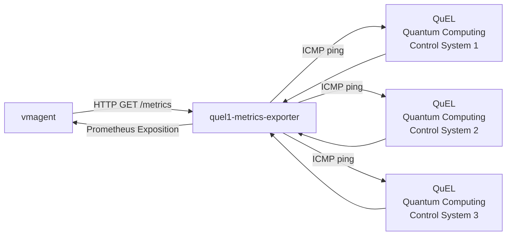

# Detailed design: custom exporter for the QuEL controlling machine

## 1. Overview

This exporter responds to pull requests from `vmagent` by retrieving time-series data from [QuEL controlling machine](https://quel-inc.com/product/).

For this custom-exporter, it only performs state monitoring via `ping` command, because Python connectivity is not supported.

The implementation uses Python's `prometheus_client` library to build a custom exporter.
This document provides the detailed design specifications for the exporter.

### 1.1 Key features and design principles

- This exporter is containerized
- Data Source: [QuEL Quantum Computing Control System](https://quel-inc.com/product/)
- Access the data source upon each `/metrics` request from `vmagent`
- If the server does not respond, return the metric value '1' to `vmagent`. Otherwise, return '0'
- The host machine must refer to `NTP` server which is consistent with the machine of `vmagent` and the _Data source_
- Timezone should be specified

## 2. Architecture

### 2.1 Positioning of this system



### 2.2 Processing flow

- `vmagent` periodically sends `/metrics` requests via HTTP GET
- On each request, the exporter triggers a ping cycle for all configured targets
- Ping operations are executed concurrently using ThreadPoolExecutor
- Results are stored in Prometheus Gauge metrics
- Metrics are returned in Prometheus Text Exposition Format

### 2.3 Configuration

The exporter is configured via a YAML file. For flexibility in containerized environments, any value in the YAML file can be overridden by a corresponding environment variable.

#### 2.3.1 Configuration Loading

The path to the configuration file can be specified using the `QUEL1_EXPORTER_CONFIG_PATH` environment variable in the host machine of this container. If not set, the default path is `./config/config.yaml`.

The final configuration values are determined by the following order of precedence (from highest to lowest):

1. **Environment Variables** (e.g., `EXPORTER_PORT`)
2. Values from the **YAML configuration file**
3. **Default values** hardcoded in the application

#### 2.3.2 Example `config.yaml`

The configuration file defines the exporter port, ping settings, and target machines.

```yaml
# ./config/config.yaml
exporter:
  port: 9102
  timezone: "Asia/Tokyo"

ping:
  timeout: 5
  count: 3
  # Target definitions.
  # You must define targets inline.
  # "name" will be the label of `target_host` for the metrics
  targets:
    - name: "target_machine_1"
      controller_type: "quel1"
      ip: "ip.address.of.target_machine_1"
    - name: "target_machine_2"
      controller_type: "quel1"
      ip: "ip.address.of.target_machine_2"
    # ... more targets
```

_\*Note: `ping.targets` must contain at least one target._

#### 2.3.3 Configuration Parameters

| Parameter             | YAML Path           | Environment Variable | Description                                                                 | Required | Default |
| :-------------------- | :------------------ | :------------------- | :-------------------------------------------------------------------------- | :------: | :------ |
| **Exporter Port**     | `exporter.port`     | `EXPORTER_PORT`      | The network port on which the exporter will listen.                         |    No    | `9102`  |
| **Exporter Timezone** | `exporter.timezone` | `SERVER_TIMEZONE`    | The timezone of the exporter, which is used to append timestamp             |    No    | `UTC`   |
| **Ping Timeout**      | `ping.timeout`      | `PING_TIMEOUT`       | Timeout in seconds for determining ping success/failure.                    |    No    | `5`     |
| **Ping Count**        | `ping.count`        | `PING_COUNT`         | Number of ICMP echo request packets to send to each target per health check |    No    | `3`     |
| **Ping Targets**      | `ping.targets`      | -                    | Targets to monitor                                                          |   Yes    | -       |

#### 2.3.4 Example in `compose.yml`

```yaml
services:
  quel1-metrics-exporter:
    image: quel1-metrics-exporter:latest
    volumes:
      - ${QUEL1_EXPORTER_CONFIG_PATH:-./config/config.yaml}:/config/config.yaml:ro
      - ${QUEL1_EXPORTER_LOGGING_CONFIG_PATH:-./config/logging.yaml}:/config/logging.yaml:ro
      - ${QUEL1_EXPORTER_LOGGING_DIR_PATH:-./logs}:/logs
    environment: # prioritized over config.yaml if set
      - EXPORTER_PORT=9102
      - PING_TIMEOUT=5
      - PING_COUNT=3
```

## 3. Detailed specifications

### 3.1 Data extraction

- Running state monitoring: retrieves via `ping` command

### 3.2 Behavior from the perspective of `vmagent`

- endpoint: `/metrics` (HTTP GET)
- response format: Prometheus Text Exposition Format
- Status code:
  - Success: 200 OK
  - Internal server Error: 500

#### 3.3 Output metrics specification

This section defines all metrics exposed by the custom exporter.
Each metric represents a specific operational parameter of the dilution refrigerator and is returned in Prometheus Text Exposition Format when `vmagent` pulls the `/metrics` endpoint.

For each QuEL controlling machine, the same metrics are collected by this exporter.

For the implementation guide, refer to the [document](https://betterstack.com/community/guides/monitoring/prometheus-python-metrics/).

##### `qubit_controller_ping_status_code`

Binary indicator of QuEL machine reachability via ICMP `ping`.

| Metric Name                         | Type  | Unit | Notes                          |
| ----------------------------------- | ----- | ---- | ------------------------------ |
| `qubit_controller_ping_status_code` | gauge | -    | 0 = reachable, 1 = unreachable |

**_Important Note_**:  
In contrast to `cryo-metrics-exporter`, the timestamps of **metrics** depend on the timestamps from `vmagent`.

#### 3.4 Output label specification

##### **Labels of the metrics**

**Common labels**:

- `target_host`

  The target to check the `ping` state. This reads `ping.targets.name` configurations.

- `target_ip`

  The target to check the `ping` state. This reads `ping.targets.ip` configurations.

- `controller_type`

  The target to check the `ping` state. This reads `ping.targets.controller_type` configurations.

  ex: `controller_type="quel1"`

## 4. Logging

The logging configuration is defined in a separate `logging.yaml` file, which is compatible with Python's `logging.config.dictConfig`. The exporter reads this file at startup to configure formatters, handlers, and log levels.

The path to the logging configuration file can be specified using the `QUEL1_EXPORTER_LOGGING_CONFIG_PATH` environment variable on the host machine of this container. If not set, the default path is `./config/logging.yaml`.

The log file storage directory references the host-side `QUEL1_EXPORTER_LOGGING_DIR_PATH`. If unset, it defaults to `./logs`.

For the detailed logging configuration and format, refer to [`logging.yaml`](../../custom_exporters/quel1_metrics_exporter/config/logging.yaml).
