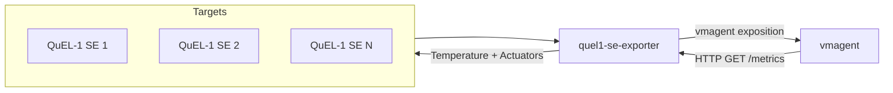
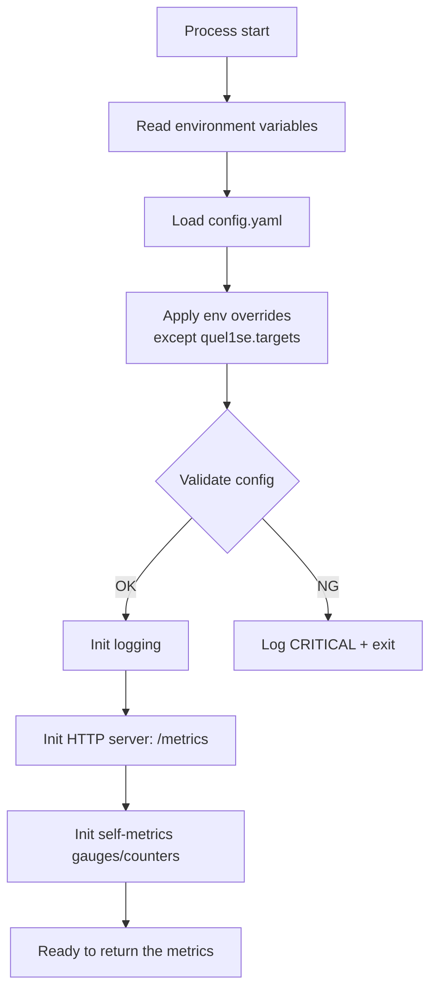
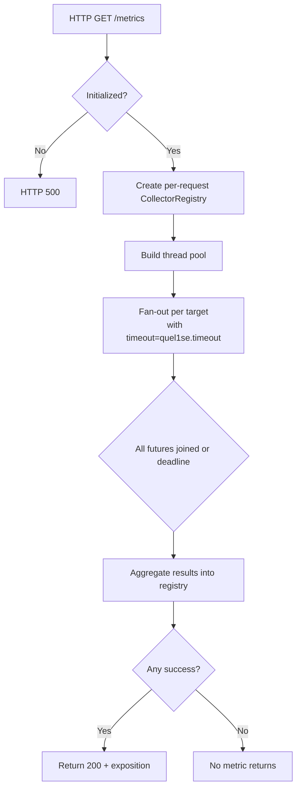
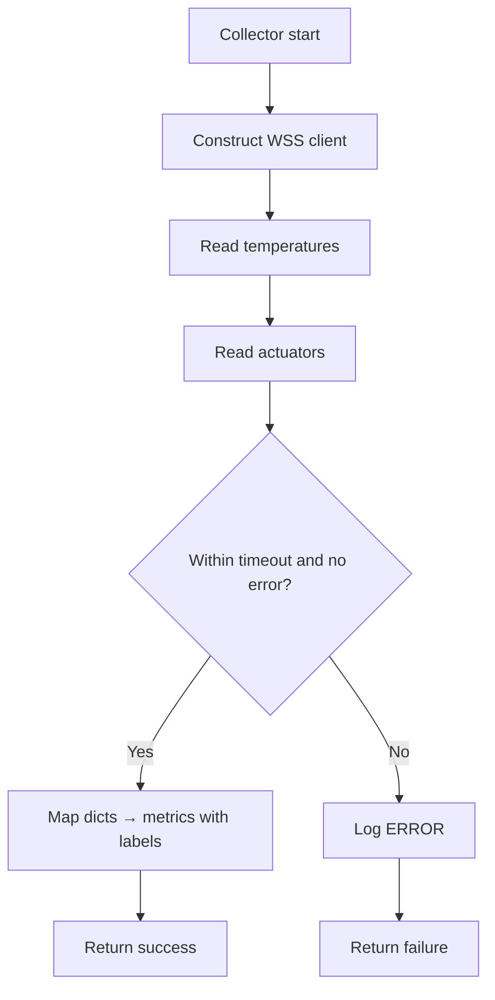

# Detailed design: custom exporter for QuEL controlling machines (with QuEL‑1 SE temperature)

## 1. Overview

This custom exporter responds to pull requests from vmagent by collecting:

- For QuEL‑1 SE targets, temperature and actuator state via `quel_ic_config` WSS APIs in the same scrape

The exporter is containerized and uses Python’s prometheus_client. It loads configuration from YAML and supports environment-variable overrides. Timestamps of metrics are assigned by `vmagent`; the exporter does not append its own timestamps. The host should be time-synchronized (e.g., via NTP) with `vmagent` and the target machines; timezone is configurable for logs.

**_Note_**:
WSS stands for "Wave Generation Subsystem".
CSS stands for "Configuration SubSystem".

## 2. Architecture

### 2.1 Positioning of this system



### 2.2 Processing flow

- `vmagent` periodically scrapes /metrics via HTTP GET.
- On each scrape:
  - For targets flagged as QuEL‑1 SE with wss_ip present:
    - Query current temperature map and actuator outputs via `quel_ic_config` WSS client.

  - Populate Prometheus gauges and return the exposition text.

- Timeouts and failures:
  - WSS query failures set temperature/actuator metrics to no-sample for that target and log an error

### 2.3 Configuration

The exporter is configured via a YAML file. For flexibility in containerized environments, any value except `quel1se.targets` in the YAML file can be overridden by a corresponding environment variable.

**Example `config.yaml`:**

The path to the configuration file can be specified using the `QUEL1SE_EXPORTER_CONFIG_PATH` environment variable in the host machine of this container. If not set, the default path is `./config/config.yaml`.

The final configuration values are determined by the following order of precedence (from highest to lowest):

1. **Environment Variables** (e.g., `QUBIT_CONTROLLER_EXPORTER_PORT`)
2. Values from the **YAML configuration file**
3. **Default values** hardcoded in the application

The configuration file defines the exporter port and target machines.

**Example config**:

```yaml
exporter:
  port: 9103
  timezone: "Asia/Tokyo"

quel1se:
  timeout: 5 # optional per-target timeout seconds
  targets:
    # QuEL‑1 SE target (temperature/actuators)
    - name: "quel1se-riken8-1"
      boxtype: "quel1se-riken8" # enables temperature/actuator collection
      wss_ip: "your.wss.ip.address" # WSS endpoint for temperature/actuators
      css_ip: "your.css.ip.address" # CSS endpoint (optional, automatically calculated from WSS if missing)
    - name: "quel1se-riken8-2"
      boxtype: "quel1se-riken8" # enables temperature/actuator collection
      wss_ip: "your.wss.ip.address" # WSS endpoint for temperature/actuators
      css_ip: "your.css.ip.address" # CSS endpoint (optional, automatically calculated from WSS if missing)
```

_\*Note: `quel1se.targets` must contain at least one target._

#### 2.3.2 Configuration parameters

The following table details all parameters that can be configured in the `config.yaml` file.

**_Timezone Expression Format_**:

All timezone parameters follow the **IANA Time Zone Database** format (e.g., `Asia/Tokyo`, `America/New_York`, `UTC`, `Europe/London`). See the [IANA Time Zone Database](https://www.iana.org/time-zones) for the complete list of valid timezone identifiers.

| Parameter             | YAML Path           | Environment Variable             | Description                                                                   | Required | Default |
| :-------------------- | :------------------ | :------------------------------- | :---------------------------------------------------------------------------- | :------: | :------ |
| **Exporter Port**     | `exporter.port`     | `QUBIT_CONTROLLER_EXPORTER_PORT` | The network port on which the exporter will listen.                           |    No    | `9103`  |
| **Exporter Timezone** | `exporter.timezone` | `EXPORTER_TIMEZONE`              | The timezone of the exporter, which is used to append timestamp mainly on log |    No    | `UTC`   |
| **Quel1-SE Timeout**  | `quel1se.timeout`   | `QUEL1SE_TIMEOUT`                | Timeout in seconds for determining success/failure.                           |    No    | `5`     |
| **Quel1-SE Targets**  | `quel1se.targets`   | -                                | Targets to monitor                                                            |   Yes    | -       |

#### 2.3.3 Primary environment variables

| Variable                               | Required | Default                 | Description                         |
| -------------------------------------- | :------: | ----------------------- | ----------------------------------- |
| `QUEL1SE_EXPORTER_CONFIG_PATH`         |    no    | `./config/config.yaml`  | Path to YAML config                 |
| `QUEL1SE_EXPORTER_LOGGING_CONFIG_PATH` |    no    | `./config/logging.yaml` | Path to logging config (dictConfig) |
| `QUEL1SE_EXPORTER_LOGGING_DIR_PATH`    |    no    | `./logs`                | Host log directory                  |

#### 2.3.4 Example in `compose.yml`

```yaml
services:
  quel1-se-metrics-exporter:
    image: quel1-se-metrics-exporter:latest
    volumes:
      - ${QUEL1SE_EXPORTER_CONFIG_PATH:-./config/config.yaml}:/config/config.yaml:ro
      - ${QUEL1SE_EXPORTER_LOGGING_CONFIG_PATH:-./config/logging.yaml}:/config/logging.yaml:ro
      - ${QUEL1SE_EXPORTER_LOGGING_DIR_PATH:-./logs}:/logs
    environment:
      - QUBIT_CONTROLLER_EXPORTER_PORT=9103
      - EXPORTER_TIMEZONE=UTC
      - QUEL1SE_TIMEOUT=5
```

## 3. Detailed specifications

This section defines runtime behavior, metric schema, error handling, and operational constraints of the exporter.

### 3.1 Data extraction

- Temperature and Actuator metrics: retrieves in dict format from `quel_ic_config`'s API call
- Acquired data: Only current values are available; historical metrics cannot be retrieved.
- Python Library
  - `quel_ic_config`, using:
    - [`Quel1seRiken8ConfigSubsystem`](https://github.com/quel-inc/quelware/blob/v0.10.7/quel_ic_config/src/quel_ic_config/quel1se_riken8_config_subsystem.py#L334) for temperature/actuator reads.
    - [`Quel1Box`](https://github.com/quel-inc/quelware/blob/v0.10.7/quel_ic_config/src/quel_ic_config/quel1_box.py#L79) for QuEL1-SE client.
    - Underlying WSS client.

- Behavior
  - The exporter performs **read-only** API calls.
  - Compatible with device/file lock mechanisms; No retries during the same scrape; retry on the next scrape from `vmagent`.

#### 3.1.1 Temperature request and output

- request

  The latest data of temperature can be obtained as follows:

  ```python
  # css is CSS client constructed via Quel1seRiken8ConfigSubsystem or Quel1Box
  temps = box.css.get_tempctrl_temperature_now()
  ```

- response (example)

  ```json
  {
    "sensor_location_1": 37.28664355165273,
    "sensor_location_2": 36.81112528826384,
    "sensor_location_3": 25.97690591138968,
    "sensor_location_4": 25.566415779240856
  }
  ```

#### 3.1.2 Actuator request and output

- request

  The latest data of actuator can be obtained as follows:

  ```python
  # css is CSS client constructed via Quel1seRiken8ConfigSubsystem or Quel1Box
  state = box.css.get_tempctrl_actuator_output()
  ```

- response (example)

  ```json
  {
    "fan": { "sensor_location_1": 0.908, "sensor_location_2": 0.908 },
    "heater": {
      "sensor_location_3": 0.563,
      "sensor_location_4": 0.519
    }
  }
  ```

### 3.2 Output metrics specification

The exporter emits two metric groups per scrape (`qubit_controller_temperature` and `qubit_controller_actuator_usage`). All samples are un-timestamped (scrape time is used by `vmagent`).

Strictly, the temperature values obtained from the controller (`QuEL1-SE`) are not absolute temperatures calibrated in Celsius (°C). The `unit="celsius"` label is applied for visualization consistency, but please exercise caution when interpreting the values.

| Metric name                       | Labels                                                                        | Type  | Unit    | Notes                  |
| --------------------------------- | ----------------------------------------------------------------------------- | ----- | ------- | ---------------------- |
| `qubit_controller_temperature`    | `location="sensor_location_1",unit="celsius",raw="true"`                      | gauge | Celsius | Per-sensor temperature |
| `qubit_controller_temperature`    | `location="sensor_location_2",unit="celsius",raw="true"`                      | gauge | Celsius | Per-sensor temperature |
| `qubit_controller_temperature`    | `location="sensor_location_3",unit="celsius",raw="true"`                      | gauge | Celsius | Per-sensor temperature |
| `qubit_controller_temperature`    | `location="sensor_location_4",unit="celsius",raw="true"`                      | gauge | Celsius | Per-sensor temperature |
| `qubit_controller_actuator_usage` | `actuator_type="fan",location="sensor_location_1",unit="ratio",raw="true"`    | gauge | ratio   | Duty ratio in [0,1]    |
| `qubit_controller_actuator_usage` | `actuator_type="fan",location="sensor_location_2",unit="ratio",raw="true"`    | gauge | ratio   | Duty ratio in [0,1]    |
| `qubit_controller_actuator_usage` | `actuator_type="heater",location="sensor_location_3",unit="ratio",raw="true"` | gauge | ratio   | Duty ratio in [0,1]    |
| `qubit_controller_actuator_usage` | `actuator_type="heater",location="sensor_location4",unit="ratio",raw="true"`  | gauge | ratio   | Duty ratio in [0,1]    |

### 3.3 Output label specification

Common labels:

- `target_name`

  configured target name (e.g., riken8-A), which can be obtained from `quel1se.targets.name`.

- `css_ip` (optional)

  target IP (control IP), which can be obtained from `quel1se.targets.css_ip`, if necessary.

- `wss_ip`

  WSS endpoint IP, which can be obtained from `quel1se.targets.wss_ip`.

- `location`

  sensor location.

- `unit`

  The unit of the metrics.
  e.g., `celsius`, `ratio`

**Actuator labels**:

- `actuator_type`

  one of fan/heater (for actuator metrics)

### 3.4 Scrape transaction

Per HTTP GET /metrics, the exporter performs a single scrape cycle that concurrently fans out to all targets. For QuEL‑1 SE targets, temperature is obtained in the same scrape.

- Concurrency model
  - A ThreadPoolExecutor dispatches per-target work.
  - Within a target, operations are serialized: WSS reads (if applicable).

- Time budgets (defaults; env overridable)
  - WSS (QuEL‑1 SE): `QUEL1SE_TIMEOUT` seconds overall per target (default 5).
  - The scrape must complete within Prometheus/vmagent scrape_timeout.

- Per-target sequence

  If boxtype=quel1se-riken8 and wss_ip present:
  - Instantiate a Quel1Box object to create WSS client and read telemetry with immediate, non-blocking APIs:
    - Temperature map: box.css.get_tempctrl_temperature_now()
    - Actuator outputs: box.css.get_tempctrl_actuator_output()
  - Map returned dicts into metrics described in 3.2.
  - Any WSS error or per-target timeout leads to omission of QuEL‑1 SE metrics for that target.

- Notes on API choice
  - The exporter uses get_tempctrl_temperature_now() to avoid waiting for the next control-loop boundary. Since the exporter never mutates actuators, loop-synchronized reads are unnecessary.
  - If immediate read repeatedly fails but loop-synced reads are desired, an implementation MAY fall back to box.css.get_tempctrl_temperature().result() within the same per-target timeout budget.

### 3.5 Integration with QuEL libraries and firmware

- Libraries and classes
  - `quel_ic_config.Quel1seRiken8ConfigSubsystem` for read-only access:
    - get_tempctrl_temperature_now() → Dict[str, float] (Celsius by sensor key)
    - get_tempctrl_actuator_output() → Dict[str, Dict[str, float]] grouped by actuator_type
  - Underlying client: exstickge CoAP tempctrl client (\_ExstickgeCoapClientQuel1seTempctrlBase) used internally.

- Minimal read-only usage example

```python
# Construct per target when scraping:
from quel_ic_config import Quel1Box

box = Quel1Box.create(
    ipaddr_wss=target.wss_ip,  # wss_ip from config
    ipaddr_css=target.css_ip,  # css_ip from config
    boxtype=target.boxtype,    # e.g., "quel1se-riken8" obtained from config
)
temps = box.css.get_tempctrl_temperature_now()   # {"sensor_location_1": 42.3, ...}
acts  = box.css.get_tempctrl_actuator_output()   # {"fan": {...}, "heater": {...}, ...}
```

- Locks and safety
  - Exporter performs read-only calls and must not invoke mutating APIs (e.g., `set_tempctrl_actuator_output`, `set_tempctrl_setpoint`, `set_tempctrl_gain`).
  - Compatible with device/file locks; reads should succeed when other clients hold locks.

- Container/runtime requirements
  - No credentials are stored; WSS access is local network CoAP/HTTP as used by `quel_ic_config`.

### 3.6 Error handling and availability

- The exporter strives to return `200` OK for `/metrics` even when some targets fail, to preserve partial visibility.
- Only if the process is not initialized (config missing or fatal startup error) should /metrics return `500` Service Unavailable.
- Retries are not performed within a single scrape to respect scrape time budgets; recovery occurs on the next scrape.
- All exceptions are logged with structured JSON (see [Logging](#4-logging)).

| Error type (WSS/read) | Exporter action                | `vmagent` HTTP                   |
| --------------------- | ------------------------------ | -------------------------------- |
| Timeout               | Omit target samples; log ERROR | 200 (or 503 if all sources fail) |
| Connection refused    | Omit target samples; log ERROR | 200 (or 503 if all sources fail) |
| Auth/permission error | Omit target samples; log ERROR | 200 (or 503 if all sources fail) |
| Config missing        | Log CRITICAL; do not serve     | 500                              |

### 3.7 Processing logic (flow diagrams)

#### 3.7.1 Startup



#### 3.7.2 /metrics scrape



#### 3.7.3 Per-target collector



## 4. Logging

The logging configuration is defined in a separate `logging.yaml` file, which is compatible with Python's `logging.config.dictConfig`. The exporter reads this file at startup to configure formatters, handlers, and log levels.

The path to the logging configuration file can be specified using the `QUEL1SE_EXPORTER_LOGGING_CONFIG_PATH` environment variable on the host machine of this container. If not set, the default path is `./config/logging.yaml`.

The log file storage directory references the host-side `QUEL1SE_EXPORTER_LOGGING_DIR_PATH`. If unset, it defaults to `./logs`.

For the detailed logging configuration and format, refer to [`logging.yaml`](../../custom_exporters/quel1_se_metrics_exporter/config/logging.yaml).
