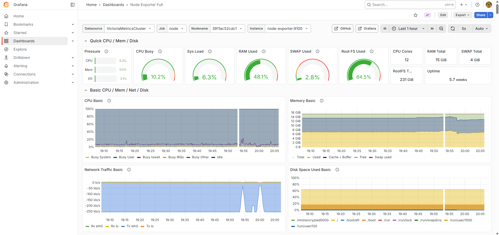
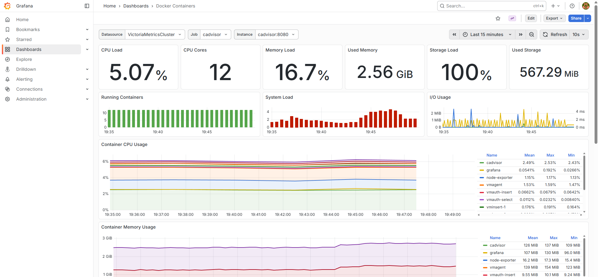
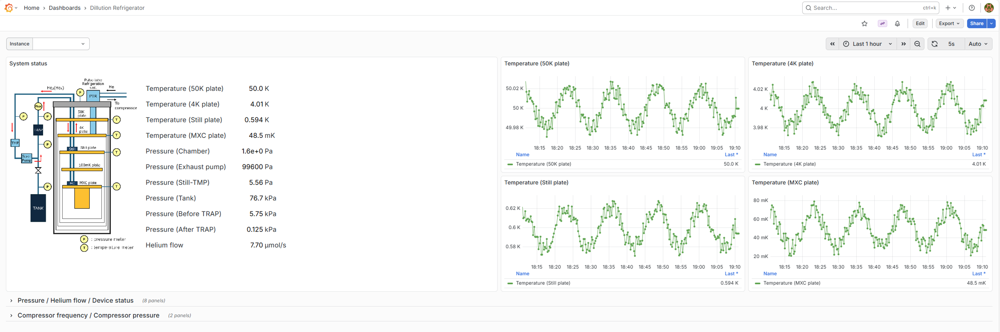
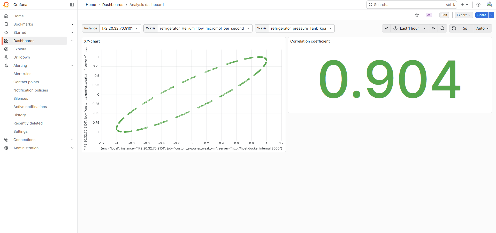
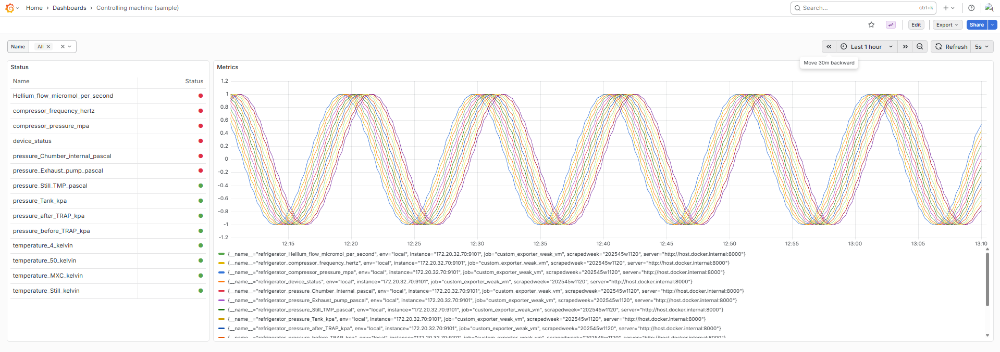
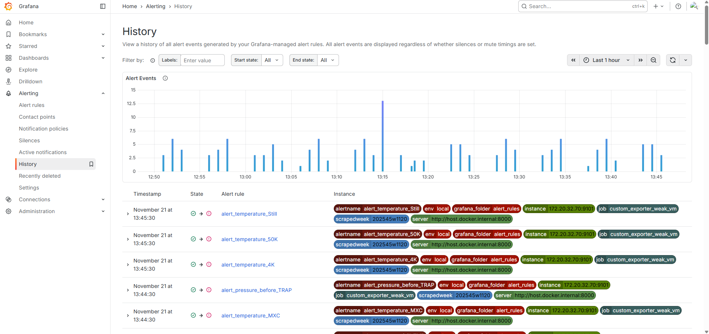

# Data Collection Platform for Quantum Computers

## Table of contents

- [0 Document Information](#0-document-information)
- [1 Purpose, background, and scope](#1-purpose-background-and-scope)
  - [Purpose](#purpose)
  - [Background](#background)
  - [Scope](#scope)
  - [Unscoped (in the early stage)](#unscoped-in-the-early-stage)
- [2 Requirements](#2-requirements)
  - [2.1 Functional Requirements](#21-functional-requirements)
  - [2.2 Non-functional requirements](#22-non-functional-requirements)
  - [2.3 Products](#23-products)
  - [2.4 Important note about `vmagent` and Prometheus](#24-important-note-about-vmagent-and-prometheus)
- [3 Architecture](#3-architecture)
  - [3.1 Hardware/container composition](#31-hardwarecontainer-composition)
  - [3.2 Servers and containers](#32-servers-and-containers)
- [4 Scalability design](#4-scalability-design)
  - [4.1 How to add the target](#41-how-to-add-the-target)
  - [4.2 How to remove the monitoring target (s)](#42-how-to-remove-the-monitoring-target-s)
  - [4.3 How to temporarily pause and resume the monitoring target (s)](#43-how-to-temporarily-pause-and-resume-the-monitoring-target-s)
  - [4.4 How to scale-out](#44-how-to-scale-out)
  - [4.5 How to scale-in](#45-how-to-scale-in)
- [5 Metrics schema and labeling strategy (VictoriaMetrics)](#5-metrics-schema-and-labeling-strategy-victoriametrics)
  - [5.1 General principles](#51-general-principles)
  - [5.2 Standard labels](#52-standard-labels)
  - [5.3 Source-specific label sets](#53-source-specific-label-sets)
  - [5.4 Cardinality management strategy](#54-cardinality-management-strategy)
- [6 Metrics to aggregate](#6-metrics-to-aggregate)
  - [6.1 OS metrics: node-exporter](#61-os-metrics-node-exporter)
  - [6.2 Container metrics: cAdvisor](#62-container-metrics-cadvisor)
  - [6.3 QPU metrics: dilution refrigerator](#63-qpu-metrics-dilution-refrigerator)
  - [6.4 QuEL1 controlling machine](#64-quel1-controlling-machine)
  - [6.5 QuEL1-SE controlling machine](#65-quel1-se-controlling-machine)
- [7 Visualization design](#7-visualization-design)
  - [7.1 Dashboard for `node-exporter`](#71-dashboard-for-node-exporter)
  - [7.2 Dashboard for `cAdvisor` (Docker containers)](#72-dashboard-for-cadvisor-docker-containers)
  - [7.3 Dashboard for dilution refrigerator](#73-dashboard-for-dilution-refrigerator)
  - [7.4 Dashboard for analyzing metrics of the dilution refrigerator](#74-dashboard-for-analyzing-metrics-of-the-dilution-refrigerator)
  - [7.5 Dashboard for QuEL1 controlling machine](#75-dashboard-for-quel1-controlling-machine)
  - [7.6 Display Format Specifications](#76-display-format-specifications)
- [8 Alert design](#8-alert-design)
  - [8.1 Metrics to alert](#81-metrics-to-alert-and-state--threshold-model)
  - [8.2 Alert notification](#82-alert-notification)
  - [8.3 Alert visualization](#83-alert-visualization)
- [9 API design](#9-api-design)
- [10 CI design](#10-ci-design)
  - [10.1 CI Pipeline Workflow](#101-ci-pipeline-workflow)
- [Appendix A Operational Interfaces](#appendix-a-operational-interfaces)
  - [A.1 Grafana (Primary Visualization and Alerting)](#a1-grafana-primary-visualization-and-alerting)
  - [A.2 VictoriaMetrics UI (VMUI) (Ad-hoc Querying and Data Exploration)](#a2-victoriametrics-ui-vmui-ad-hoc-querying-and-data-exploration)
- [Appendix B: Windows Host Monitoring Configuration](#appendix-b-windows-host-monitoring-configuration)
  - [B.1 Rationale](#b1-rationale)
  - [B.2 Configuration Steps](#b2-configuration-steps)

## 0 Document Information

- Document Name: Data Collection Platform Design Document
- Version: v1.0
- Author: SEC
- Change History

| Version | Date       | Changes       | Author/Approver |
| ------- | ---------- | ------------- | --------------- |
| 1.0     | 2026-03-31 | Initial Draft | SEC             |

---

## 1 Purpose, background, and scope

### Purpose

Development of a metrics collection and visualization system for operational management of quantum computer hardware and software.

### Background

There is a need to improve the RAS (Reliability, Availability, Serviceability) of quantum computers and prepare for future expansion of quantum computer utilization.

### Scope

- Setting up machines related to quantum computers
- Data aggregation foundation
- Data storing function
- Data visualization function
- Alerting function

### Unscoped (in the early stage)

- Collection analysis
- User management, authorization of the system
- Display of log data, including system logs
- Data-backup

---

## 2 Requirements

### 2.1 Functional Requirements

#### 2.1.1 Aggregation

The system SHALL collect time‑series operational metrics from monitoring targets and physical/virtual servers at configurable intervals using a pull model.

| ID         | Requirement                                                                                                                                                       |
| ---------- | ----------------------------------------------------------------------------------------------------------------------------------------------------------------- |
| FR-AGG-001 | The system SHALL use a central component to perform scraping and forward data to the storage backend.                                                             |
| FR-AGG-002 | Scrape targets, intervals, and timeouts SHALL be configurable through version-controlled files without requiring code changes.                                    |
| FR-AGG-003 | The system SHALL support relabeling rules to modify or drop labels before ingestion, enabling cardinality control.                                                |
| FR-AGG-004 | Operator documentation SHALL provide step-by-step procedures for adding and removing monitoring targets.                                                          |
| FR-AGG-005 | The system SHALL be designed for a trusted intranet environment, minimizing exposed service endpoints and preferring direct component-to-component communication. |
| FR-AGG-006 | The system SHALL provide a RESTful API to retrieve aggregated metrics and manage metadata.                                                                        |

#### 2.1.2 Storing

| ID            | Requirement                                                                                                                                  |
| ------------- | -------------------------------------------------------------------------------------------------------------------------------------------- |
| FR-STORE-001  | The system SHALL store time-series data from all sources, including operational metrics from hardware and servers.                           |
| FR-STORE-002  | The system SHALL provide label-based metrics compaction and allow deletion of specific series via VictoriaMetrics API where permissible.     |
| FR-DATA-001   | The system SHALL periodically collect time-series data (e.g., temperature, pressure) from monitoring targets and store it in the data store. |
| FR-DATA-002   | The system SHALL store general monitoring data such as CPU usage and disk utilization in addition to domain-specific equipment data.         |
| FR-DATA-003   | The data store SHALL allow collected data to be reused by external visualization and analysis systems.                                       |
| FR-DATA-004   | The data store SHALL use time-series optimized storage technologies.                                                                         |
| FR-DATA-005   | The system SHALL support efficient data compression and backup to enable long-term retention of various monitoring items.                    |
| FR-CONF-001   | The system SHALL allow configuration of data type, collection interval, start, and stop of data acquisition.                                 |
| FR-LOGIC-001  | The system SHALL enable operators to implement and use custom data collection logic for different data types.                                |
| FR-EXT-001    | The system SHALL provide data structure transformation capabilities to support future extensibility.                                         |
| FR-EVENT-001  | The system SHALL record events such as state changes and allow later search and analysis of these events.                                    |
| FR-META-001   | The system SHALL allow metadata to be attached to collected data.                                                                            |
| FR-API-001    | The system SHALL provide an external interface to retrieve and update data in the data store.                                                |
| FR-API-002    | The external interface SHALL use a RESTful API.                                                                                              |
| FR-NOTIFY-001 | The system SHALL provide functionality to send data or notifications to external systems (e.g., messaging platforms).                        |

#### 2.1.3 Visualization

| ID         | Requirement                                                                                                                          |
| ---------- | ------------------------------------------------------------------------------------------------------------------------------------ |
| FR-VIS-001 | The system SHALL retrieve time-series data from the data collection platform and visualize it on dashboards.                         |
| FR-VIS-002 | The system SHALL allow visualization of time-series data within a specified time range using graphs.                                 |
| FR-VIS-003 | The system SHALL display equipment data along with a view that helps users understand the hardware layout of the monitoring targets. |

#### 2.1.4 Alerting

| ID          | Requirement                                                                                                                           |
| ----------- | ------------------------------------------------------------------------------------------------------------------------------------- |
| FR-ALRT-001 | The system SHALL support alert definitions on metric thresholds, composite conditions using Grafana Alerting or external rule engine. |
| FR-ALRT-002 | Alerts SHALL be routable to configurable notification channels (e.g., messaging platforms, email).                                    |
| FR-ALRT-003 | Deduplication and grouping SHALL minimize noisy notifications (group by host, subsystem, severity).                                   |
| FR-ALRT-004 | The system SHALL send a notification when an alert is resolved (i.e., when the metric returns to a normal state).                     |
| FR-ALRT-005 | Silence / maintenance windows SHALL be configurable via Grafana Alerting APIs or UI.                                                  |
| FR-ALRT-006 | Alert rule definitions SHALL be stored as code (YAML / JSON).                                                                         |

### 2.2 Non-functional requirements

#### 2.2.1 basic requirements

| ID           | Requirement                                                                                                                                                                            |
| ------------ | -------------------------------------------------------------------------------------------------------------------------------------------------------------------------------------- |
| NFR-GOV-001  | The software SHALL comply with OQTOPUS policies and development guidelines.                                                                                                            |
| NFR-OSS-001  | The software SHALL be developed as OSS, ensuring that sensitive information (e.g., IP addresses, passwords, internal data) is NOT exposed in public repositories.                      |
| NFR-CODE-001 | Source code comments SHALL be written in English.                                                                                                                                      |
| NFR-CONF-001 | Environment-dependent information (e.g., logo, IP address, directory names) SHALL be configurable and NOT hardcoded.                                                                   |
| NFR-LOG-001  | The application SHALL output execution logs, including stack traces and input data for debugging purposes, especially in case of errors.                                               |
| NFR-QA-001   | The application SHALL apply linting tools and include test code executable via common frameworks (e.g., pytest).                                                                       |
| NFR-QA-002   | Continuous integration SHALL be implemented using GitHub Actions to automatically run linting and tests.                                                                               |
| NFR-DOC-001  | Documentation SHALL be created and published using widely adopted OSS documentation platforms (e.g., Read the Docs), and SHALL include installation and usage instructions in English. |

#### 2.2.2 Additional requirements

| ID            | Requirement                                                                                                                              |
| ------------- | ---------------------------------------------------------------------------------------------------------------------------------------- |
| NFR-SCALE-001 | The system SHALL support horizontal scale-out by adding `vmstorage` (and if needed `vmselect`) hosts without redesign of exporters.      |
| NFR-SCALE-002 | The architecture SHALL tolerate >2× year-over-year increase in active time-series count (with proportional hardware scaling).            |
| NFR-SCALE-003 | Plugin / exporter SDK guidelines SHALL be documented to enable third-party metric extensions.                                            |
| NFR-GRAN-001  | The data collection interval (scrape interval) for key metrics SHALL be configurable and its default value is supposed to be 60 seconds. |

---

#### 2.3 Products

To meet the storing requirements above, VictoriaMetrics in cluster mode has been selected as the core time-series database.

| Requirement Area      | Technology Choice & Rationale                                                                                                                                                                                                                            |
| --------------------- | -------------------------------------------------------------------------------------------------------------------------------------------------------------------------------------------------------------------------------------------------------- |
| **Time-Series DB**    | **VictoriaMetrics (Cluster)**: Chosen for its high performance, storage efficiency, and horizontal scalability, which aligns with long-term retention needs.                                                                                             |
| **Scraping Engine**   | **`vmagent`**: Chosen for its high performance, low resource usage, and native integration with the VictoriaMetrics cluster. It performs the pull-based collection and uses the `remote_write` protocol to send data to the `vmauth` ingestion endpoint. |
| **Metric Exposition** | **Prometheus Exposition Format**: The standard for exposing metrics. Standard exporters like `node-exporter` and `cAdvisor` will be used. Custom exporters will be developed using the `prometheus_client` library for Python.                           |
| **Data Ingestion**    | **`vminsert`**: Handles data ingestion, providing replication and routing of incoming data to `vmstorage` nodes.                                                                                                                                         |
| **Data Storage**      | **`vmstorage`**: The durable storage layer. It stores time-series data and can be scaled horizontally to increase capacity.                                                                                                                              |
| **Data Querying**     | **`vmselect`**: Executes queries across all `vmstorage` nodes, providing a complete view of the data. It can be scaled to improve query concurrency.                                                                                                     |
| **Access & Routing**  | **`vmauth`**: Acts as an authentication proxy and load balancer for both write (`vminsert`) and read (`vmselect`) paths, providing a unified access point.                                                                                               |
| **Backup**            | **`vmbackup`/`vmrestore` + External Storage**: `vmbackup` creates incremental snapshots of `vmstorage` with high compression efficiency. `vmrestore` enables selective restoration of specific time ranges or metric series.                             |

#### 2.4 Important note about `vmagent` and Prometheus

- One of the replacement for [Prometheus](https://prometheus.io/).
- High performance with respect to RAM, CPU and disk I/O.
- Configuration format: `promscrape.config` has the same structure as Prometheus's `scrape_configs`.
- Remote Write: Sends to VictoriaMetrics (and other compatible storage systems) using the same protocol as Prometheus's `api/v1/write`.

For these reasons, we decided to use vmagent instead of Prometheus as our data collection tool.

## 3 Architecture

### 3.1 Hardware/container composition

#### 3.1.1 Physical host inventory

| Host (planned)                 | Role                                                      | OS (baseline) | Notes               |
| ------------------------------ | --------------------------------------------------------- | ------------- | ------------------- |
| machine-to-monitor             | Monitored target host                                     | Linux         | Target workload     |
| quel1_1-quel1_N                | QuEL's Quantum Computing Control Systems                  | Linux         | by Quel             |
| proxy-to-qubit-controller      | Aggregation proxy to controling machine (quel1_1-quel1_N) | Linux         | for quel1_1-quel1_N |
| proxy-to-dilution-refrigerator | Cryogenic data interface                                  | Windows       | HTTP/SMB source     |
| monitoring-01                  | Prometheus / VictoriaMetrics / Grafana                    | Linux         | single node         |

#### 3.1.2 Containerized components

| Component                                         | Host                      | Image (tag placeholder)                       | Number of Instance | Port\*         | In-bound (from)                           | Out-bound         | Purpose / Notes                                           |
| ------------------------------------------------- | ------------------------- | --------------------------------------------- | ------------------ | -------------- | ----------------------------------------- | ----------------- | --------------------------------------------------------- |
| node-exporter                                     | machine-to-monitor        | prom/node-exporter:v1.9.1                     | 1                  | 9100 (exposed) | OS                                        | `vmagent`         | Host metrics                                              |
| cAdvisor                                          | machine-to-monitor        | gcr.io/cadvisor/cadvisor:v0.52.1              | 1                  | 8088 (exposed) | Docker runtime                            | `vmagent`         | Container metrics                                         |
| node-exporter                                     | proxy-to-qubit-controller | prom/node-exporter:v1.9.1                     | 1                  | 9100 (exposed) | OS                                        | `vmagent`         | Host metrics                                              |
| custom-exporter (**`quel1-metrics-exporter`**)    | proxy-to-qubit-controller | ghcr.io/astral-sh/uv:python3.13-bookworm-slim | 1                  | 9102 (exposed) | quel1_1-quel1_N (command/log)             | `vmagent`         | ICMP ping status                                          |
| custom-exporter (**`quel1-se-metrics-exporter`**) | proxy-to-qubit-controller | ghcr.io/astral-sh/uv:python3.12-bookworm-slim | 1                  | 9103 (exposed) | proxy-to-dilution-refrigerator (WSS/CSS)  | `vmagent`         | Temperature + actuator metrics                            |
| node-exporter                                     | monitoring-01             | prom/node-exporter:v1.9.1                     | 1                  | 9100 (exposed) | OS                                        | `vmagent`         | Monitoring host metrics                                   |
| cAdvisor                                          | monitoring-01             | gcr.io/cadvisor/cadvisor:v0.52.1              | 1                  | 8088 (exposed) | Local containers                          | `vmagent`         | Container metrics                                         |
| custom-exporter (**`cryo-metrics-exporter`**)     | monitoring-01             | ghcr.io/astral-sh/uv:python3.13-bookworm-slim | 1                  | 9101 (exposed) | proxy-to-dilution-refrigerator (HTTP/SMB) | `vmagent`         | Temperature + other cryogenic metrics normalization       |
| `vmagent`                                         | monitoring-01             | victoriametrics/vmagent:v1.127.0              | 1                  | 8429 (exposed) | Exporters (HTTP scrape)                   | `vmauth`          | Scrape + relabel + remoteWrite                            |
| `vmauth (insert)`                                 | monitoring-01             | victoriametrics/vmauth:v1.127.0               | 1                  | 8427 (exposed) | `vmagent`                                 | `vminsert`        | Auth and Load Balancing (write path)                      |
| `vminsert`                                        | monitoring-01             | victoriametrics/vminsert:v1.127.0-cluster     | 2                  | 8480           | `vmauth (insert)`                         | `vmstorage`       | Ingestion fan-out                                         |
| `vmstorage`                                       | monitoring-01             | victoriametrics/vmstorage:v1.127.0-cluster    | 2                  | 8400           | `vminsert`                                | `vmselect`        | TS chunk storage (shared disk tiers)                      |
| `vmselect`                                        | monitoring-01             | victoriametrics/vmselect:v1.127.0-cluster     | 2                  | 8481 (exposed) | `vmauth (select)`                         | `vmauth (select)` | Query, and for VMUI execution                             |
| `vmauth (select)`                                 | monitoring-01             | victoriametrics/vmauth:v1.127.0               | 1                  | 8428 (exposed) | Grafana / api-server                      | `vmselect`        | Auth and Load Balancing (read path)                       |
| grafana                                           | monitoring-01             | grafana/grafana:12.3.0-18481575143-ubuntu     | 1                  | 3000 (exposed) | User browser                              | -                 | Visualization                                             |
| loki                                              | monitoring-01             | grafana/loki:3.5.8                            | 1                  | 3100 (exposed) | User browser                              | -                 | Visualization and data store for alerting history         |
| api-server                                        | monitoring-01             | ghcr.io/astral-sh/uv:python3.13-bookworm-slim | 1                  | 8080 (exposed) | External clients                          | user application  | Programmatic query / metadata enrichment                  |
| weekly-relabeling-cron                            | monitoring-01             | alpine:3.20                                   | 1                  | -              | -                                         | -                 | Weeky updating the value of `scrapedweek` (ex. `202544w`) |

\* When external connections or data collection are required, the port number is explicitly marked with `(exposed)`. Particularly, one of the `vmselect` port is exposed for use with [VMUI](#a2-victoriametrics-ui-vmui-ad-hoc-querying-and-data-exploration).

#### 3.1.3 Custom exporters

This project requires the development of two custom exporters to bridge data from non-standard sources into the Prometheus ecosystem. These components must be implemented as part of the development scope.

These exporters include converters (e.g. unit conversion).

**`quel1-metrics-exporter`** in `proxy-to-qubit-controller`:

Acts as a proxy to collect metrics from the QuEL control machines (`quel1_1`-`quel1_N`) via ICMP ping.

For detailed specification, see `./custom-exporters/quel1-metrics-exporter.md`.

**`cryo-metrics-exporter`** in `monitoring-01`:

Collects and normalizes metrics from the cryogenic system.

It fetches temperature data via HTTP from the BlueFors server on `proxy-to-dilution-refrigerator` and retrieves other log data via SMB from the same host.

It then converts these disparate data formats into a unified set of Prometheus metrics.

For detailed specification, see `./custom-exporters/cryo-metrics-exporter.md`.

#### 3.1.4 Weekly relabelling container

This container is responsible for adding weekly labels to specific metrics.
To facilitate weekly analysis and visualization, weekly labels (e.g. `scrapedweek=202544w`) are assigned to collected metrics.
This assignment occurs immediately before the pull of `vmagent`.

This weekly label is applied to only specific metrics (e.g. the metrics scraped by the **custom-exporters**).

##### **Prerequisites**

- Add settings to `vmagent` to load additional label configurations from a YAML file.
- This container should be launched on the same machine as `vmagent`.

##### **Labeling strategy**

- Name: `scrapedweek`
- Value format: YYYYWWw (YYYYWW compliant with ISO week number %G-%V. Example: 202544w)
- Update frequency: Weekly (daily updates may be performed as needed to ensure reproducibility)

##### **Target Metrics**

Weekly labels are applied to the following job types (for example):

- `cryo-metrics-exporter` (custom exporter for refrigerator data)
- `quel1-metrics-exporter` (custom exporter for QuEL control machines)

Standard exporters (`node-exporter`, `cAdvisor`) are **excluded** to minimize cardinality impact.

##### **relabel_weekly.yml Structure**

The relabel configuration file has the following structure:

```yaml
# Weekly label assignment for specific metric sources
# Generated by: weekly-relabeling-cron
# Last updated: 2025-11-25 00:00:00 JST

- source_labels: [job]
  regex: "(cryo-metrics|quel-metrics)"
  target_label: scrapedweek
  replacement: "202547w" # Updated weekly by cron job
```

**Configuration of `vmagent`**:

Add `-remoteWrite.relabelConfig` option in `compose.yaml`

```yaml
vmagent:
image: victoriametrics/vmagent:v1.127.0
container_name: vmagent
restart: unless-stopped
ports:
  - "8429:8429"
volumes:
  - ./vmagent:/etc/prometheus:ro
  - ./vmagent:/etc/vmagent
  - vmagent-data:/tmp/vmagent-remotewrite-data
command:
  - -promscrape.config=/etc/prometheus/prometheus.yml
  - -remoteWrite.url=http://vmauth-insert:8427/insert/0/prometheus/api/v1/write
  - -remoteWrite.tmpDataPath=/tmp/vmagent-remotewrite-data
  - -remoteWrite.showURL
  - -remoteWrite.relabelConfig=/etc/vmagent/relabel_weekly.yml # The configuration of weekly relabelling
  - -promscrape.configCheckInterval=30s
depends_on:
  - vmauth-insert
environment:
  - TZ=Asia/Tokyo
  - NO_PROXY=*
networks:
  - monitoring
```

##### **Implementation Details**

The `weekly-relabeling-cron` container performs the following operations:

###### **`.yaml` file generation**

The shell script below creates or overwrites the configuration file of `vmagent` the file-path is designated by `-remoteWrite.relabelConfig` option in `compose.yaml` file.

```bash
#!/usr/bin/env bash
set -euo pipefail
TZ=Asia/Tokyo
YEAR=$(date +%G)
WEEK=$((10#$(date +%V)))
VALUE="${YEAR}${WEEK}w"
cat > /path/to/vmagent/relabel_weekly.yml <<EOF
- action: replace
  target_label: scrapedweek
  replacement: "${VALUE}"
EOF
curl -fsS -X POST http://localhost:8429/-/reload
echo "updated scrapedweek=${VALUE} and reloaded"
```

###### **Execution Schedule**

- Cron expression: `0 0 * * 1` (Every Monday at 00:00)
- Timezone: `Asia/Tokyo`
- Log output: `/var/log/weekly-relabeling.log`

##### **Error Handling**

- If `relabel_weekly.yml` file update fails, previous week's label remains active
- `vmagent` continues operation with last valid configuration
- Cron errors are logged to `/var/log/weekly-relabeling.log`

#### 3.1.5 Data flow summary (mapping to 3.2 diagram)

1. each exporter (node-exporter, cAdvisor, custom exporters) → `vmagent` scrape via HTTP Pull
2. `vmagent` → remoteWrite → `vmauth (insert)` → `vminsert` → `vmstorage`
3. Query: Grafana / api-server → `vmauth (select)` → `vmselect` → `vmstorage`

| #   | Target to monitor                                         | Metrics to monitor         | Implementation    | Extraction                                                         |
| --- | --------------------------------------------------------- | -------------------------- | ----------------- | ------------------------------------------------------------------ |
| 1   | proxy-to-dilution-refrigerator                            | OS metrics                 | Docker            | node-exporter                                                      |
| 2   | proxy-to-dilution-refrigerator (connects to refrigerator) | Temperature                | prometheus_client | HTTP from `http://<cryo-data-host>:<port>/channel/historical-data` |
| 3   | proxy-to-dilution-refrigerator (connects to refrigerator) | Other than temperature     | prometheus_client | SMB from `smb://<cryo-data-host>/<share>/<path>`                   |
| 4   | proxy-to-qubit-controller                                 | OS metrics                 | Docker            | node-exporter                                                      |
| 5   | proxy-to-qubit-controller                                 | metrics of quel1_1-quel1_N | Docker            | prometheus_client                                                  |
| 6   | quel1_1-quel1_N                                           | ping status                | -                 | prometheus_client                                                  |
| 7   | machine-to-monitor                                        | OS metrics                 | Docker            | node-exporter                                                      |
| 8   | machine-to-monitor                                        | Other Docker containers    | Docker            | cAdvisor                                                           |

#### 3.1.6 Sampling policy (defaults)

The default scrape interval for all metric sources is set to 60 seconds.

This value should be adjusted based on the operational requirements and performance characteristics of the source hardware.

| Metric Source / Group                                                 | Scrape Interval | Scrape Timeout |
| --------------------------------------------------------------------- | --------------- | -------------- |
| node-exporter (all hosts)                                             | 60s             | 15s            |
| cAdvisor (container metrics)                                          | 60s             | 15s            |
| BlueFors temperature (HTTP/SMB parsed) by **`cryo-metrics-exporter`** | 60s             | 15s            |
| quel1 control metrics (ICMP ping) by **`quel1-metrics-exporter`**     | 60s             | 15s            |
| quel1-se control metrics by **`quel1-se-metrics-exporter`**           | 60s             | 15s            |

#### 3.1.7 Design Considerations

| Aspect                                | Decision / Rationale                                                                                                                           |
| ------------------------------------- | ---------------------------------------------------------------------------------------------------------------------------------------------- |
| Write Path                            | `vmagent` + `vmauth (insert)` + `vminsert (cluster)` → `vmstorage` (HA, horizontal scalable)                                                   |
| Query Path                            | `vmauth (select)` → `vmselect (cluster)` → `vmstorage`                                                                                         |
| Retention                             | 100 years (`vmstorage` -retentionPeriod)                                                                                                       |
| Cardinality Ctrl                      | Scrape relabel, drop high-churn labels (container id full hash)                                                                                |
| Failure Handling (Automated Recovery) | Containers are configured with health checks (by `restart: unless-stopped`) to enable automatic restarts upon failure by the container runtime |
| Failure Handling (Monitoring)         | Component status is monitored via Grafana dashboards and the VictoriaMetrics UI (VMUI) for operator oversight                                  |
| Security                              | Designed for a trusted intranet; `vmauth` access control is configurable; minimize exposed ports between hosts                                 |

### 3.2 Servers and containers

The arrow below shows the data flow.

```mermaid
flowchart LR
  subgraph Clients[Targets to monitor]
    subgraph proxy-to-qubit-controller[proxy-to-qubit-controller]
      proxy-to-qubit-controller-os[host OS<br/>CPU, Mem, Disk]
      proxy-to-qubit-controller-node-exporter[node-exporter]
      proxy-to-qubit-controller-os -->|metrics|proxy-to-qubit-controller-node-exporter
      proxy-to-qubit-controller-cAdvisor[cAdvisor]
      style proxy-to-qubit-controller-os stroke:#e63946,stroke-width:3px,fill:#805080
    end
    quel1-se-metrics-exporter[quel1-se-metrics-exporter]
    subgraph machine-to-monitor[machine-to-monitor]
      machine-to-monitor-os[host OS<br/>CPU, Mem, Disk]
      machine-to-monitor-container1[docker container1]
      machine-to-monitor-container2[docker container2]
      machine-to-monitor-node-exporter[node-exporter]
      machine-to-monitor-cAdvisor[cAdvisor]
      quel1-metrics-exporter[quel1-metrics-exporter]
      style machine-to-monitor-os stroke:#e63946,stroke-width:3px,fill:#805080

      machine-to-monitor-container1 -->|metrics of docker| machine-to-monitor-cAdvisor
      machine-to-monitor-container2 -->|metrics of docker| machine-to-monitor-cAdvisor
      machine-to-monitor-os -->|metrics| machine-to-monitor-node-exporter
    end
    subgraph quel1[quel1_1-quel1_N]
    end
    subgraph quel1se[quel1-se]
    end
    subgraph proxy-to-dilution-refrigerator[proxy-to-dilution-refrigerator]
      bluefors-server[bluefors server]
      file-logs[bluefors log files]
    end

    quel1-metrics-exporter -->|command| quel1
    quel1 -.->|metrics| quel1-metrics-exporter
    quel1se -.->|metrics| quel1-se-metrics-exporter
  end
  subgraph monitoring-machine[Monitoring Machine]
    subgraph DB[VictoriaMetrics]
      DB-vmauth-insert[LB for insert -vmauth-]
      DB-vmauth-select[LB for select -vmauth-]
      DB-vminsert1[vminsert1]
      DB-vminsert2[vminsert2]
      DB-vmstorage1[vmstorage1]
      DB-vmstorage2[vmstorage2]
      DB-vmselect1[vmselect1]
      DB-vmselect2[vmselect2]
      DB-vmauth-insert --> DB-vminsert1
      DB-vmauth-insert --> DB-vminsert2
      DB-vminsert1 --> DB-vmstorage1
      DB-vminsert1 --> DB-vmstorage2
      DB-vminsert2 --> DB-vmstorage1
      DB-vminsert2 --> DB-vmstorage2
      DB-vmselect1 --> DB-vmauth-select
      DB-vmselect2 --> DB-vmauth-select
      DB-vmstorage1 --> DB-vmselect1
      DB-vmstorage1 --> DB-vmselect2
      DB-vmstorage2 --> DB-vmselect1
      DB-vmstorage2 --> DB-vmselect2
    end
    vmagent[vmagent]
    weekly-relabeling-cron[weekly-relabeling-cron]
    weekly-relabeling-cron ==>|edit the setting file| vmagent
    monitoring-machine-api-server[api-server]
    monitoring-machine-custom-exporter[cryo-metrics-exporter]
    monitoring-machine-node-exporter[node-exporter]
    monitoring-machine-cAdvisor[cAdvisor]
    monitoring-machine-os[host OS<br/>CPU, Mem, Disk]
    style monitoring-machine-os stroke:#e63946,stroke-width:3px,fill:#805080
    bluefors-server ---->|metrics -Temperature-
    via HTTP| monitoring-machine-custom-exporter
    file-logs ---->|metrics -others-
    via SMB| monitoring-machine-custom-exporter
    monitoring-machine-os -->|metrics|monitoring-machine-node-exporter
    machine-to-monitor-cAdvisor ---->|metrics| vmagent
    proxy-to-qubit-controller-cAdvisor ---->|metrics| vmagent
    machine-to-monitor-node-exporter ---->|metrics| vmagent
    monitoring-machine-cAdvisor ---->|metrics| vmagent
    proxy-to-qubit-controller-custom-exporter ---->|metrics| vmagent
    quel1-se-metrics-exporter ---->|metrics| vmagent
    proxy-to-qubit-controller-node-exporter ---->|metrics| vmagent
    monitoring-machine-custom-exporter ---->|metrics| vmagent
    monitoring-machine-node-exporter ---->|metrics| vmagent
    vmagent -->|insert metrics| DB-vmauth-insert
    grafana[Grafana]
    DB-vmauth-select ----->|via Queries| monitoring-machine-api-server
    DB-vmauth-select ----->|via Queries| grafana
  end
```



---

## 4 Scalability design

### 4.1 How to add the target

#### OS metrics (node-exporter), Container metrics (cAdvisor), and Metrics to extract by custom exporter

Since the pulling configuration (located at `./vmagent/prometheus.yml`) is reloaded each 30 seconds, the update in `prometheus.yml` is automatically applied.

##### Step1: edit `vmagent` Configuration

Locate and edit the file:
`./vmagent/prometheus.yml`

Add the following lines:

```yaml
- job_name: "arbitrary-job-name"
  scrape_interval: 1s
  static_configs:
    - targets: ["<target IP address>:<port number>"]
```

, where `arbitrary-job-name` should be **unique** job name for `vmagent` to extract, `<target IP address>` is IP address that the machine is locating, and `<port number>` is port number that is configured to open.

##### Step2: create `compose.yaml` file

The codes below is the example of `node-exporter`.

```yaml
services:
  node-exporter:
    image: quay.io/prometheus/node-exporter:v1.9.1
    container_name: node-exporter
    restart: unless-stopped
    pid: "host"
    ports:
      - "9100:9100"
    volumes:
      - /proc:/host/proc:ro
      - /sys:/host/sys:ro
      - /:/host:ro,rslave
    command:
      - --path.rootfs=/host
      - --path.procfs=/host/proc
      - --path.sysfs=/host/sys
    environment:
      - TZ=Asia/Tokyo
    networks:
      - monitoring

networks:
  monitoring:
```

##### Step3: Deploy and Run the Exporter on the Target Host

The corresponding exporter must be deployed and running on the new target host. The standard deployment method is via Docker Compose.

1. **Prerequisites**: The target host must have Docker and Docker Compose installed.
2. **Configuration**: A `compose.yaml` file, such as the `node-exporter` example provided above, must be placed on the target host. This file defines the exporter container, its configuration, and necessary volume mounts to access host metrics.
3. **Execution**: The exporter is launched as a detached container by executing the following command in the directory containing the `compose.yaml` file:

```bash
docker compose up -d
```

Once started, the exporter will expose a metrics endpoint (e.g., on port 9100), which `vmagent` will then begin to scrape as configured in Step 1.

### 4.2 How to remove the monitoring target (s)

For the removal of the monitoring target (s), only one step is required.

#### Procedure: edit `vmagent` Configuration

Locate and edit the file:
`./vmagent/prometheus.yml`

remove or comment-out the following lines:

```yaml
- job_name: "arbitrary-job-name"
  static_configs:
    - targets: ["<target IP address>:<port number>"]
```

Then, the configuration is automatically applied.

### 4.3 How to temporarily pause and resume the monitoring target (s)

Commenting out the relevant lines will prevent metrics from being aggregated within 30 seconds.

To resume collection, simply uncomment the relevant lines, and collection will re-start within 30 seconds.

While collection is paused, metrics are not collected. Therefore, if you plot the relevant metrics in Grafana, a gap in the data will appear for the period during which no data was collected.

### 4.4 How to scale-out

#### **`vmagent`**

##### Overview

To enhance scrape throughput and distribute the collection workload, you can scale out `vmagent` by adding more instances. This process involves updating the `compose.yaml` file to define the new `vmagent` service, configuring it to join the existing cluster, and ensuring all instances are aware of the new cluster topology.

The key steps are:

- Add a new `vmagent` container definition.
- Update the cluster configuration (`-promscrape.cluster.membersCount`) across all `vmagent` instances to reflect the new total.
- Assign a unique member ID (`-promscrape.cluster.memberNum`) to the new instance.
- Define a dedicated persistent volume for the new instance.
- Deploy the changes.

##### Step-by-Step Procedure

This example demonstrates scaling the cluster from 2 to 3 `vmagent` instances.

The detailed configuration steps, including modifications of `compose.yaml`, dedup strategy, and other configuration files, are documented in the [vmagent Scaling Guide](./vmagent-scaling.md).

The general process involves:

**Step 1: Edit `compose.yaml`**:

Modify the `services` and `volumes` sections in your `compose.yaml` file.

1. **Update Existing `vmagent` Instances**: Change the `-promscrape.cluster.membersCount` argument for all existing `vmagent` services to the new total number of instances (e.g., `3`).
2. **Add the New `vmagent` Instance**: Copy an existing `vmagent` service definition and modify it for the new instance.
   - Give it a unique service name (e.g., `new-vmagent`).
   - Assign a unique `container_name`.
   - Set its `-promscrape.cluster.memberNum` to a new, unique, 0-based index (e.g., `2`).
   - Update its `-promscrape.cluster.membersCount` to match the new total.
   - Map a unique port on the host to the container's port `8429` (e.g., `"38429:8429"`).
   - Assign it a new, dedicated volume for its data.
3. **Add the New Volume**: Define the new volume in the top-level `volumes` section.

```yaml
services:
  # --- UPDATE EXISTING VMAGENT SERVICES ---
  existing-vmagent-1:
    image: victoriametrics/vmagent:v1.127.0
    container_name: existing-vmagent
    command:
      - -promscrape.config=/etc/prometheus/prometheus.yml
      - -remoteWrite.url=http://vmauth-insert:8427/insert/0/prometheus/api/v1/write
      - -remoteWrite.tmpDataPath=/tmp/vmagent-remotewrite-data
      - -remoteWrite.showURL
      - -promscrape.configCheckInterval=30s
      - -promscrape.cluster.membersCount=3 # UPDATE: New total number of instances
      - -promscrape.cluster.memberNum=0 # No change: Unique ID for this instance
    volumes:
      - ./vmagent:/etc/prometheus:ro
      - existing-vmagent-1-data:/tmp/vmagent-remotewrite-data
    ports: ["18429:8429"]
    depends_on:
      - vmauth-insert
    environment:
      - TZ=Asia/Tokyo
      - NO_PROXY=*
    networks: [monitoring]

  existing-vmagent-2:
    image: victoriametrics/vmagent:v1.127.0
    container_name: existing-vmagent-2
    command:
      - -promscrape.config=/etc/prometheus/prometheus.yml
      - -remoteWrite.url=http://vmauth-insert:8427/insert/0/prometheus/api/v1/write
      - -remoteWrite.tmpDataPath=/tmp/vmagent-remotewrite-data
      - -remoteWrite.showURL
      - -promscrape.configCheckInterval=30s
      - -promscrape.cluster.membersCount=3 # UPDATE: New total number of instances
      - -promscrape.cluster.memberNum=1 # No change: Unique ID for this instance
    volumes:
      - ./vmagent:/etc/prometheus:ro
      - existing-vmagent-2-data:/tmp/vmagent-remotewrite-data
    ports: ["28429:8429"]
    depends_on:
      - vmauth-insert
    environment:
      - TZ=Asia/Tokyo
      - NO_PROXY=*
    networks: [monitoring]

  # Add new vmagent instance
  new-vmagent:
    image: victoriametrics/vmagent:v1.127.0
    container_name: new-vmagent
    command:
      - -promscrape.config=/etc/prometheus/prometheus.yml
      - -remoteWrite.url=http://vmauth-insert:8427/insert/0/prometheus/api/v1/write
      - -remoteWrite.tmpDataPath=/tmp/vmagent-remotewrite-data
      - -remoteWrite.showURL
      - -promscrape.configCheckInterval=30s
      - -promscrape.cluster.membersCount=3 # Must match total cluster size
      - -promscrape.cluster.memberNum=2 # Unique ID for the new instance
    volumes:
      - ./new-vmagent:/etc/prometheus:ro
      - new-vmagent-data:/tmp/vmagent-remotewrite-data # Dedicated volume for new instance
    depends_on:
      - vmauth-insert
    environment:
      - TZ=Asia/Tokyo
      - NO_PROXY=*
    networks: [monitoring]
# ... other services ...
```

**Step 2: Apply the Configuration**:

Deploy the changes by running `docker compose up`. This command updates the running services with the new configuration.

```sh
docker compose up -d
```

The `-d` flag runs the containers in detached mode. The cluster will automatically re-distribute the scrape targets among all `vmagent` instances.

#### **`vmselect`**

##### Overview

To scale out `vmselect`, you increase the number of query processing nodes. This improves query performance and concurrency. The process involves adding a new `vmselect` service to the `compose.yaml` file and registering it with `vmauth` to enable load balancing.

The key steps are:

- Add a new `vmselect` container definition, ensuring it connects to all `vmstorage` nodes.
- Update the `vmauth-select` configuration file (`auth.yml`) to include the new `vmselect` endpoint in its backend list.
- Deploy the `vmselect` service and restart `vmauth-select` to apply the changes.

##### Step-by-Step Procedure

**Step 1: Add New `vmselect` Service to `compose.yaml`**:

Define a new service for the `vmselect` instance.

- Give it a unique service name (e.g., `new-vmselect`).
- Assign a unique `container_name`.
- In the `command` section, list all `vmstorage` nodes using the `-storageNode` flag. The new `vmselect` must be able to reach all storage nodes to return complete query results.
- In the `depends_on` section, list all `vmstorage` service names.
- Expose a unique port on the host (e.g., `"38481:8481"`).
- Configure a health check that points to the new container's own name and port.

```yaml
services:
  # ... existing services ...

  # Add new vmselect instance
  new-vmselect:
    image: victoriametrics/vmselect:v1.127.0-cluster
    container_name: new-vmselect
    restart: unless-stopped
    command:
      - -httpListenAddr=:8481 # Port for accepting HTTP requests
      - -storageNode=existing-vmstorage-1:8401 # Connect to same vmstorage instances
      - -storageNode=existing-vmstorage-2:8401
      # - -storageNode=... # Must include ALL vmstorage instances for complete data access
    depends_on: [existing-vmstorage-1, existing-vmstorage-2] # Enter vmstorage service names
    ports: ["28481:8481"] # Port 28481 is a unique port dedicated to the new vmselect instance
    environment:
      - TZ=Asia/Tokyo
    networks: [monitoring]
# ...
```

**Step 2: Update `vmauth` Configuration for Load Balancing**:

Edit `./vmauth-select/auth.yml` to add the new `vmselect` instance to the list of backends. `vmauth` will automatically load balance incoming queries across all endpoints listed in `url_prefix`.

```yaml
unauthorized_user:
  url_map:
    - src_paths: ["/select/.*", "/admin/.*"]
      url_prefix:
        - "http://existing-vmselect:8481/" # Existing vmselect instance
        - "http://new-vmselect:8481/" # ADD: New vmselect instance
      # vmauth load balances requests across all url_prefix entries.
```

**Step 3: Apply the Configuration**:

First, start the new `vmselect` instance. Then, restart the `vmauth-select` service to make it load the updated `auth.yml` configuration.

```sh
# Start the new vmselect container
docker compose up -d new-vmselect

# Restart vmauth-select to apply the new routing rule
docker compose restart vmauth-select
```

#### **`vminsert`**

##### Overview

To scale out `vminsert`, you add more nodes to handle data ingestion. This increases the write throughput of the system. The process is similar to scaling `vmselect`: add a new `vminsert` service and register it with `vmauth` for load balancing.

The key steps are:

- Add a new `vminsert` container definition, ensuring it can connect to all `vmstorage` nodes.
- Update the `vmauth-insert` configuration file (`auth.yml`) to include the new `vminsert` endpoint.
- Deploy the `vminsert` service and restart `vmauth-insert` to apply the changes.

##### Step-by-Step Procedure

**Step 1: Add New `vminsert` Service to `compose.yaml`**:

Define a new service for the `vminsert` instance.

- Give it a unique service name (e.g., `new-vminsert`).
- Assign a unique `container_name`.
- In the `command` section, list all `vmstorage` nodes using the `-storageNode` flag.
- In the `depends_on` section, list all `vmstorage` service names.
- Expose a unique port on the host (e.g., `"38480:8480"`).
- Configure a health check that points to the new container's own name and port.

```yaml
services:
  # ... existing services ...

  # Add new vminsert instance
  new-vminsert:
    image: victoriametrics/vminsert:v1.127.0-cluster
    container_name: vminsert-2
    restart: unless-stopped
    command:
      - -httpListenAddr=:8480 # Port for accepting HTTP requests
      - -storageNode=existing-vmstorage-1:8481 # Connect to same vmstorage instances
      - -storageNode=existing-vmstorage-2:8481
      # - -storageNode=... # Must include ALL vmstorage instances for complete data access
    depends_on: [existing-vmstorage-1, existing-vmstorage-2, ...] # Enter vmstorage service names.
    environment:
      - TZ=Asia/Tokyo
    networks: [monitoring]
# ...
```

**Step 2: Update `vmauth` Configuration for Load Balancing**:

Edit `./vmauth-insert/auth.yml` to add the new `vminsert` instance to the list of backends. `vmauth` will load balance incoming writes across all configured endpoints.

```yaml
unauthorized_user:
  url_map:
    - src_paths: ["/.*"]
      url_prefix:
        - "http://existing-vminsert:8480/" # Existing vminsert instance
        - "http://new-vminsert:8480/" # ADD: New vminsert instance
      # vmauth load balances requests across all url_prefix entries.
```

**Step 3: Apply the Configuration**:

Start the new `vminsert` instance, then restart the `vmauth-insert` service to apply the new load balancing configuration.

```sh
# Start the new vminsert container
docker compose up -d new-vminsert

# Restart vmauth-insert to apply the new routing rule
docker compose restart vmauth-insert
```

#### **`vmstorage`**

##### Overview

To scale out `vmstorage`, edit the `compose.yaml` file.

Mainly add the following settings:

- Add a new `vmstorage` container to increase storage capacity
- Configure storage persistence for the new `vmstorage` instance
- Set up configuration with existing vminsert and vmselect instances to utilize the new `vmstorage`

##### Key Properties & Constraints

- Data placement:

  New `vmstorage` nodes do not rebalance historical data. Only newly ingested time series (or new chunks) will be distributed to the added nodes. Historical redistribution requires a separate migration process (out of scope).

- Replication:

  Set at `vminsert` via `-replicationFactor=<N>`. It should be ≤ the number of `vmstorage` nodes. Increase it only if you have enough nodes and need higher redundancy.

- Retention:

  `-retentionPeriod` must be identical across all `vmstorage` nodes in the same cluster.

- Compatibility:

  All cluster components should run the same version.

##### Step-by-Step Procedure

**Step1: Edit the `compose.yaml` file**:

The following modifications are required in `compose.yaml`:

- Add persistent storage for the new `vmstorage` instance in the `volumes` section
- Update `vminsert-*` and `vmselect-*` `-storageNode=` lists to include all `vmstorage` nodes.
- Set up health checks and monitoring for the new `vmstorage` instance

```yaml
services:
  # existing services...

  new-vmstorage:
    image: victoriametrics/vmstorage:v1.127.0-cluster
    container_name: new-vmstorage
    restart: unless-stopped
    volumes:
      - new-vmstorage-data:/storage # Persistent storage for vmstorage
    command:
      - -storageDataPath=/storage # Specify data storage path
      - -retentionPeriod=100y # Set data retention period
      - -httpListenAddr=:8482 # Set the port number to accept http requests
      - -vminsertAddr=:8400 # Accept connections from vminsert port-number
      - -vmselectAddr=:8401 # Accept connections from vmselect port-number
    depends_on: []
    environment:
      - TZ=Asia/Tokyo
    networks:
      - monitoring

  # Add vmstorage integration settings to existing vminsert
  existing-vminsert:
    image: victoriametrics/vminsert:v1.127.0-cluster
    container_name: existing-vminsert
    restart: unless-stopped
    ports:
      - "8480:8480"
    command:
      - -httpListenAddr=:8480
      - -storageNode=existing-vmstorage:8400
      - -storageNode=new-vmstorage:8400 # Added vmstorage settings
    depends_on: [existing-vmstorage, new-vmstorage-2] # Added vmstorage settings
    environment:
      - TZ=Asia/Tokyo
    networks:
      - monitoring

  # Add vmstorage integration settings to existing vmselect
  existing-vmselect:
    image: victoriametrics/vmselect:v1.127.0-cluster
    container_name: existing-vmselect
    restart: unless-stopped
    ports:
      - "8481:8481"
      command:
        - -httpListenAddr=:8481
        - -storageNode=existing-vmstorage:8401
        - -storageNode=new-vmstorage:8401 # Added vmstorage settings
      depends_on: [existing-vmstorage-1, new-vmstorage-2] # Added vmstorage settings
      environment:
        - TZ=Asia/Tokyo
    networks:
      - monitoring

  # existing code...
networks:
  monitoring:

volumes:
  existing-vmstorage-data:
  new-vmstorage-data: # Volume for added vmstorage
```

**Step2: Apply changes**:

Execute following commands in the proper order

```bash
# add new storage container
docker compose up -d new-vmstorage
# apply changes to target to the new vmstorage.
docker compose up -d existing-vminsert
```

### 4.5 How to scale-in

#### **vmagent**

To remove a `vmagent` instance:

1. Remove or comment-out the corresponding `vmagent` service section in the `compose.yaml` file
2. Remove the associated volume definition from the `volumes` section

#### **vmselect**

To remove a `vmselect` instance:

1. Remove or comment-out the corresponding `vmselect` service section in the `compose.yaml` file
2. Remove the corresponding endpoint from `unauthorized_user` -> `url_map` -> `url_prefix` in the `./vmauth-select/auth.yml` file
3. Restart the `vmauth-select` service to apply configuration changes

#### **vminsert**

To remove a `vminsert` instance:

1. Remove or comment-out the corresponding `vminsert` service section in the `compose.yaml` file
2. Remove the corresponding endpoint from `unauthorized_user` -> `url_map` -> `url_prefix` in the `./vmauth-insert/auth.yml` file
3. Restart the `vmauth-insert` service to apply configuration changes

---

## 5 Metrics schema and labeling strategy (VictoriaMetrics)

### 5.1 General principles

- **Metric Naming**: Metric names should be descriptive and follow the `subsystem_thing` convention where possible (e.g., `node_cpu_seconds_total`, `refrigerator_temperature`). This makes metrics self-explanatory.
- **Labeling**: Labels should describe the source and characteristics of the metric, but must be managed carefully to avoid high cardinality.

### 5.2 Standard labels

The labels below are automatically filled

- `__name__`: Metric name (e.g. `node_cpu_scaling_frequency_max_hertz`, `refrigerator_device_status`).
- `job`: Identifies the scrape configuration or exporter type (e.g., `node-exporter`, `cadvisor`, `refrigerator-bluefors`).
- `instance`: The `<host>:<port>` of the scraped endpoint, identifying the specific source process.

### 5.3 Source-specific label sets

This section details the characteristic labels applied by each data source.

#### 5.3.1 OS metrics: node-exporter

Metrics from `node-exporter` describe host-level resources.

- `device`: The block device or network interface name (e.g., `sda`, `eth0`).
- `mountpoint`: The filesystem mount point (e.g., `/`, `/data`).
- `fstype`: The type of the filesystem (e.g., `ext4`, `xfs`).
- `cpu`: The CPU core identifier (typically filtered to keep only `cpu="total"`).
- `mode`: The CPU state (e.g., `idle`, `user`, `system`).

#### 5.3.2 Container metrics: cAdvisor

Metrics from `cAdvisor` describe container resources.

- `container`: The name of the Docker container.
- `image`: The container image name and tag (digest is removed).

#### 5.3.3 QPU metrics: Dilution refrigerator

- `device_name`: The original data source (e.g., `"ulvac"` or `"bluefors"`).
- `stage`: The cooling stage of the dilution refrigerator.
- `location`: The physical location of the sensor.
- `component`: The specific component being monitored.
- `rotation`: Identifies the specific rotational speed sensor for the compressor.
- `side`: Identifies the specific pressure side of the compressor.
- `cool_down_id`: The cool-down ID.

#### 5.3.4 Controlling machine (QuEL1)

Metrics from the custom exporter for `quel1` systems.

- `target_host`: The `quel1` host (e.g., `quel1_1`) from which the metric was derived.

### 5.4 Cardinality management strategy

To ensure long-term performance and scalability, the following strategies are enforced by `vmagent`'s `relabel_configs` and `metric_relabel_configs`.

1. **Drop high-cardinality labels**:
   - `cAdvisor`: Drop `id` (full container hash), `image_id`, and other volatile identifiers.
   - `node-exporter`: Drop labels for ephemeral devices (e.g., `loop*`, `veth*`, `docker*`).

2. **Aggregate where possible**:
   - `node_cpu_seconds_total`: Drop per-core series by default, keeping only the `cpu="total"` aggregate. Per-core data can be enabled temporarily via a separate, high-interval scrape job for debugging.

3. **Filter unnecessary series**:
   - `node-exporter`: Exclude metrics from pseudo-filesystems like `squashfs` and `overlay`.
   - `cAdvisor`: Drop per-task metrics and focus on container-level aggregates.

4. **Normalize labels**:
   - `cAdvisor`: The `image` label is rewritten to remove the `@sha256:...` digest, retaining only the repository and tag.

---

## 6 Metrics to aggregate

### 6.1 OS metrics: node-exporter

For the metrics list, please refer to the following url:

- https://github.com/prometheus/node_exporter

### 6.2 Container metrics: cAdvisor

For the metrics list, please refer to the following url:

- https://docs.cloudera.com/management-console/1.5.4/monitoring-metrics/topics/cdppvc_ds_cadvisor.html

### 6.3 QPU metrics: dilution refrigerator

For the metrics list, please refer to the following document:

- `./custom-exporters/cryo-metrics-exporter.md`

### 6.4 QuEL1 controlling machine

The QuEL1 controlling machines are specialized quantum computing control systems that manage the quantum processing unit operations.

Since Python connectivity to QuEL1 is [not supported](https://github.com/quel-inc/quelware), it only performs state monitoring via `ping` command.

The detailed design and specifications are written in `./custom-exporters/quel1-metrics-exporter.md`.

| Metric name                         | Notes / Labels                                                                                                                                                            |
| ----------------------------------- | ------------------------------------------------------------------------------------------------------------------------------------------------------------------------- |
| `qubit_controller_ping_status_code` | Status of the `QuEL1` controling machines. 0 = reachable, 1 = unreachable. Labels: `target_host="quel1_1",target_ip="<IP_ADDRESS>",controller_type="quel1"`, for example. |

### 6.5 QuEL1-SE controlling machine

Same as the QuEL1, QuEL1-SE controlling machines are second edition of specialized quantum computing control systems that manage the quantum processing unit operations.

Since Python libraries are supported, it monitors not only temperature but also the operational status of actuator.

The detailed design and specifications are written in `./custom-exporters/quel1-se-metrics-exporter.md`.

#### 6.5.1 Temperature

Strictly, the temperature values obtained from the controller (`QuEL1-SE`) are not absolute temperatures calibrated in Celsius (°C). The `unit="celsius"` label is applied for visualization consistency, but please exercise caution when interpreting the values. For conversion and calibration policies and details, refer to `./custom-exporters/quel1-se-metrics-exporter.md`.

| Metric name                    | Notes / Labels                                                                           |
| ------------------------------ | ---------------------------------------------------------------------------------------- |
| `qubit_controller_temperature` | Per-sensor temperature. Labels: `location="sensor_location_1",unit="celsius",raw="true"` |
| `qubit_controller_temperature` | Per-sensor temperature. Labels: `location="sensor_location_2",unit="celsius",raw="true"` |
| `qubit_controller_temperature` | Per-sensor temperature. Labels: `location="sensor_location_3",unit="celsius",raw="true"` |
| `qubit_controller_temperature` | Per-sensor temperature. Labels: `location="sensor_location_4",unit="celsius",raw="true"` |

#### 6.5.2 Actuator

| Metric name                       | Notes / Labels                                                                                                          |
| --------------------------------- | ----------------------------------------------------------------------------------------------------------------------- |
| `qubit_controller_actuator_usage` | Operation status of the actuator. Labels: `actuator_type="fan",location="sensor_location_1",unit="ratio",raw="true"`    |
| `qubit_controller_actuator_usage` | Operation status of the actuator. Labels: `actuator_type="fan",location="sensor_location_2",unit="ratio",raw="true"`    |
| `qubit_controller_actuator_usage` | Operation status of the actuator. Labels: `actuator_type="heater",location="sensor_location_3",unit="ratio",raw="true"` |
| `qubit_controller_actuator_usage` | Operation status of the actuator. Labels: `actuator_type="heater",location="sensor_location4",unit="ratio",raw="true"`  |

---

## 7 Visualization design

### 7.1 Dashboard for `node-exporter`

| Field                               | Value / Notes                                                                                                             |
| ----------------------------------- | ------------------------------------------------------------------------------------------------------------------------- |
| Source                              | https://github.com/rfmoz/grafana-dashboards/blob/master/prometheus/node-exporter-full.json                                |
| Commit SHA                          | `f6aec3bfaa7df4c14b8b09e712864dbabe86a94d`                                                                                |
| License                             | Apache-2.0 (retain original notice in header; list local modifications)                                                   |
| Import                              | Import `node-exporter-full.json` into grafana/provisioning/dashboards (retain original folder naming)                     |
| Query normalization (`scrapedweek`) | Not applicable (standard exporter; excluded from weekly relabeling to minimize cardinality)                               |
| Rationale                           | Reuse established layout for CPU, memory, disk, network, load to accelerate operator familiarity and reduce design effort |

**Dashboard appearance**
The appearance of the dashboard is shown below:

<div align="center">

</div>

### 7.2 Dashboard for `cAdvisor` (Docker containers)

| Field                               | Value / Notes                                                                                                                                           |
| ----------------------------------- | ------------------------------------------------------------------------------------------------------------------------------------------------------- |
| Source                              | https://github.com/stefanprodan/dockprom/blob/master/grafana/provisioning/dashboards/docker_containers.json                                             |
| Commit SHA                          | `f6aec3bfaa7df4c14b8b09e712864dbabe86a94d`                                                                                                              |
| License                             | MIT (retain original notice; prepend list of local modifications)                                                                                       |
| Import                              | Import `docker_containers.json` into grafana/provisioning/dashboards (retain original folder naming)                                                    |
| Query normalization (`scrapedweek`) | Use PromQL: `sum without(scrapedweek)(...)`, `rate(... ignoring(scrapedweek))`, or relabel drop, so panels do not split by weekly export batches        |
| Rationale                           | Instance scoping simplifies per-host troubleshooting; ignoring `scrapedweek` prevents artificial series explosion and keeps long-term graphs continuous |

**_Note_**:

- Added template variables: instance (host), container (regex), job (fixed: cadvisor).
- All PromQL queries constrained by {job="cadvisor",instance="$instance"} and container=~"$container".

**Dashboard appearance**
The appearance of the dashboard is shown below:

<div align="center">

</div>

### 7.3 Dashboard for dilution refrigerator

This dashboard is an original. No third-party OSS dashboard JSON or templates are reused; panels and queries are authored specifically for this system.

This dashboard is designed to display the whole metrics regarding [dilution refrigerator](#533-qpu-metrics-dilution-refrigerator).

**Dashboard appearance**
The appearance of the dashboard is shown below:

<div align="center">

</div>

### 7.4 Dashboard for analyzing metrics of the dilution refrigerator

This dashboard is an original. No third-party OSS dashboard JSON or templates are reused; panels and queries are authored specifically for this system.

This dashboard is designed to analyze the whole metrics regarding [dilution refrigerator](#63-qpu-metrics-dilution-refrigerator).
You can select the `X` and `Y` axes and plot them as a scatter plot.

**Dashboard appearance**
The appearance of the dashboard is shown below:

<div align="center">

</div>

### 7.5 Dashboard for QuEL1 controlling machine

This dashboard is an original. No third-party OSS dashboard JSON or templates are reused; panels and queries are authored specifically for this system.

This dashboard is designed to display the vitality monitoring of QuEL1 controlling machines.

**Dashboard appearance**
The appearance of the dashboard is shown below:

<div align="center">

</div>

The left side of the dashboard shows a table view of the status. Green dots show the status is `0`, safe status. Red dots show the status is `1`, status not responding.
The right side of the dashboard shows a time-series plot of the status. The history of the status of QuEL1 can be seen.
The picture above is an example view.

### 7.6 Display Format Specifications

This section defines the display formatting rules for metric values shown on Grafana dashboards.

#### 7.6.1 General Rules

- **Rounding Method**: Standard rounding (round half up) is applied to all displayed values.
- **Raw Data Access**: While dashboards show rounded values, operators can query the database directly for full precision data.

#### 7.6.2 Temperature Display

| Stage       | Display Unit | Decimal Places | Notes                                         |
| ----------- | ------------ | -------------- | --------------------------------------------- |
| 50K plate   | K            | Default        | -                                             |
| 4K plate    | K            | Default        | -                                             |
| Still plate | K            | Default        | -                                             |
| MXC plate   | mK           | 1              | Displayed in millikelvin with 1 decimal place |

#### 7.6.3 Pressure Display

| Location                        | Display Unit | Format     | Notes                                             |
| ------------------------------- | ------------ | ---------- | ------------------------------------------------- |
| Before trap / After trap / Tank | kPa          | Standard   | -                                                 |
| Still-TMP line / Exhaust pump   | Pa           | Standard   | -                                                 |
| Chamber (internal)              | Pa           | Scientific | Use scientific notation due to wide dynamic range |

#### 7.6.4 Flow Rate Display

| Metric      | Display Unit | Symbol | Notes                                           |
| ----------- | ------------ | ------ | ----------------------------------------------- |
| Helium flow | µmol/s       | µ      | Use "µ" (micro sign) instead of "u" if possible |

#### 7.6.5 Compressor Display

| Metric    | Display Unit | Notes |
| --------- | ------------ | ----- |
| Frequency | Hz           | -     |
| Pressure  | MPa          | -     |

#### 7.6.6 Device Status Display

- Equipment status values (0/1) should be displayed as colored indicators:
  - **Green circle**: Normal operation (value = 0)
  - **Red circle**: Failure or not responding (value = 1)

---

## 8 Alert design

In this section, specify alert rules (**Grafana Unified Alerting**) for the following refrigerator metrics:

- `refrigerator_temperature`
- `refrigerator_helium_flow`

Rules are defined to detect the metrics that have **been resolved** or have **exceeded** the threshold.

### 8.1 Metrics to alert and State / threshold model

| Metric                     | Key label(s)                                                   | Metrics notes                             | Logic                           | Severity |
| -------------------------- | -------------------------------------------------------------- | ----------------------------------------- | ------------------------------- | -------- |
| `refrigerator_temperature` | `stage="plate_50k",location="flange",unit="kelvin",raw="true"` | Temperature at 50 K stage                 | temperature > 41, current value | critical |
| `refrigerator_temperature` | `stage="plate_4k",location="flange",unit="kelvin",raw="true"`  | Temperature at 4 K stage                  | temperature > 5, current value  | critical |
| `refrigerator_temperature` | `stage="still",location="flange",unit="kelvin",raw="true"`     | Temperature at Still plate                | temperature > 2, current value  | critical |
| `refrigerator_temperature` | `stage="mxc",location="flange",unit="kelvin",raw="true"`       | Temperature at MXC (Mixing Chamber) plate | temperature > 1, current value  | critical |
| `refrigerator_helium_flow` | `raw="true"`                                                   | Helium flow rate of main circulation      | flow > 81.5, current value      | critical |

### 8.2 Alert notification

Alerts are delivered to configurable notification channels.

- Channel: configurable per subsystem (e.g., `#alerts`).
- Transport: Grafana Unified Alerting webhook (defined in Grafana provisioning).
- Message fields: title, summary, firing duration, last value, panel URL.
- Resolve notifications: enabled (fires when state returns to OK).

### 8.3 Alert visualization

Alert visualization and management are handled through [**Grafana Loki**](https://grafana.com/oss/loki/) integration with Grafana unified alerting.

**Features**:

- **Alert Dashboard**: Grafana provides a dedicated alerting interface accessible via the Grafana UI sidebar (Alerting - Alert Rules).
- **Alert History**: Historical alert events are stored and queried through **Grafana Loki**, enabling operators to:
  - Review past alert occurrences and resolution patterns
  - Analyze alert frequency and trends over time
  - Debug alert rule effectiveness and tune thresholds

The alerting history can be accessed via Grafana UI sidebar (Alerting - History)

- **Real-time Monitoring**: Current alert states are displayed in real-time (delay is less than 10 seconds) dashboards with visual indicators (firing, resolved).

**Alert State Display**:

- **Green**: Normal operation, all metrics within thresholds
- **Yellow**: Pending alerts (condition met but within evaluation period)
- **Red**: Firing alerts requiring immediate attention
- **Gray**: Insufficient data or configuration issues

**Access**: Alert visualization is available at `http://<IP_of_monitoring-01>:3000/alerting` through the Grafana interface.

**Dashboard appearance**:

<div align="center">

</div>

---

## 9 API design

The API specification must follow [OQTOPUS OpenAPI Developer Guideline](https://github.com/oqtopus-team/oqtopus-cloud/blob/develop/docs/en/developer_guidelines/openapi.md).

The detailed external REST API specification is maintained in `api-server/api-server.md`.

Open API specification is also maintained in `api-server/oas/openapi.yaml`, which is generated via `make generate` command.

This system design document only positions the API server as an architectural component.  
The authoritative source for:

- Endpoint paths and methods
- Field naming (snake_case JSON fields)
- Time range and payload limits
- Asynchronous job lifecycle (`add`, `modify`, `delete` label operations) is `./api-server/api-server.md`.

**Note**:  
Authentication for `api-server` is configurable. By default it is designed for trusted intranet environments.

---

## 10 CI design

This system will use GitHub Actions as its Continuous Integration (CI) platform. The CI pipeline is designed to ensure code quality, correctness, and build integrity through automated validation upon every push and pull request to the `main` and `develop` branches.

### 10.1 CI Pipeline Workflow

The CI workflow is defined in `.github/workflows/ci.yml` and consists of the following key jobs:

1. **Lint and Format Check**:
   - **Trigger**: Runs on every push and pull request.
   - **Actions**:
     - Uses `ruff` to check for Python code style and quality issues.
     - Verifies code formatting to maintain a consistent style across the codebase.
   - **Goal**: To catch syntax errors and style violations early.

2. **Unit Testing**:
   - **Trigger**: Runs on every push and pull request.
   - **Actions**:
     - Executes the unit test suite for the `api-server` component to validate its logic.
     - Runs unit tests for any custom exporters to ensure they parse and expose metrics correctly. This includes verifying exception handling, such as ensuring that if `vmagent` fails a pull, the exporter correctly queues the data and sends multiple data points on the next successful pull.
   - **Goal**: To verify the correctness of individual components and prevent regressions.

3. **Docker Build Validation**:
   - **Trigger**: Runs on every push and pull request.
   - **Actions**:
     - Builds the Docker images for all services defined in the `compose.yaml` files (e.g., `node-exporter`, `cAdvisor`, `api-server`, custom exporters).
     - The build process is tested for multiple architectures if necessary.
   - **Goal**: To ensure that all services can be successfully containerized and that their dependencies are correctly defined.

---

## Appendix A Operational Interfaces

This section describes the graphical user interfaces (GUIs) provided for system monitoring, data visualization, and operational verification.

### A.1 Grafana (Primary Visualization and Alerting)

Grafana serves as the primary interface for visualizing metrics and managing alerts. It is intended for daily operational monitoring by system users and operators.

- **Access**: The Grafana instance will be accessible via a web browser at `http://<IP_of_monitoring-01>:3000`.
- **Authentication**: Default credentials (`username: admin`, `password: admin`) are provided for initial setup and must be changed upon first login.
- **Features**:
  - Provides pre-configured dashboards for monitoring host resources (`node-exporter`), container performance (`cAdvisor`), and cryogenic system status.
  - Allows users to create and customize their own dashboards.
  - Serves as the interface for viewing and managing alert rules and their current statuses.

### A.2 VictoriaMetrics UI (VMUI) (Ad-hoc Querying and Data Exploration)

The VictoriaMetrics UI (VMUI) provides direct, low-level access to the time-series database for advanced querying and troubleshooting. It is primarily intended for developers and system administrators.

- **Access**: The VMUI is accessible at `http://<IP_of_monitoring-01>:8481/select/0/vmui`. This endpoint is exposed via the `vmselect` component.
- **Purpose**:
  - To perform ad-hoc data exploration using the PromQL query language.
  - To verify that metrics are being ingested correctly from various exporters.
  - To analyze cardinality and inspect specific time series for debugging purposes.
- **Example Verification Query**: To confirm that data is being stored in the database, an operator can execute a query to list all metric names. This is a basic health check for the data ingestion pipeline.

```PromQL
# Lists all metric names present in the database
{__name__!=""}
```

---

## Appendix B: Windows Host Monitoring Configuration

This section provides guidelines for configuring Windows hosts to enable metric collection, particularly when using Windows Subsystem for Linux (WSL) 2. The recommended approach is to run `node_exporter` within the WSL2 instance and expose its metrics port to the host network.

### B.1 Rationale

Running `node_exporter` directly on Windows can have limitations. By running it inside WSL2, we can leverage the full feature set of the standard Linux version. However, since WSL2 operates on a separate virtual network, port forwarding is required to make the exporter's endpoint (`:9100`) accessible from the main network where `vmagent` resides.

### B.2 Configuration Steps

The following steps must be performed on the Windows host using an administrator shell (e.g., PowerShell or Command Prompt).

1. **Identify the WSL2 Instance IP Address**:
   First, determine the IP address assigned to the WSL2 instance. This can be found by running the following command inside the WSL2 environment.

   ```bash
   ip addr show eth0
   ```

   Note the IP address (e.g., `172.x.x.x`).

2. **Configure Port Forwarding**:
   Create a port proxy rule on the Windows host to forward traffic from the host's network interface to the WSL2 instance's IP address and port.

   ```powershell
   netsh interface portproxy add v4tov4 listenport=9100 listenaddress=0.0.0.0 connectport=9100 connectaddress=<IP_address_from_step_1>
   ```

3. **Create a Firewall Rule**:
   Add an inbound firewall rule to allow traffic on the listening port.

   ```powershell
   netsh advfirewall firewall add rule name="Allow node_exporter (Port 9100)" dir=in action=allow protocol=TCP localport=9100
   ```

By following these steps, the `node_exporter` metrics will be exposed on port 9100 of the Windows host, allowing it to be scraped by `vmagent`.
