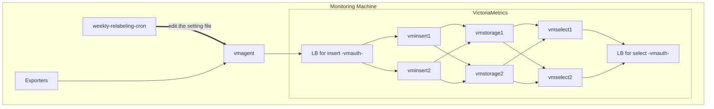

# VictoriaMetrics cluster setup

This directory contains the configuration for the VictoriaMetrics Cluster and metrics collection system.

## Architecture



## Directory structure

```tree
victoriametrics-cluster/
├── compose.yaml           # Main configuration file
├── .env.example                  # Example for environment variable file
├── .env                          # Environment variable file
├── vmagent/
│   └── prometheus.yml            # Metrics scrape target configuration
├── vmauth-insert/
│   └── auth.yml                  # Routing configuration for vminsert
├── vmauth-select/
│   └── auth.yml                  # Routing configuration for vmselect
└── weekly-relabeling-cron/
    ├── Dockerfile
    ├── relabel_weekly.sh         # Script to update scrapedweek label
    └── relabel_weekly.yml        # Label configuration read by vmagent (auto-generated)
```

## Getting started

```bash
docker-compose up -d
```

## Main components

### 1. VictoriaMetrics cluster

- **vmstorage-1, vmstorage-2**: Storage nodes that persist metrics data
- **vminsert-1, vminsert-2**: Nodes that handle metrics ingestion
- **vmselect-1, vmselect-2**: Nodes that handle metrics queries
- **vmauth-insert**: Load balancer for `vminsert` (Port: 8427)
- **vmauth-select**: Load balancer for `vmselect` (Port: 8428)

### 2. vmagent

Metrics collection agent. It scrapes metrics from targets defined in `prometheus.yml` and sends them to the VictoriaMetrics Cluster via `vmauth-insert`.

**Important**: `vmagent` reads `relabel_weekly.yml` from the `weekly-relabeling-cron` directory and applies weekly labels (`scrapedweek`) to metrics.

### 3. weekly-relabeling-cron

Cron job container that updates the `scrapedweek` label weekly.

- **Operation**: Executes `relabel_weekly.sh` every minute and updates `relabel_weekly.yml` based on the current year, week, day of week, and time.
- **After update**: Notifies `vmagent` to reload configuration via the `/-/reload` endpoint.
- **Label format**: `202550w5d0944` (format: year+week+day+time)

## Adding or modifying scrape targets

### Adding new metrics scrape targets

Add a new scrape job to `vmagent/prometheus.yml`.

```yaml
scrape_configs:
  - job_name: "node"
    scrape_interval: 10s
    static_configs:
      - targets: ["10.20.108.113:9100"]

  # Add new job
  - job_name: "new-exporter"
    scrape_interval: 10s
    static_configs:
      - targets: ["<IP>:<PORT>"]
```

Since the configuration is periodically reloaded every 30 seconds by `vmagent`, it is automatically applied.

### Modifying `scrapedweek` label targets

Edit the `TARGET_JOBS_REGEX` in `weekly-relabeling-cron/relabel_weekly.sh`.

**For a single job**:

```bash
export TARGET_JOBS_REGEX='virtual-machine'
```

**For multiple jobs** (regex match):

```bash
export TARGET_JOBS_REGEX='virtual-machine|new-exporter|another-job'
```

After making changes, restart weekly-relabeling-cron.

```bash
docker-compose up -d --build weekly-relabeling-cron
```

### Modifying timezone

**_Note_**
Since VictoriaMetrics clusters handle time-series data based on UTC, timezone changes have minimal impact.

All containers in this setup use the timezone specified by the `TIMEZONE_VM_CLUSTER` environment variable. By default, it is set to `UTC`.

Create a `.env` file in the same directory as `compose.yaml` and set the `TIMEZONE_VM_CLUSTER` variable:

```bash
# .env
TIMEZONE_VM_CLUSTER=America/New_York
```

The example of `.env` is located as `.env.example`.

This allows you to manage environment variables separately from the `compose.yaml` configuration. After creating or modifying the `.env` file, restart all containers:

```bash
docker-compose down
docker-compose up -d
```

**Note**: Changing the timezone affects:

- The `scrapedweek` label generation in `weekly-relabeling-cron`
- Log timestamps in all services listed in [Main Components](#main-components)

Available timezone values can be found in the [Time Zone Lists](https://en.wikipedia.org/wiki/List_of_tz_database_time_zones).

## Verification

### Check VictoriaMetrics status

```bash
# Check vmselect status
curl http://localhost:8428/select/0/prometheus/api/v1/status/buildinfo

# Check metrics
curl 'http://localhost:8428/select/0/prometheus/api/v1/query?query=up'
```

### Verify scrapedweek label

```bash
curl 'http://localhost:8428/select/0/prometheus/api/v1/query?query={job="virtual-machine"}'
```

Verify that the response includes a label like `scrapedweek="202550w"`.

### Check weekly-relabeling-cron logs

```bash
docker exec -it weekly-relabeling-cron cat /var/log/cron.log
```

Logs similar to the following should appear every minute:

```log
updated scrapedweek=202550w and reloaded
```

If the following log appears, it indicates that relabeling has not been performed.

```log
cat: /var/log/cron.log: No such file or directory
```

## Port list

| Service         | Port | Purpose                       |
| --------------- | ---- | ----------------------------- |
| `vmauth-insert` | 8427 | Metrics ingestion entry point |
| `vmauth-select` | 8428 | Metrics query entry point     |
| `vmagent`       | 8429 | `vmagent` management UI       |
| `vmselect-1`    | 8481 | Direct access to `vmselect-1` |

## Troubleshooting

### scrapedweek label not applied

1. Verify that `weekly-relabeling-cron/relabel_weekly.yml` is correctly generated:

   ```bash
   cat weekly-relabeling-cron/relabel_weekly.yml
   ```

2. Check if `vmagent` is correctly loading the relabel configuration:

   ```bash
   docker logs vmagent | grep relabel
   ```

3. Verify that `TARGET_JOBS_REGEX` matches the scrape job names

### Metrics not being collected

1. Check `vmagent` logs:

   ```bash
   docker logs vmagent
   ```

2. Verify that scrape targets are running and network connectivity exists:

   ```bash
   curl http://<target-ip>:<target-port>/metrics
   ```

3. Review `prometheus.yml` configuration

## Data Persistence

Data is persisted in the following volumes:

- `vmstorage1-data`: Metrics data for `vmstorage-1`
- `vmstorage2-data`: Metrics data for `vmstorage-2`
- `vmagent-data`: Buffer data for `vmagent`

To completely remove all data:

```bash
docker-compose down -v
```
